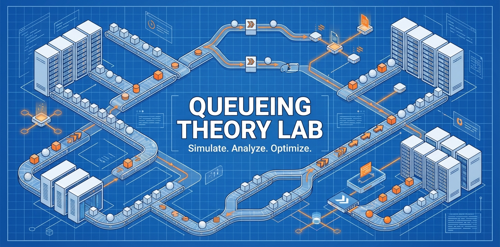

# Системы массового обслуживания: Симуляция и численные методы 🔄



Python-библиотека для симуляции и анализа систем массового обслуживания (СМО) и сетей очередей.


---

## 📚 Документация

**Подробная документация доступна:**

- **[📖 Полная документация (Русский)](docs/README.md)** — Полное руководство на русском языке с подробными туториалами, примерами и теорией
- **[🚀 Быстрый старт](docs/getting_started.md)** — Начните работу за несколько минут
- **[📘 Основные концепции](docs/concepts.md)** — Основы теории массового обслуживания
- **[🎮 Руководство по симуляции](docs/simulation.md)** — Имитационное моделирование
- **[🧮 Руководство по расчетам](docs/calculation.md)** — Численные методы
- **[📊 Каталог моделей](docs/models.md)** — Поддерживаемые модели СМО
- **[🌐 Сети очередей](docs/networks.md)** — Сети СМО
- **[⭐ Приоритетные системы](docs/priorities.md)** — Системы с приоритетами
- **[💡 Примеры использования](docs/examples.md)** — Практические примеры

---

## 🔍 Основные возможности

- **Симуляция**: Моделирование различных типов систем массового обслуживания и сетей
- **Численные методы**: Решение стационарных задач теории массового обслуживания
- **Метрики производительности**: Анализ времени ожидания, времени пребывания, коэффициентов загрузки и многое другое
- **Широкая поддержка моделей**: FIFO, приоритеты, прогулки, отрицательные заявки, fork-join, сети и многое другое

---

## 📦 Установка

```bash
pip install most-queue
```

Или установка из репозитория:

```bash
git clone https://github.com/xabarov/most-queue.git
cd most-queue
pip install -e .
```

**Требования:** Python >= 3.9

---

## 📰 Новости

- **Февраль 2026** — Добавлены расчеты по методу **Такахаси–Таками** для FIFO-моделей **H₂/M/c** и **H₂/H₂/c**:
  - `most_queue/theory/fifo/gmc_takahasi.py` — **H₂/M/c**
  - `most_queue/theory/fifo/hkhk_takahasi.py` — **H₂/H₂/c**
  - Улучшено API: `H2MnCalc.set_sources()` и `MGnCalc.set_servers()` теперь принимают `H2Params` напрямую (без повторного фиттинга), а `HkHkNCalc` корректно работает с complex-fit для \(CV<1\).
- **2025** — Для метода расчета многоканальной СМО с **разогревом**, **охлаждением** и **задержкой начала охлаждения** опубликована статья (реализация: `most_queue/theory/vacations/mgn_with_h2_delay_cold_warm.py`):
  - Лохвицкий, В. А. Численный расчет многоканальной системы массового обслуживания с разогревом, охлаждением и задержкой начала охлаждения / В. А. Лохвицкий, Р. С. Хабаров, Е. Л. Яковлев // Авиакосмическое приборостроение. – 2025. – № 1. – С. 44–57. – DOI [10.25791/aviakosmos.1.2025.1456](https://doi.org/10.25791/aviakosmos.1.2025.1456). – EDN OVJXK

---

## 🎉 Версия 2.7

**Основные изменения:**

- **Метод Такахаси–Таками для FIFO H₂-моделей**: расчёты для **H₂/M/c** (`H2MnCalc`) и **H₂/H₂/c** (`HkHkNCalc`)
- **Поддержка complex-fit для H₂ (CV<1) в расчётах**: численные методы корректно работают с комплексными параметрами H₂-аппроксимации
- **Улучшено API для H₂-параметров**: `H2MnCalc.set_sources()` и `MGnCalc.set_servers()` принимают `H2Params` напрямую (без повторного фиттинга)
- **Тесты валидации с таблицами**:
  - `tests/test_tt_vs_sim_cv105.py` — TT vs симуляция при CV≈1.05 (одинаковые `H2Params`)
  - `tests/test_tt_vs_sim_gamma_cvl1.py` — CV<1: TT (H₂ complex-fit) vs `Gamma`‑симуляция (одинаковые mean/CV)

---

## 🚀 Быстрый старт

### Базовый пример: M/M/1 система

```python
from most_queue.sim.base import QsSim

# Создание симулятора
qs = QsSim(num_of_channels=1)

# Настройка потока поступления (пуассоновский с интенсивностью λ = 0.5)
qs.set_sources(0.5, "M")

# Настройка обслуживания (экспоненциальное с интенсивностью μ = 1.0)
qs.set_servers(1.0, "M")

# Запуск симуляции
results = qs.run(10000)

# Получение результатов
print(f"Среднее время ожидания: {results.w[0]:.4f}")
print(f"Среднее время пребывания: {results.v[0]:.4f}")
print(f"Коэффициент загрузки: {results.utilization:.4f}")
```

### Численный расчет

```python
from most_queue.theory.fifo.mmnr import MMnrCalc

# Создание калькулятора
calc = MMnrCalc(n=1)
calc.set_sources(l=0.5)
calc.set_servers(mu=1.0)

# Выполнение расчета
results = calc.run()
print(f"Среднее время ожидания: {results.w[0]:.4f}")
```

**См. [Руководство по быстрому старту](docs/getting_started.md) для дополнительных примеров.**

---

## 📚 Структура проекта

Most-Queue состоит из двух основных модулей:

- **`most_queue.sim`** — Программы симуляции систем массового обслуживания
- **`most_queue.theory`** — Численные методы для расчета моделей теории массового обслуживания

---

## 🧪 Поддерживаемые модели

### FIFO системы
- **M/M/c**, **M/M/c/r** — Многоканальные системы с пуассоновским потоком
- **M/G/1**, **M/G/c** — Системы с произвольным распределением времени обслуживания
- **GI/M/1**, **GI/M/c** — Системы с общим потоком поступления
- **H₂/M/c** — Гиперэкспоненциальный поток поступления, метод Такахаси-Таками (§7.6.1)
- **M/D/c**, **E_k/D/c** — Системы с детерминированным обслуживанием
- **M/H₂/c** — Метод Такахаси-Таками с гиперэкспоненциальным обслуживанием
- **H₂/H₂/c** — Метод Такахаси-Таками для гиперэкспоненциального потока и обслуживания

Примечание про H₂ и \(CV<1\): реальное H₂-распределение имеет \(CV\\ge 1\), но для численных методов допускается **complex-fit** (комплексные параметры аппроксимации). Симулятор `QsSim` не генерирует H₂ с комплексными параметрами, поэтому сравнение “теория vs симуляция” возможно только когда параметры вещественные.\n\nДля \(CV<1\) валидацию удобно делать через `Gamma`‑симуляцию с теми же mean/CV (см. `tests/test_tt_vs_sim_gamma_cvl1.py`).

### Системы с приоритетами
- **M/G/1/PR**, **M/G/1/NP** — Одноканальные с прерываемым/непрерываемым приоритетом
- **M/G/c/PR**, **M/G/c/NP** — Многоканальные с приоритетами
- **M/Ph/c/PR** — Фазовое распределение обслуживания с приоритетами

### Специализированные системы
- **Прогулки** — Системы с прогулками серверов и прогревом
- **Отрицательные заявки** — Модели RCS и disaster
- **Fork-Join** — Системы параллельной обработки
- **Пакетное поступление** — Системы M^x/M/1
- **Нетерпеливые заявки** — Системы с уходом клиентов
- **Engset** — Закрытые системы с конечным числом источников
- **Сети** — Открытые и закрытые сети очередей

**См. [Каталог моделей](docs/models.md) для полного списка и деталей.**

---

## 📌 Области применения

- **Облачные вычисления**: Моделирование масштабируемости и производительности инфраструктуры
- **Call-центры**: Оптимизация штата и времени ожидания клиентов
- **Транспорт**: Улучшение транспортных потоков и логистики
- **Сетевой трафик**: Анализ и прогнозирование потоков данных
- **Производство**: Оптимизация производственных линий
- **Здравоохранение**: Планирование ресурсов больниц

**См. [Примеры использования](docs/examples.md) для практических кейсов.**

---

## 📖 Most-Queue 2.x API

Единый API для симуляции и расчета:

```python
# Численный расчет
calc = MGnCalc(n=NUM_OF_CHANNELS)
calc.set_sources(l=ARRIVAL_RATE)
calc.set_servers(b=b)
calc_results = calc.run()

# Симуляция
qs = QsSim(NUM_OF_CHANNELS)
qs.set_sources(ARRIVAL_RATE, "M")
qs.set_servers(gamma_params, "Gamma")
sim_results = qs.run(NUM_OF_JOBS)
```

---

## 📁 Ресурсы

- **[Тесты](tests/)** — Примеры с сравнением теоретических и симуляционных результатов
- **[Туториалы](tutorials/)** — Jupyter-ноутбуки с пошаговыми руководствами
- **[Документация](docs/)** — Подробная документация на русском языке

---

## 🔍 Ключевые слова для поиска

- Теория массового обслуживания
- Симуляция
- Численные методы
- Сети очередей
- Анализ производительности
- Облачные вычисления
- Оптимизация call-центров
- Транспортные системы
- Сетевой трафик
- Python-пакет

---

## 👥 Участие в разработке

Мы приветствуем ваш вклад!

- Откройте [issue](https://github.com/xabarov/most-queue/issues) для сообщений об ошибках или предложений
- Отправьте pull request для улучшений функциональности
- Контакты: xabarov1985@gmail.com

---

## 📄 Лицензия

См. файл [LICENSE](LICENSE) для деталей.

---

**Для подробной документации, примеров и туториалов см. [docs/README.md](docs/README.md)**
