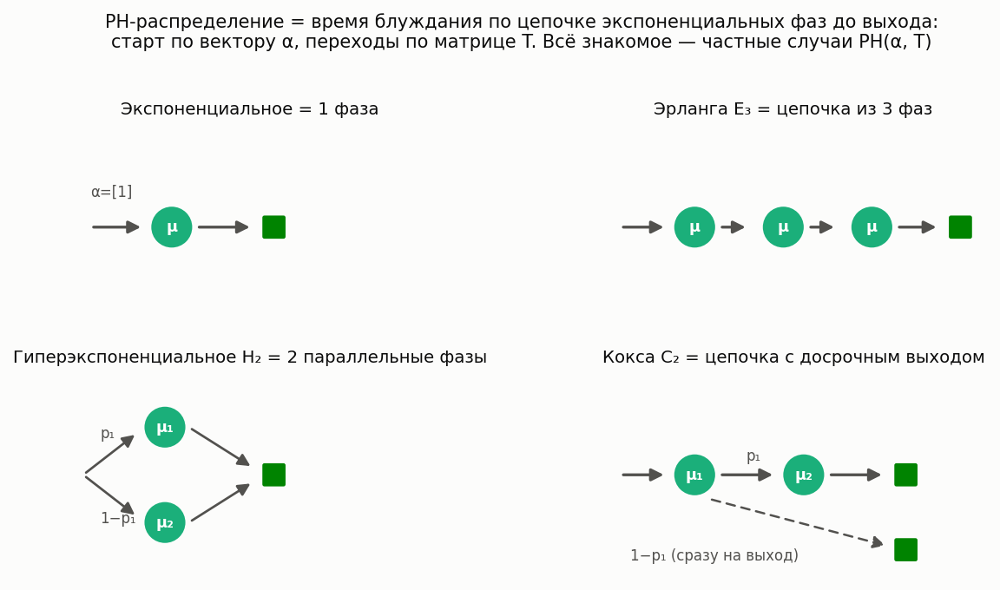
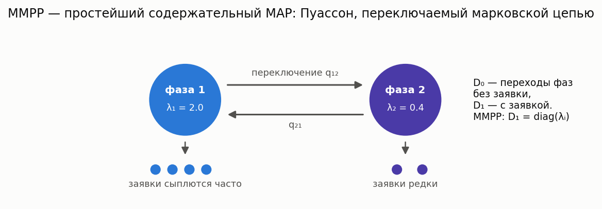

# Distributions Reference

[🇷🇺 Русская версия](distributions.ru.md)

The Most-Queue library supports a variety of distributions for modeling job interarrival times and service times. This reference describes all supported distributions and how to use them.

## Supported distributions

| Distribution | Kendall notation | Parameters |
|--------------|---------------------|-----------|
| Exponential | M | μ (rate) |
| Hyperexponential of order 2 | H | H2Params |
| Erlang | E | ErlangParams |
| Gamma | Gamma | GammaParams |
| Coxian of order 2 | C | Cox2Params |
| Pareto | Pa | ParetoParams |
| Deterministic | D | b (constant value) |
| Uniform | Uniform | UniformParams |
| Normal (Gaussian) | Norm | GaussianParams |

## Exponential distribution (M)

**Kendall notation:** M (Markovian)

The exponential distribution is used to model Poisson arrivals and exponential service.

### Parameters

- **`mu`** (float) — rate (the parameter of the exponential distribution)

### Usage in simulation

```python
from most_queue.sim.base import QsSim

qs = QsSim(num_of_channels=1)

# Arrival stream with rate λ = 0.5
qs.set_sources(0.5, "M")

# Service with rate μ = 1.0
qs.set_servers(1.0, "M")
```

### Usage in calculations

```python
from most_queue.theory.fifo.mmnr import MMnrCalc

calc = MMnrCalc(n=1)
calc.set_sources(l=0.5)  # arrival rate
calc.set_servers(mu=1.0)  # service rate
```

### Properties

- Mean: 1/μ
- Variance: 1/μ²
- Coefficient of variation: 1.0

## Hyperexponential distribution of order 2 (H)

**Kendall notation:** H

The hyperexponential distribution is a mixture of two exponential distributions. Useful for modeling distributions with a coefficient of variation > 1.

### Parameters (H2Params)

```python
from most_queue.random.utils.params import H2Params

h2_params = H2Params(
    p1=0.3,    # probability of the first component (0 < p1 < 1)
    mu1=1.0,   # rate of the first component
    mu2=2.0    # rate of the second component
)
```

### Fitting by mean and CV

```python
from most_queue.random.distributions import H2Distribution

# Create parameters from the mean and coefficient of variation
h2_params = H2Distribution.get_params_by_mean_and_cv(
    mean=2.0,   # mean value
    cv=1.5      # coefficient of variation (must be >= 1)
)
```

### Usage

```python
from most_queue.sim.base import QsSim
from most_queue.random.distributions import H2Distribution, H2Params

qs = QsSim(num_of_channels=1)

# Create the parameters
h2_params = H2Distribution.get_params_by_mean_and_cv(mean=2.0, cv=1.2)

# Use in simulation
qs.set_sources(0.5, "M")
qs.set_servers(h2_params, "H")

# Calculations require the moments
b = H2Distribution.calc_theory_moments(h2_params, num=5)
```

## Gamma distribution (Gamma)

**Kendall notation:** Gamma

The Gamma distribution is a flexible distribution that can model a variety of shapes (including the exponential as a special case).

### Parameters (GammaParams)

```python
from most_queue.random.utils.params import GammaParams

gamma_params = GammaParams(
    alpha=2.0,  # shape parameter
    mu=1.0      # rate parameter
)
```

### Fitting by mean and CV

```python
from most_queue.random.distributions import GammaDistribution

gamma_params = GammaDistribution.get_params_by_mean_and_cv(
    mean=2.0,   # mean value
    cv=0.6      # coefficient of variation
)
```

### Usage

```python
from most_queue.sim.base import QsSim
from most_queue.random.distributions import GammaDistribution

qs = QsSim(num_of_channels=1)

# Create the parameters
gamma_params = GammaDistribution.get_params_by_mean_and_cv(mean=2.0, cv=0.7)

# Simulation
qs.set_sources(0.5, "M")
qs.set_servers(gamma_params, "Gamma")

# For calculations
b = GammaDistribution.calc_theory_moments(gamma_params, num=5)
```

## Erlang distribution (E)

**Kendall notation:** E

The Erlang distribution is the sum of k independent exponential distributions with the same parameter. Useful for modeling distributions with CV < 1.

### Parameters (ErlangParams)

```python
from most_queue.random.utils.params import ErlangParams

erlang_params = ErlangParams(
    k=3,        # number of phases (integer >= 1)
    mu=1.0      # rate of each phase
)
```

### Fitting by mean and CV

```python
from most_queue.random.distributions import ErlangDistribution

erlang_params = ErlangDistribution.get_params_by_mean_and_cv(
    mean=2.0,   # mean value
    cv=0.5      # coefficient of variation (must be <= 1)
)
```

### Usage

```python
from most_queue.sim.base import QsSim
from most_queue.random.distributions import ErlangDistribution

qs = QsSim(num_of_channels=1)

erlang_params = ErlangDistribution.get_params_by_mean_and_cv(mean=2.0, cv=0.6)
qs.set_sources(0.5, "M")
qs.set_servers(erlang_params, "E")
```

## Coxian distribution of order 2 (C)

**Kendall notation:** C

The Coxian distribution is a two-phase distribution that can model a wide range of coefficients of variation.

### Parameters (Cox2Params)

```python
from most_queue.random.utils.params import Cox2Params

cox_params = Cox2Params(
    p1=0.4,     # probability of moving to the second phase
    mu1=1.0,    # rate of the first phase
    mu2=2.0     # rate of the second phase
)
```

### Usage

```python
from most_queue.sim.base import QsSim
from most_queue.random.utils.params import Cox2Params

qs = QsSim(num_of_channels=1)

cox_params = Cox2Params(p1=0.4, mu1=1.0, mu2=2.0)
qs.set_sources(0.5, "M")
qs.set_servers(cox_params, "C")
```

## Pareto distribution (Pa)

**Kendall notation:** Pa

The Pareto distribution is used to model heavy-tailed distributions.

### Parameters (ParetoParams)

```python
from most_queue.random.utils.params import ParetoParams

pareto_params = ParetoParams(
    alpha=2.0,   # shape parameter
    K=1.0        # minimum value
)
```

### Fitting by mean and CV

```python
from most_queue.random.distributions import ParetoDistribution

pareto_params = ParetoDistribution.get_params_by_mean_and_cv(
    mean=2.0,
    cv=1.5
)
```

## Deterministic distribution (D)

**Kendall notation:** D

The deterministic distribution is a constant value with no randomness.

### Parameters

- **`b`** (float) — constant value

### Usage

```python
from most_queue.sim.base import QsSim

qs = QsSim(num_of_channels=1)

# Constant interval between jobs
qs.set_sources(2.0, "D")  # interval = 2.0

# Constant service time
qs.set_servers(3.0, "D")  # service time = 3.0
```

## Uniform distribution (Uniform)

**Kendall notation:** Uniform

The uniform distribution on the interval [a, b].

### Parameters (UniformParams)

```python
from most_queue.random.utils.params import UniformParams

uniform_params = UniformParams(
    mean=2.0,        # mean value
    half_interval=1.0  # half of the interval, (b - a) / 2
)
```

### Usage

```python
from most_queue.sim.base import QsSim
from most_queue.random.utils.params import UniformParams

qs = QsSim(num_of_channels=1)

uniform_params = UniformParams(mean=2.0, half_interval=1.0)
qs.set_sources(0.5, "M")
qs.set_servers(uniform_params, "Uniform")
```

## Normal distribution (Norm)

**Kendall notation:** Norm

The normal (Gaussian) distribution. **Warning:** it can produce negative values, which have no physical meaning for time.

### Parameters (GaussianParams)

```python
from most_queue.random.utils.params import GaussianParams

gaussian_params = GaussianParams(
    mean=2.0,    # mean value
    std=0.5      # standard deviation
)
```

### Usage

```python
from most_queue.sim.base import QsSim
from most_queue.random.utils.params import GaussianParams

qs = QsSim(num_of_channels=1)

gaussian_params = GaussianParams(mean=2.0, std=0.5)
qs.set_sources(0.5, "M")
qs.set_servers(gaussian_params, "Norm")
```

## Phase-type distributions (PH)

**Kendall notation:** PH



**In plain words:** if you have worked with Exponential, Erlang, H₂ or Coxian distributions,
you already know phase-type distributions — those are all special cases. A PH random variable
is the time a "token" spends walking through a chain of exponential **phases** until it exits:
the initial phase is drawn from a vector **α**, and the transitions between phases are governed
by a sub-generator matrix **T** (exit rates are `t0 = -T @ 1`). Chain the phases in a row — you
get Erlang; put them in parallel — H₂; allow an early exit — Coxian. An arbitrary (α, T) gives
you a family dense enough to approximate any positive distribution.

| Familiar distribution | PH structure | Converter |
|---|---|---|
| Exponential(μ) | single phase | `PHDistribution.from_exp(mu)` |
| Erlang-r | chain of r identical phases | `PHDistribution.from_erlang(params)` |
| H₂ | two parallel phases | `PHDistribution.from_h2(params)` |
| Coxian-2 | chain with early exit | `PHDistribution.from_cox(params)` |

Raw moments are available in closed form: `m_k = k! · α (−T)⁻ᵏ 1`.

### Usage

```python
import numpy as np
from most_queue.random.map_ph import PHDistribution, PHParams
from most_queue.random.utils.params import ErlangParams

# ready-made converter...
ph = PHDistribution.from_erlang(ErlangParams(r=3, mu=2.0))

# ...or any custom (alpha, T): here Erlang-2 with a slower second phase
custom = PHParams(alpha=np.array([1.0, 0.0]), T=np.array([[-2.0, 2.0], [0.0, -0.7]]))

moments = PHDistribution.calc_theory_moments(custom, 4)
f_at_1 = PHDistribution.get_pdf(custom, 1.0)

# in simulation: PH works as a source or a server distribution
from most_queue.sim.base import QsSim
qs = QsSim(1)
qs.set_sources(1.0, "M")
qs.set_servers(custom, "PH")
```

**Why bother, if H₂/Erlang already exist?** PH is the service-side language of the
**matrix-analytic** solvers: the [MAP/PH/1 calculator](models.md#matrix-analytic-models-mapph)
accepts any PH service, so one model covers everything from deterministic-like (long Erlang
chains) to highly variable (H₂) service within a single exact method.

## Markovian Arrival Process (MAP)

**Kendall notation:** MAP



**In plain words:** every arrival model above is a *renewal* process — interarrival times are
independent, a coin with no memory. Real traffic is usually **bursty**: a short gap tends to be
followed by another short one. A MAP adds exactly this memory: a background Markov chain wanders
between phases, and arrivals are generated at a phase-dependent rate. Two matrices define it:
**D₀** (phase transitions *without* an arrival) and **D₁** (transitions that *emit* an arrival).

The simplest meaningful example is the **MMPP** (Markov-modulated Poisson process) in the figure:
a fast phase and a slow phase, switching occasionally — the arrival stream alternates between
bursts and lulls while the long-run rate stays fixed.

Special cases: a one-phase MAP is the Poisson process; `D1 = t0 @ alpha` gives a renewal process
with PH interarrival times (no correlation). The interarrival raw moments and the **lag-k
autocorrelation** are available in closed form.

### Usage

```python
import numpy as np
from most_queue.random.map_ph import MAP, PHDistribution

# MMPP-2: rate 2.0 in phase 1, rate 0.4 in phase 2, slow switching
mmpp = MAP.mmpp([2.0, 0.4], np.array([[-0.2, 0.2], [0.3, -0.3]]))

print(MAP.arrival_rate(mmpp))            # long-run rate
print(MAP.calc_theory_moments(mmpp, 3))  # interarrival raw moments
print(MAP.lag_correlation(mmpp, 1))      # the burstiness a renewal model cannot see

# other factories
poisson = MAP.poisson(1.0)
renewal_h2 = MAP.from_ph_renewal(PHDistribution.from_exp(1.0))

# in simulation: a MAP is a stateful arrival source
from most_queue.sim.base import QsSim
qs = QsSim(1)
qs.set_sources(mmpp, "MAP")
qs.set_servers(1.5, "M")
```

**Why it matters:** at the same utilization, mean and CV of interarrival times, positive
correlation can multiply the mean waiting time several-fold — see the exact
[MAP/PH/1 model](models.md#matrix-analytic-models-mapph) and the demo notebook
[`tutorials/map_ph_correlation.ipynb`](../tutorials/map_ph_correlation.ipynb).

## Computing distribution moments

Numerical calculation methods require the raw moments of the distributions:

```python
from most_queue.random.distributions import (
    H2Distribution,
    GammaDistribution,
    ErlangDistribution
)

# H2 distribution
h2_params = H2Distribution.get_params_by_mean_and_cv(mean=2.0, cv=1.2)
b = H2Distribution.calc_theory_moments(h2_params, num=5)
# b[0] - mean, b[1] - second moment, b[2] - third moment, etc.

# Gamma distribution
gamma_params = GammaDistribution.get_params_by_mean_and_cv(mean=2.0, cv=0.7)
b = GammaDistribution.calc_theory_moments(gamma_params, num=5)

# Erlang distribution
erlang_params = ErlangDistribution.get_params_by_mean_and_cv(mean=2.0, cv=0.5)
b = ErlangDistribution.calc_theory_moments(erlang_params, num=5)
```

## Choosing a distribution

### By coefficient of variation

- **CV < 1**: Erlang (E) or Gamma (Gamma)
- **CV = 1**: Exponential (M)
- **CV > 1**: Hyperexponential (H) or Gamma (Gamma)

### By the nature of the data

- **Poisson arrivals**: Exponential (M)
- **Regular arrivals**: Deterministic (D) or Erlang (E)
- **High variability**: Hyperexponential (H) or Pareto (Pa)
- **General-purpose**: Gamma (Gamma) or Coxian (C)

## Example: comparing distributions

```python
from most_queue.sim.base import QsSim
from most_queue.random.distributions import (
    H2Distribution,
    GammaDistribution,
    ErlangDistribution
)

arrival_rate = 0.4
service_mean = 2.5
service_cv = 0.8
num_jobs = 30000

# H2 distribution
h2_params = H2Distribution.get_params_by_mean_and_cv(service_mean, service_cv)
qs_h2 = QsSim(1)
qs_h2.set_sources(arrival_rate, "M")
qs_h2.set_servers(h2_params, "H")
results_h2 = qs_h2.run(num_jobs)

# Gamma distribution
gamma_params = GammaDistribution.get_params_by_mean_and_cv(service_mean, service_cv)
qs_gamma = QsSim(1)
qs_gamma.set_sources(arrival_rate, "M")
qs_gamma.set_servers(gamma_params, "Gamma")
results_gamma = qs_gamma.run(num_jobs)

# Comparison
print(f"H2: mean waiting time = {results_h2.w[0]:.4f}")
print(f"Gamma: mean waiting time = {results_gamma.w[0]:.4f}")
```

## Listing supported distributions

To get the list of all supported distributions:

```python
from most_queue.random.distributions import print_supported_distributions

print_supported_distributions()
```

---

**See also:**
- [Queueing system simulation](simulation.md) — using distributions in simulation
- [Numerical methods](calculation.md) — working with distribution moments
- [Usage examples](examples.md) — practical examples
