# Catalog of Supported Queueing System Models

[🇷🇺 Русская версия](models.ru.md)

The Most-Queue library supports a wide range of queueing system models. This catalog describes all available models with usage examples.

Each section opens with a diagram and an intuitive explanation. The diagrams are generated by the
script [`figures/generate_figures.py`](figures/generate_figures.py) — when adding a new model,
add a diagram function there and regenerate: `python docs/figures/generate_figures.py`.

**How to read Kendall notation A/B/c:** the first letter is the arrival process, the second is the
service time distribution, the third is the number of servers. `M` — exponential ("memoryless",
Poisson arrivals), `G`/`GI` — general, `D` — deterministic (constant),
`H₂` — hyperexponential (mixture of two exponentials, high variability), `Ek` — Erlang
(sum of k exponentials, low variability), `Ph` — phase-type.

## FIFO systems (First In First Out discipline)

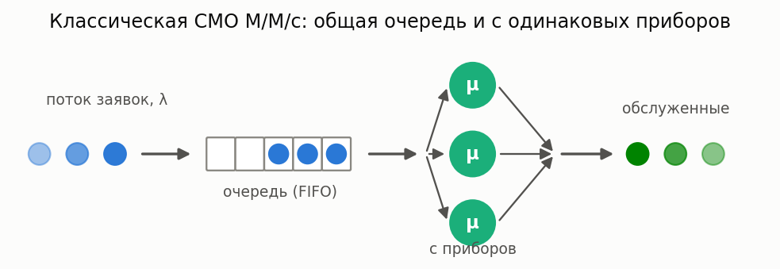

**In plain words:** jobs (customers, tasks, packets) arrive at random moments, join a common
queue, and are served in order of arrival by the first server to become free. The only difference
between the models in this section is how "random" the arrivals and service are:
from fully memoryless M/M/c to general distributions approximated by a hyperexponential
(the Takahashi–Takami method).

### M/M/c

**Description:** Multi-server system with Poisson arrivals and exponential service.

**In plain words:** the "ideal call center" — both the gaps between calls and the call durations
are random and independent of the past. The simplest multi-server model; all characteristics
are computed exactly, and it is the right starting point for any analysis.

**Calculator class:** `MMnrCalc`

**Example:**

```python
from most_queue.theory.fifo.mmnr import MMnrCalc

calc = MMnrCalc(n=3)  # 3 servers
calc.set_sources(l=2.0)
calc.set_servers(mu=1.0)
results = calc.run()
```

### M/M/c/r

**Description:** M/M/c with a finite queue (at most r waiting positions).

**In plain words:** same as M/M/c, but the "waiting room" has only r seats: a job that arrives
to a full system is rejected and lost. A model for systems with a finite buffer (telephony,
network equipment).

**Calculator class:** `MMnrCalc`

**Example:**

```python
from most_queue.theory.fifo.mmnr import MMnrCalc

calc = MMnrCalc(n=3, r=20)  # 3 servers, queue capacity 20
calc.set_sources(l=2.0)
calc.set_servers(mu=1.0)
results = calc.run()
```

### M/M/n/0 — Erlang B (loss system)


**Description:** The classical loss system: there is no queue, and a job that finds all n servers busy is lost. The blocking probability is given by the Erlang B formula (a numerically stable recursion).

**In plain words:** how many phone lines (hospital beds, parking spots) are needed to lose no
more than a given fraction of customers. By Sevastyanov's theorem the blocking probability does
not depend on the shape of the service distribution — only on its mean — so the result also
holds for M/G/n/0.

**Calculator class:** `ErlangBCalc` (`most_queue.theory.fifo.erlang`)

**Example:**

```python
from most_queue.theory.fifo.erlang import ErlangBCalc

calc = ErlangBCalc(n=3)
calc.set_sources(l=2.0)
calc.set_servers(mu=1.0)
results = calc.run()
blocking = calc.get_blocking_probability()
```

### M/M/n — Erlang C (waiting system)

**Description:** Multi-server system with an infinite queue. The waiting probability is given by the Erlang C formula; the waiting time moments are available in closed form.

**In plain words:** the basic staffing model: what is the probability that a customer has to wait,
and for how long. The wait is either zero (a server is free) or exponential — which is why all
the moments follow from a single formula.

**Calculator class:** `ErlangCCalc` (`most_queue.theory.fifo.erlang`)

**Example:**

```python
from most_queue.theory.fifo.erlang import ErlangCCalc

calc = ErlangCCalc(n=3)
calc.set_sources(l=2.0)
calc.set_servers(mu=1.0)
results = calc.run()
p_wait = calc.get_waiting_probability()
```

### M/G/∞ (infinitely many servers)

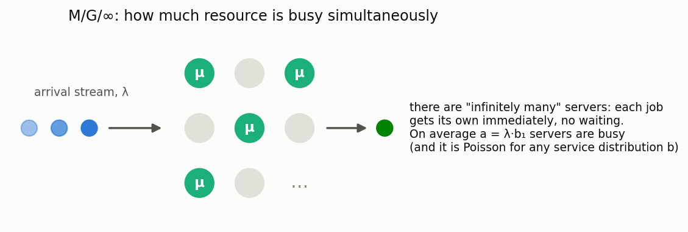

**Description:** Every job instantly gets its own server: there is no waiting, and the number of busy servers has a Poisson distribution with mean λ·b₁, regardless of the shape of the service distribution (insensitivity).

**In plain words:** a model of an "abundant" resource — active sessions, calls in a large network,
cars on a highway. It answers the question "how much of the resource is actually in use at once"
and serves as a building block for staffing approximations.

**Calculator class:** `MGInfCalc` (`most_queue.theory.fifo.m_g_inf`)

**Example:**

```python
from most_queue.theory.fifo.m_g_inf import MGInfCalc
from most_queue.random.distributions import GammaDistribution

calc = MGInfCalc()
calc.set_sources(l=1.0)

gamma_params = GammaDistribution.get_params_by_mean_and_cv(2.0, 1.2)
b = GammaDistribution.calc_theory_moments(gamma_params, 4)
calc.set_servers(b=b)

results = calc.run()
busy_mean = calc.get_offered_load()  # mean number of busy servers
```

### M/G/1

**Description:** Single-server system with Poisson arrivals and a general service time distribution.

**In plain words:** one server, arbitrary service time (specified via raw moments). The classical
Pollaczek–Khinchine setting: the queue grows not only with the load but also with the *variability*
of the service time — for the same mean, a system with rare "heavy" jobs waits far longer than
one with identical jobs.

**Calculator class:** `MG1Calc`

**Example:**

```python
from most_queue.theory.fifo.mg1 import MG1Calc
from most_queue.random.distributions import H2Distribution

calc = MG1Calc()
calc.set_sources(l=0.5)

h2_params = H2Distribution.get_params_by_mean_and_cv(mean=2.0, cv=0.8)
b = H2Distribution.calc_theory_moments(h2_params, 5)
calc.set_servers(b)

results = calc.run()
```

The next four models are **size-based disciplines**: the server decides whom to serve based on
the *size* of the job (known or predicted), not on the order of arrival. Here is how the same
jobs pass through a single server under different disciplines:


### M/G/1 SRPT

**Description:** Single-server M/G/1 under the **Shortest Remaining Processing Time** discipline (preemption by remaining work). Numerically: the Schrage–Miller formula (1966).

**In plain words:** the server is always busy with the job that has the least work *remaining*;
if a shorter one arrives, the current job is preempted and waits (see the diagram above, where
job A yields the server and is finished at the end). SRPT provably minimizes the mean sojourn
time among all disciplines.

**Calculator class:** `MG1SrptCalc`  
**Simulation:** `SizeBasedQsSim(discipline="SRPT")` — the job size is sampled on arrival.

**Example:**

```python
from most_queue.theory.srpt import MG1SrptCalc
from most_queue.random.distributions import H2Distribution

calc = MG1SrptCalc()
calc.set_sources(1.0)
h2 = H2Distribution.get_params_by_mean_and_cv(0.7, 1.2)
calc.set_servers(h2, "H")
results = calc.run()
```

### M/G/1 SJF (SPT)

**Description:** Non-preemptive service by the **smallest true size** (Shortest Job First / Shortest Processing Time).

**In plain words:** no preemption — when the server becomes free, the shortest job in the queue
is taken, but a service once started always runs to completion.

**Calculator class:** `MG1SjfCalc`  
**Simulation:** `SizeBasedQsSim(discipline="SJF")`

### M/G/1 PSJF

**Description:** Preemptive service by the **original** job size (different from SRPT).

**In plain words:** like SRPT, but the comparison uses the *full original* size, not the
remainder: an almost-finished long job will still yield to a newly arrived short one.

**Calculator class:** `MG1PsjfCalc`  
**Simulation:** `SizeBasedQsSim(discipline="PSJF")`

### M/G/1 SPJF (with predictions)

**Description:** Non-preemptive service by the **predicted** size \(Y\) (Mitzenmacher, 2020). The joint distribution \((X,Y)\) is specified by a predictor object (`PerfectPredictor`, `ExpNoisePredictor`, …).

**In plain words:** the true job size is unknown, but a *prediction* of it is available (e.g.
from an ML model) — we serve the jobs that are short "according to the forecast". The model
answers the question of how much of the SJF gain survives with imprecise predictions. With a
perfect predictor it reduces to SJF.

**Calculator class:** `MG1SpjfCalc`  
**Simulation:** `SizeBasedQsSim(discipline="SPJF")` + `set_predictor(...)`.

**Example:**

```python
from most_queue.theory.srpt import MG1SpjfCalc
from most_queue.theory.srpt.utils.predictor import ExpNoisePredictor

calc = MG1SpjfCalc()
calc.set_sources(0.5)
calc.set_servers(1.0, "M")
calc.set_predictor(ExpNoisePredictor())
results = calc.run()
```

The next three disciplines (FB, PS, LCFS-PR) complete the size-based family. How each of them
treats jobs of different sizes is computed by the library's own calculators:

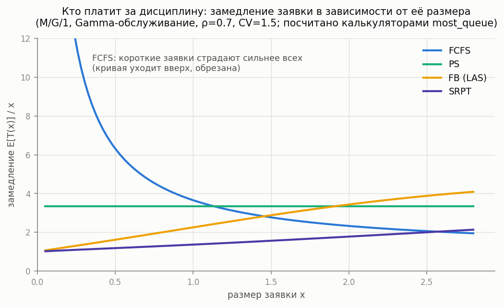

### M/G/1 FB (Foreground-Background / LAS)

**Description:** A preemptive **blind** discipline: the server always serves the job with the least *attained* service; ties share the server equally. Job sizes need not be known.

**In plain words:** "give the newcomers a chance": a fresh job gets the server immediately and
keeps it until it catches up with the others in attained service. If short jobs are common
(decreasing hazard rate, CV > 1), FB approaches SRPT without knowing the sizes; if the service
time is nearly constant, FB loses even to FCFS. Exponential service is the boundary case: FB
coincides with PS.

**Calculator class:** `MG1FbCalc` (`most_queue.theory.srpt`)
**Simulation:** `FBSim` (`most_queue.sim.single_server_disciplines`)

**Example:**

```python
from most_queue.theory.srpt import MG1FbCalc
from most_queue.random.distributions import GammaDistribution

calc = MG1FbCalc()
calc.set_sources(1.0)
calc.set_servers(GammaDistribution.get_params_by_mean_and_cv(0.7, 1.2), "Gamma")
results = calc.run()
```

### M/G/1 PS (Processor Sharing)

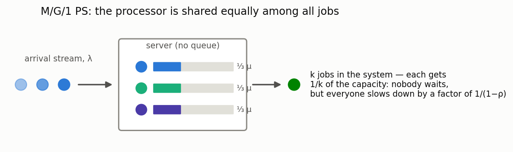

**Description:** The server is shared equally among all jobs present (each of k jobs is served at rate 1/k). The state probabilities are geometric and insensitive to the shape of the service distribution; the conditional mean sojourn time of a job of size x is exactly x/(1−ρ).

**In plain words:** a model of a CPU, a web server, a shared channel: nobody waits "in a queue",
but everyone is slowed down by the same factor 1/(1−ρ). A perfectly fair discipline — the
baseline for comparison with SRPT/SJF (which are faster on average, but at the expense of long
jobs). Only the means are computed for now (higher moments — Yashkov/Ott methods — are deferred).

**Calculator class:** `MG1PSCalc` (`most_queue.theory.fifo.mg1_ps`)
**Simulation:** `ProcessorSharingSim` (`most_queue.sim.single_server_disciplines`)

**Example:**

```python
from most_queue.theory.fifo.mg1_ps import MG1PSCalc

calc = MG1PSCalc()
calc.set_sources(l=1.0)
calc.set_servers([0.7, 1.2])  # service time moments
results = calc.run()
slowdown = calc.get_mean_slowdown()          # 1/(1-rho)
t_x = calc.get_conditional_sojourn_mean(2.0)  # x/(1-rho)
```

### M/G/1 LCFS-PR

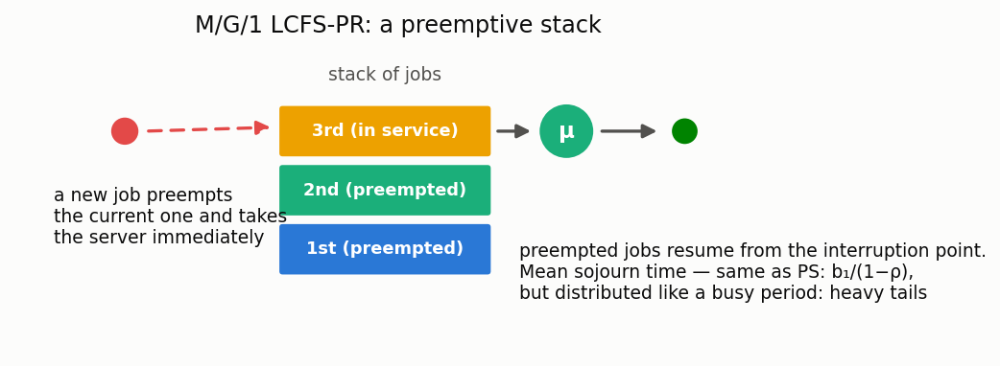

**Description:** A preemptive stack: a new job preempts the one in service, and preempted jobs later resume from the point of interruption. The sojourn time is distributed as an M/G/1 busy period — all moments follow from the Takács recursions; the state probabilities are the same geometric ones (BCMP).

**In plain words:** "last come, first served": a fresh job gets the server immediately, but risks
being preempted itself. The mean sojourn time is the same as under PS (b₁/(1−ρ), insensitive
to the distribution shape), but the variability is much larger — the tails are those of a busy
period. FCFS has a different mean: it also depends on b₂ (Pollaczek–Khinchine).

**Calculator class:** `MG1LcfsPrCalc` (`most_queue.theory.fifo.mg1_lcfs_pr`)
**Simulation:** `LcfsPRSim` (`most_queue.sim.single_server_disciplines`)

### GI/M/1

**Description:** Single-server system with general arrivals and exponential service.

**In plain words:** the mirror image of M/G/1 — now the "general" side is not the service but
the arrival process: the interarrival times may have any distribution (specified via moments),
while service is exponential.

**Calculator class:** `GIM1Calc`

**Example:**

```python
from most_queue.theory.fifo.gi_m_1 import GIM1Calc
from most_queue.random.distributions import GammaDistribution

calc = GIM1Calc()

gamma_params = GammaDistribution.get_params_by_mean_and_cv(mean=2.0, cv=0.6)
a = GammaDistribution.calc_theory_moments(gamma_params)
calc.set_sources(a)

calc.set_servers(mu=0.6)
results = calc.run()
```

### GI/M/c

**Description:** Multi-server system with general arrivals and exponential service.

**Calculator class:** `GiMn`

**Example:**

```python
from most_queue.theory.fifo.gi_m_n import GiMn
from most_queue.random.distributions import GammaDistribution

calc = GiMn(n=3)  # 3 servers

gamma_params = GammaDistribution.get_params_by_mean_and_cv(mean=2.0, cv=0.6)
a = GammaDistribution.calc_theory_moments(gamma_params)
calc.set_sources(a)

calc.set_servers(mu=0.6)
results = calc.run()
```

### GI/G/1 and GI/G/m (two-moment approximations)

**Description:** Approximate computation of the mean waiting time from the first two moments of the arrival and service processes: Kingman (upper bound), Krämer–Langenbach-Belz for GI/G/1 (exact for M/G/1), Allen–Cunneen for GI/G/m (exact for M/M/m).

**In plain words:** "back-of-the-napkin formulas" for capacity planning: for when only the means
and variabilities are known and no exact solution exists. Only the first moment is returned
(this is an approximation, not an exact solution); the typical KLB error is a few percent. The
Kimura formula (interpolation over D/M/s, M/D/s, M/M/s) is deferred — it requires exact D/M/s
solutions.

**Calculator classes:** `GIG1ApproxCalc`, `GIGmApproxCalc` (`most_queue.theory.fifo.gi_g_approx`)

**Example:**

```python
from most_queue.theory.fifo.gi_g_approx import GIG1ApproxCalc
from most_queue.random.distributions import GammaDistribution

a_params = GammaDistribution.get_params_by_mean_and_cv(1.0, 0.56)
b_params = GammaDistribution.get_params_by_mean_and_cv(0.7, 1.2)

calc = GIG1ApproxCalc()  # or GIG1ApproxCalc(approximation="kingman")
calc.set_sources(GammaDistribution.calc_theory_moments(a_params, 4))
calc.set_servers(GammaDistribution.calc_theory_moments(b_params, 4))
results = calc.run()  # results.w — [w1], first moment only
```

### H₂/M/c (Takahashi–Takami method)

**Description:** Multi-server system with hyperexponential arrivals (H₂) and exponential service (M). Uses the simplified algorithm of §7.6.1 (formulas for z_j, x_j, t_{j,i}, level 0).

**In plain words:** H₂ (a "mixture of two exponentials") is a universal building block: by fitting
its parameters to the mean and coefficient of variation, one can approximate almost any real
distribution (for CV < 1 — with complex-valued parameters). The Takahashi–Takami method is an
iterative numerical algorithm that solves such multi-server phase-type models exactly.

**Calculator class:** `H2MnCalc`

**Example:**

```python
from most_queue.theory.fifo.gmc_takahasi import H2MnCalc
from most_queue.random.distributions import H2Distribution

calc = H2MnCalc(n=3)

h2_params = H2Distribution.get_params_by_mean_and_cv(1.0, 1.2, is_clx=True)  # mean, cv
#
# For CV<1 use the complex fit: is_clx=True.
# Important: the `QsSim` simulator cannot generate H2 with complex parameters,
# so comparison with simulation is only possible when the parameters are real-valued.
calc.set_sources(h2_params)

calc.set_servers(b=2.0)  # mean service time

results = calc.run()
```

### H₂/H₂/c (Takahashi–Takami method)

**Description:** Multi-server system with hyperexponential arrivals and hyperexponential service. Uses the algorithm of §7.6.2 (CH7).

**Calculator class:** `HkHkNCalc`

**Example:**

```python
from most_queue.theory.fifo.hkhk_takahasi import HkHkNCalc
from most_queue.random.distributions import H2Distribution

calc = HkHkNCalc(n=3, k=2)

h2_arr = H2Distribution.get_params_by_mean_and_cv(1.0, 1.2)
# For CV<1 use the complex fit: is_clx=True (the parameters may then be complex).
calc.set_sources(u=[h2_arr.p1, 1 - h2_arr.p1], lam=[h2_arr.mu1, h2_arr.mu2])

h2_srv = H2Distribution.get_params_by_mean_and_cv(2.0, 1.2)
calc.set_servers(y=[h2_srv.p1, 1 - h2_srv.p1], mu=[h2_srv.mu1, h2_srv.mu2])

results = calc.run()
```

**Note on CV<1:** for \(CV<1\) the H₂ approximation uses a *complex fit* (complex-valued parameters).
The `QsSim` simulator does not generate H₂ with complex parameters, so for validation it is
convenient to compare the calculation (H₂ complex fit) with a simulation of an equivalent
`Gamma` model matched by mean/CV (see the tests in `tests/test_tt_vs_sim_gamma_cvl1.py`).

### M/D/c

**Description:** Multi-server system with Poisson arrivals and deterministic service time.

**In plain words:** service takes exactly the same time for every job (an assembly line, a
machine cycle). Zero service variability is the best case for a queue: at the same load the
wait is half as long as in M/M/c.

**Calculator class:** `MDn`

**Example:**

```python
from most_queue.theory.fifo.m_d_n import MDn

calc = MDn(n=3)
calc.set_sources(l=2.0)
calc.set_servers(b=1.0)  # constant service time
results = calc.run()
```

### E_k/D/c

**Description:** Multi-server system with Erlang-distributed interarrival times and deterministic service.

**In plain words:** an Erlang arrival stream is more "rhythmic" than a Poisson one (jobs arrive
more regularly), and the service time is constant. A model of nearly deterministic production
lines.

**Calculator class:** `EkDn`

**Example:**

```python
from most_queue.theory.fifo.ek_d_n import EkDn

calc = EkDn(n=3, k=2)  # 3 servers, Erlang of order 2
calc.set_sources(l=2.0)
calc.set_servers(b=1.0)
results = calc.run()
```

### M/H₂/c (Takahashi–Takami method)

**Description:** Multi-server system with Poisson arrivals and hyperexponential service. Uses the Takahashi–Takami numerical method with complex parameters.

**Calculator class:** `MGnCalc`

**Example:**

```python
from most_queue.theory.fifo.mgn_takahasi import MGnCalc
from most_queue.random.distributions import H2Distribution

calc = MGnCalc(n=5)

calc.set_sources(l=2.0)

h2_params = H2Distribution.get_params_by_mean_and_cv(mean=2.0, cv=1.2, is_clx=True)
calc.set_servers(h2_params)

results = calc.run()
```

## Priority systems

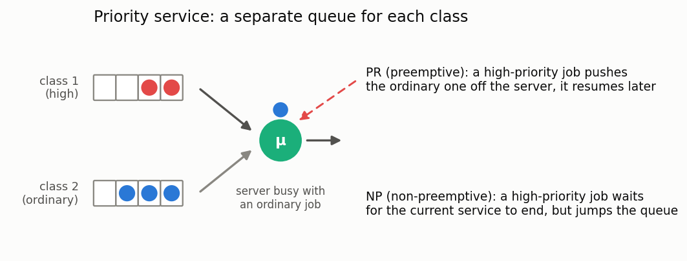

**In plain words:** jobs are divided into importance classes, each class with its own queue.
The server always takes a job from the most important non-empty class. Two modes: **PR**
(preemptive) — an important job evicts an ordinary one right off the server; **NP**
(non-preemptive) — a service once started runs to completion, but the important job then jumps
the queue. The price of priority: lower classes wait longer — many times longer at high load.

### M/G/1/PR (preemptive priority)

**Description:** Single-server system with several priority classes. High-priority jobs may preempt the service of low-priority ones.

**Calculator class:** `MG1PreemptiveCalc`

**Example:**

```python
from most_queue.theory.priority.preemptive.mg1 import MG1PreemptiveCalc

calc = MG1PreemptiveCalc(num_of_classes=3)
calc.set_sources([0.1, 0.2, 0.3])  # arrival rates for each class

# Service time moments for each class
b = [
    [2.0, 4.0, 8.0],  # class 1
    [3.0, 9.0, 27.0], # class 2
    [4.0, 16.0, 64.0] # class 3
]
calc.set_servers(b)

results = calc.run()
```

### M/G/1/NP (non-preemptive priority)

**Description:** Single-server priority system in which a service once started is never interrupted.

**Calculator class:** `MG1NonPreemptiveCalc`

**Example:**

```python
from most_queue.theory.priority.non_preemptive.mg1 import MG1NonPreemptiveCalc

calc = MG1NonPreemptiveCalc(num_of_classes=3)
calc.set_sources([0.1, 0.2, 0.3])
calc.set_servers(b)  # moments for each class
results = calc.run()
```

### M/G/c/PR and M/G/c/NP

**Description:** Multi-server priority systems (preemptive and non-preemptive).

**Calculator class:** `MGnInvarApproximation`

**Example:**

```python
from most_queue.theory.priority.mgn_invar_approx import MGnInvarApproximation

calc = MGnInvarApproximation(n=5, priority="PR")  # or "NP"
calc.set_sources([0.1, 0.2, 0.3])
calc.set_servers(b)
results = calc.run()
```

### M/Ph/c/PR

**Description:** Multi-server system with phase-type service time distribution and priorities.

**Calculator class:** `MPhNPrty`

**Example:** See the test `test_m_ph_n_prty.py`

### M/M/2 with 3 priority classes (PR)

**Description:** Two-server system with three preemptive priority classes, approximated via busy periods.

**Calculator class:** `MM2BusyApprox3Classes` (`most_queue.theory.priority.preemptive.mm2_3cls_busy_approx`)

**Example:** See the test `test_mm2_3cls_prty_busy.py`

### M/M/n with 2 priority classes (PR)

**Description:** Multi-server system with two preemptive priority classes, approximated via busy periods.

**Calculator class:** `MMnPR2ClsBusyApprox` (`most_queue.theory.priority.preemptive.mmn_2cls_pr_busy_approx`)

**Example:** See the test `test_mmn_prty_busy_approx.py`

### M/M/n with m priority classes (PR) — RDR-A

**Description:** Multi-server system with an **arbitrary number of preemptive-resume priority
classes**, solved by the aggregated Recursive Dimensionality Reduction method (RDR-A) of
Harchol-Balter, Osogami, Scheller-Wolf & Wierman. To analyse class *k*, all higher-priority
classes are aggregated into a single stream whose busy period is matched by a Cox-2
distribution, reducing the *m*-class problem to a chain of exact two-class problems. Returns the
per-class mean response and waiting time; the highest class carries full raw moments (exact
M/M/n). Matches simulation within a few percent — aggregation is exact when classes share a
common service rate (the paper's canonical setting), and a load-preserving effective rate is
used otherwise.

**Calculator class:** `RDRAPriorityCalc` (`most_queue.theory.priority.preemptive.rdr_a`)

**Example:**

```python
from most_queue.theory.priority.preemptive.rdr_a import RDRAPriorityCalc

calc = RDRAPriorityCalc(n=3)
calc.set_sources([0.6, 0.6, 0.6, 0.6])  # arrival rates, highest priority first
calc.set_servers([1.0, 1.0, 1.0, 1.0])  # service rates per class
results = calc.run()
# results.v[k][0] — mean sojourn time of class k
```

### M/M/k with m priority classes (PR) — exact reference

**Description:** Exact solver for M/M/k with an arbitrary number of preemptive-resume priority
classes and class-dependent exponential rates. Builds the full continuous-time Markov chain on
the class-count vector, truncated per class, and solves the stationary distribution by
uniformized power iteration. Exact up to truncation (reports the boundary mass as a quality
check). Intended as a **noise-free reference** to validate the RDR / RDR-A approximations — the
state space is `∏(N_i+1)`, so it is practical for small `m` and low-to-moderate load, not for the
lowest class at very high load (which is precisely what RDR is for).

It also computes the **exact per-class response-time second moment** (variance) on request, by
the tagged-job first-passage method (the paper's §2.4), for the standard FCFS-resume within-class
discipline.

**Calculator class:** `MMkPriorityExact` (`most_queue.theory.priority.preemptive.mmk_prty_exact`)

**Example:**

```python
from most_queue.theory.priority.preemptive.mmk_prty_exact import MMkPriorityExact

calc = MMkPriorityExact(n=2, with_variance=True)
calc.set_sources([0.3, 0.3, 0.3])
calc.set_servers([1.2, 1.0, 0.8])
results = calc.run()
# results.v[k][0] — exact mean sojourn of class k
# results.v[k][1] — exact second moment of sojourn (variance = v[k][1] - v[k][0]**2)
# calc.boundary_mass — truncation quality indicator
```

> Note on discipline: the second moment is for **FCFS-resume** (a preempted job resumes in its
> arrival-order position). The mean is discipline-invariant. The discrete-event
> `PriorityQueueSimulator` reinserts a preempted job at the back of its class queue, so its
> higher moments differ from `MMkPriorityExact`'s while its means agree.

### M/PH/PH/k with two priority classes (PR) — exact

**Description:** Exact solver for M/PH/PH/k with two preemptive-resume priority classes, where
**both** classes have phase-type service (the §2.3 base case of RDR). Under FCFS-resume only the
≤ k in-service (and ≤ k frozen) jobs carry a live PH phase, so the CTMC is finite; the low class's
active jobs are tracked as an age-ordered tuple. Returns exact per-class means.

**Calculator class:** `MPhPhK2Class` (`most_queue.theory.priority.preemptive.mph_ph_k_2class`)

**Example:**

```python
from most_queue.theory.priority.preemptive.mph_ph_k_2class import MPhPhK2Class, PhaseType

calc = MPhPhK2Class(n=2)
calc.set_sources(l_high=0.4, l_low=0.4)
calc.set_servers(PhaseType.from_moments([1.0, 9.0, 135.0]), PhaseType.from_moments([1.0, 9.0, 135.0]))
results = calc.run()  # results.v[k][0] — exact mean sojourn of class k
```

### M/PH/k with m priority classes (PR) — RDR-A with phase-type service

**Description:** RDR-A for M/PH/k with an arbitrary number of preemptive-resume priority classes
and **per-class phase-type** service (the paper's Fig 5b/6/10 setting). Aggregates the higher
classes into one PH stream and solves each pair exactly with `MPhPhK2Class`. Matches an independent
FCFS-resume simulation within a couple percent.

**Calculator class:** `RDRAPriorityPH` (`most_queue.theory.priority.preemptive.rdr_a`)

**Example:**

```python
from most_queue.theory.priority.preemptive.rdr_a import RDRAPriorityPH

calc = RDRAPriorityPH(n=2)
calc.set_sources([0.2, 0.2, 0.2, 0.2])                 # arrival rates, highest priority first
calc.set_servers([[1.0, 9.0, 135.0]] * 4)              # 3 service moments per class
results = calc.run()  # results.v[k][0] — mean sojourn of class k

## Systems with vacations

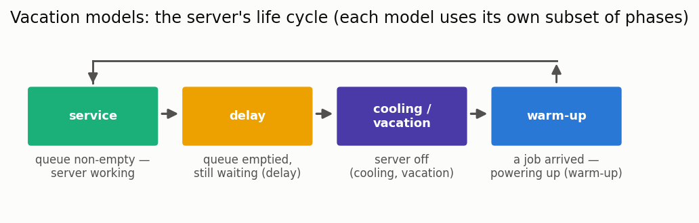

**In plain words:** the server is not always ready to work instantly. After idling it needs a
**warm-up** (machine warm-up, cold start of a server), after emptying the queue it may go into
**cooling/vacation** (power saving, scheduled maintenance), sometimes with a **delay**
(waiting to see whether another job arrives before shutting down). Jobs that arrive "at the
wrong time" have to wait longer — the models in this section compute how much longer.

### M/G/1 with multiple vacations

**Description:** The classical vacation model: having emptied the queue, the server goes on vacation; if it returns to an empty system, it immediately takes the next one. Exact solution via the Fuhrmann–Cooper decomposition: waiting time = M/G/1 waiting time + residual vacation time.

**In plain words:** a server that "keeps napping" while there is no work (power saving,
background tasks). The price jobs pay for vacations is on average half the vacation "length"
adjusted for its variability, independently of the load.

**Calculator class:** `MG1MultipleVacationsCalc` (`most_queue.theory.vacations.mg1_vacations`)
**Simulation:** `VacationQueueingSystemSimulator(1, is_multiple_vacations=True)` + `set_cold(...)`

**Example:**

```python
from most_queue.theory.vacations.mg1_vacations import MG1MultipleVacationsCalc
from most_queue.random.distributions import GammaDistribution

b = GammaDistribution.calc_theory_moments(
    GammaDistribution.get_params_by_mean_and_cv(0.7, 1.2), 5)
vac = GammaDistribution.calc_theory_moments(
    GammaDistribution.get_params_by_mean_and_cv(1.5, 1.2), 4)

calc = MG1MultipleVacationsCalc()
calc.set_sources(l=1.0)
calc.set_servers(b)
calc.set_vacations(vac)
results = calc.run()  # k moments of W require k+1 vacation moments
```

### M/G/1 under N-policy


**Description:** The server switches off when the system empties and switches back on only once N jobs have accumulated; it then serves until the system is empty again. Exact solution: the extra term added to the M/G/1 waiting time is an Erlang mixture, on average (N−1)/(2λ).

**In plain words:** saving on "start-ups": the larger N, the less often the server starts, but
the longer the first accumulated jobs wait. A model for choosing the threshold N (batch start
of equipment, infrequent shuttle runs). N=1 is the ordinary M/G/1.

**Calculator class:** `MG1NPolicyCalc` (`most_queue.theory.vacations.mg1_vacations`)
**Simulation:** `NPolicyQueueSim(1, big_n=N)`

### M/G/1 with an unreliable server (breakdowns & repairs)

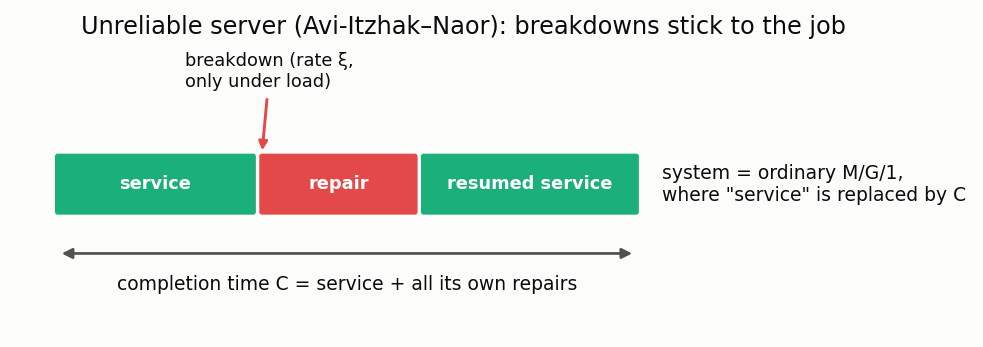

**Description:** The server fails at Poisson rate ξ while serving; the repair time has a general distribution; the interrupted job resumes from where it stopped. Exact reduction to an M/G/1 with a "completion time" (service plus its own repairs) — Avi-Itzhak–Naor (1963).

**In plain words:** a machine that breaks under load: a job occupies the server for its service
time plus all the repairs that happen during it. The cumulants of the completion time are
computed in closed form, after which the ordinary Pollaczek–Khinchine formula applies.

**Calculator class:** `MG1UnreliableCalc` (`most_queue.theory.vacations.mg1_unreliable`)
**Simulation:** `UnreliableQueueSim` (`most_queue.sim.unreliable`)

**Example:**

```python
from most_queue.theory.vacations.mg1_unreliable import MG1UnreliableCalc
from most_queue.random.distributions import GammaDistribution

b = GammaDistribution.calc_theory_moments(
    GammaDistribution.get_params_by_mean_and_cv(0.5, 1.2), 5)
r = GammaDistribution.calc_theory_moments(
    GammaDistribution.get_params_by_mean_and_cv(0.4, 1.2), 5)

calc = MG1UnreliableCalc()
calc.set_sources(l=1.0)
calc.set_servers(b)
calc.set_breakdowns(xi=0.3, repair=r)
results = calc.run()
```

### M/H₂/c with warm-up

**Description:** Multi-server system with hyperexponential service and server warm-up.

**Calculator class:** `MH2nH2Warm`

**Example:**

```python
from most_queue.theory.vacations.m_h2_h2warm import MH2nH2Warm

calc = MH2nH2Warm(n=3)
# Configure the warm-up and service parameters
# (see the test test_m_h2_h2warm.py)
```

### M/M/n with H2 cooling and H2 warm-up

**Description:** Multi-server system with exponential service and hyperexponential cooling and warm-up.

**Calculator class:** `MMnHyperExpWarmAndCold` (`most_queue.theory.vacations.mmn_with_h2_cold_and_h2_warmup`)

**Example:** See the test `test_mmn_h2cold_h2warm.py`

### M/G/1 with warm-up

**Description:** Single-server system with warm-up.

**Calculator class:** `MG1WarmCalc`

### M/Ph/c with warm-up, delay, and vacations

**Description:** A complex system with H₂ service, H₂ warm-up, H₂ delay, and H₂ vacations.

**Calculator class:** `MGnH2ServingColdWarmDelay`

**Example:** See the test `test_mgn_with_h2_delay_cold_warm.py`

## Systems with negative customers

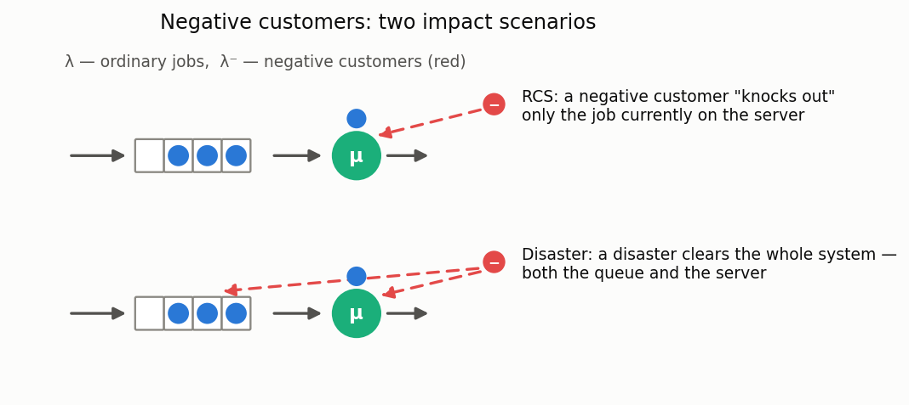

**In plain words:** in addition to ordinary jobs, a second, "malicious" stream arrives —
negative customers (Gelenbe, G-networks). Such a customer is not served itself but destroys
someone else's work: in the **RCS** variant it knocks the job off the server (a failure, a
virus, a task cancellation); in the **disaster** variant it wipes out the whole system (a
reboot, a catastrophe). The models compute how much is ultimately lost and how much longer the
surviving jobs take.

### M/G/1 RCS (Remove Customer from Service)

**Description:** A system where negative customers remove the job in service.

**Calculator class:** `MG1NegativeCalcRCS`

**Example:**

```python
from most_queue.theory.negative.mg1_rcs import MG1NegativeCalcRCS

calc = MG1NegativeCalcRCS()
calc.set_sources(l=0.5, l_neg=0.1)  # l_neg - arrival rate of negative customers
calc.set_servers(b)
results = calc.run()
```

### M/G/1 Disaster

**Description:** Single-server system where a negative customer removes all jobs from the system.

**Calculator class:** `MG1Disasters` (`most_queue.theory.negative.mg1_disasters`)

**Example:** See the test `test_mg1_disaster.py`

### M/G/c RCS

**Description:** Multi-server system with RCS-type negative customers.

**Calculator class:** `MGnNegativeRCSCalc`

### M/G/c Disaster

**Description:** A system where negative customers remove all jobs from the system (both from the queue and from service).

**Calculator class:** `MGnNegativeDisasterCalc`

**Example:** See the tests `test_mgn_disaster.py` and `test_mg1_disaster.py`

## Fork-Join systems

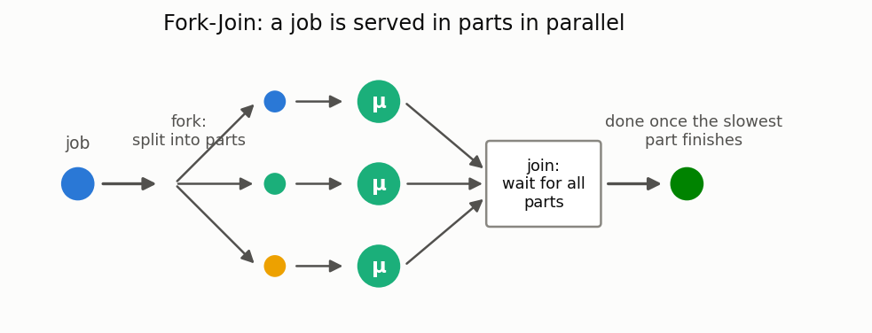

**In plain words:** on arrival, a job splits (fork) into several parts, the parts are served
in parallel on different servers, and the result is ready only when all parts are collected
(join). This is how parallel computing, RAID arrays, and distributed queries (map-reduce) work.
The response time is determined by the *slowest* part — which is why the mean sojourn time
grows with the number of parts even for the same total amount of work.

### M/M/c Fork-Join

**Description:** A system where a job splits into several parts served in parallel and then rejoined.

**Calculator class:** `ForkJoinMarkovianCalc`

**Example:**

```python
from most_queue.theory.fork_join.m_m_n import ForkJoinMarkovianCalc

calc = ForkJoinMarkovianCalc(n=5, k=2)  # 5 servers, 2 required
calc.set_sources(l=1.0)
calc.set_servers(mu=1.0)
results = calc.run()
```

### M/G/c Split-Join

**Description:** A Split-Join system with a general service time distribution.

**In plain words:** the strict variant of Fork-Join — the next job does not begin service until
the previous one has been fully reassembled (a synchronous batch pipeline).

**Calculator class:** `SplitJoinCalc`

**Example:** See the test `test_fj_sim.py`

## Systems with batch arrivals

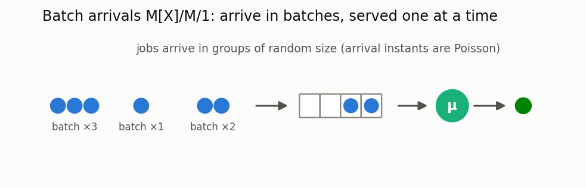

**In plain words:** jobs arrive not one at a time but in batches of random size — a bus full of
tourists, a bundle of transactions, a batch of tasks from a scheduler. Even at the same average
arrival rate, batching noticeably lengthens the queue: jobs that arrive together are forced to
wait for one another.

### M^x/M/1

**Description:** A system where jobs arrive in batches of random size.

**Calculator class:** `BatchMM1`

**Example:**

```python
from most_queue.theory.batch.mm1 import BatchMM1

calc = BatchMM1()
# Batch size probabilities: [p(1), p(2), p(3), ...]
batch_probs = [0.2, 0.3, 0.1, 0.2, 0.2]
calc.set_sources(l=0.5, batch_probs=batch_probs)
calc.set_servers(mu=1.0)
results = calc.run()
```

## Systems with impatient jobs


**In plain words:** each job has its own random "patience budget"; if its turn does not come in
time, it leaves unserved (an abandoned call in a call center, a cancelled order, a timed-out
request). The key questions for the model: what fraction of customers is lost, and how this
depends on the number of servers.

### M/M/1/D (with exponential impatience)

**Description:** A system where jobs may leave the queue if the wait is too long.

**Calculator class:** `MM1Impatience`

**Example:** See the test `test_impatience.py`

### Erlang-A (M/M/n+M)

**Description:** The multi-server abandonment model: n servers, Poisson arrivals, exponential service, and an exponential patience clock for every waiting job. Always stable; the workhorse of call-center staffing (Palm; Garnett–Mandelbaum–Reiman).

**In plain words:** the realistic call center: some callers hang up before an agent answers.
The model answers the two staffing questions at once — what fraction of customers is lost and
how many servers are needed to keep that fraction below a target
(`find_min_servers`).

**Calculator class:** `MMnImpatienceCalc` (`most_queue.theory.impatience.mmn`)
**Simulation:** `ImpatientQueueSim`

**Example:**

```python
from most_queue.theory.impatience.mmn import MMnImpatienceCalc

calc = MMnImpatienceCalc(n=3, theta=0.3)  # theta — impatience rate
calc.set_sources(1.0)
calc.set_servers(0.5)
results = calc.run()
p_abandon = calc.get_abandonment_probability()
n_needed = calc.find_min_servers(target_abandonment=0.05)
```

## Retrial queues

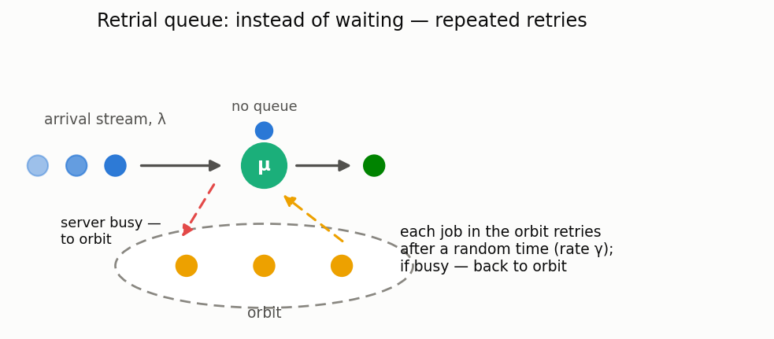

**In plain words:** there is no waiting room at all: a job that finds the server busy goes to
an invisible **orbit** and retries after a random time (a caller who got a busy tone and dials
again). Compared with an ordinary queue, the server sometimes idles while jobs sit in orbit —
so waits are longer, and the slower the retries (small γ), the worse it gets.

### M/M/1 retrial

**Description:** Classical (linear) retrial policy: each of j orbiting jobs retries at rate γ. Solved exactly by adaptive truncation of the level-dependent chain.

**Calculator class:** `MM1RetrialCalc` (`most_queue.theory.retrial`)
**Simulation:** `RetrialQueueSim` (`most_queue.sim.retrial`)

**Example:**

```python
from most_queue.theory.retrial import MM1RetrialCalc

calc = MM1RetrialCalc(gamma=0.7)
calc.set_sources(1.0)
calc.set_servers(1.43)
results = calc.run()
orbit_mean = calc.get_orbit_mean()
```

### M/G/1 retrial

**Description:** General service times; mean orbit size and waiting in closed form (Falin–Templeton): E[N_o] = λ²b₂/(2(1−ρ)) + λρ/(γ(1−ρ)). As γ→∞ the ordinary M/G/1 is recovered.

**In plain words:** the retrial penalty is an additive term on top of the ordinary M/G/1
queue length — it grows as retries become lazier. The formula was verified in this library
against the exact M/M/1-retrial solution and against simulation.

**Calculator class:** `MG1RetrialCalc` (`most_queue.theory.retrial`)
**Simulation:** `RetrialQueueSim`

## Matrix-analytic models (MAP/PH)

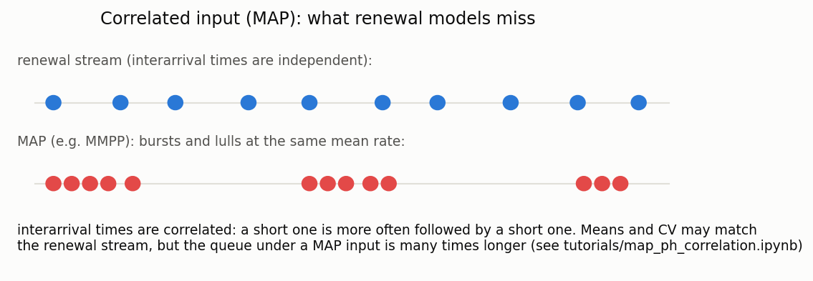

**In plain words:** real traffic is bursty — a short interarrival gap tends to be followed by
another short one. The Markovian Arrival Process (MAP) captures this correlation with a pair of
matrices (D₀, D₁); phase-type (PH) distributions play the same role for service times. The
MAP/PH/1 queue is solved **exactly** by the matrix-geometric (QBD) method — and the answer can
differ from a renewal model with identical mean/CV by several times
(see [`tutorials/map_ph_correlation.ipynb`](../tutorials/map_ph_correlation.ipynb)).

New to PH and MAP? They are introduced step by step — with diagrams showing how Exp, Erlang,
H₂ and Coxian are all special cases of PH, and how the MMPP works — in the
[distributions reference](distributions.md#phase-type-distributions-ph).

### MAP/PH/1

**Description:** Correlated arrivals, phase-type service, one server. Stationary distribution via the QBD logarithmic-reduction method (Latouche–Ramaswami); waiting-time moments by differentiating the arriving-job LST.

**Calculator class:** `MapPh1Calc` (`most_queue.theory.matrix.map_ph1`)
**Simulation:** `QsSim` with `set_sources(map_params, "MAP")` and `set_servers(ph_params, "PH")`

**Example:**

```python
import numpy as np
from most_queue.random.distributions import H2Distribution
from most_queue.random.map_ph import MAP, PHDistribution
from most_queue.theory.matrix.map_ph1 import MapPh1Calc

mmpp = MAP.mmpp([2.0, 0.4], np.array([[-0.2, 0.2], [0.3, -0.3]]))  # bursty arrivals
# any PH: from_exp / from_erlang / from_h2 / from_cox, or a custom (alpha, T)
service = PHDistribution.from_h2(H2Distribution.get_params_by_mean_and_cv(0.5, 1.2))

calc = MapPh1Calc()
calc.set_sources(mmpp)
calc.set_servers(service)
results = calc.run()
```

### M/PH/1 and PH/PH/1

**Description:** Special cases via the same QBD engine: `MPh1Calc` (Poisson arrivals) reproduces Pollaczek–Khinchine exactly; `PhPh1Calc` (renewal PH arrivals) covers GI/PH-type single-server systems.

**Calculator classes:** `MPh1Calc`, `PhPh1Calc` (`most_queue.theory.matrix.map_ph1`)

### MAP/M/c

**Description:** Correlated arrivals with **c** exponential servers, solved as a level-dependent-boundary QBD (levels 0..c-1 encode the number of busy servers, homogeneous from level c on). The realistic model of a call center or data center fed by bursty traffic.

**In plain words:** the multi-server companion of MAP/PH/1 — Erlang C, but with the arrival
burstiness that Erlang C ignores. A one-phase (Poisson) MAP reproduces Erlang C exactly; a
bursty MAP with the same rate produces a much longer wait.

**Calculator class:** `MapMMcCalc` (`most_queue.theory.matrix.map_mmc`)
**Simulation:** `QsSim(c)` with `set_sources(map_params, "MAP")` and `set_servers(mu, "M")`

**Example:**

```python
import numpy as np
from most_queue.random.map_ph import MAP
from most_queue.theory.matrix.map_mmc import MapMMcCalc

mmpp = MAP.mmpp([2.5, 0.5], np.array([[-0.15, 0.15], [0.25, -0.25]]))  # bursty arrivals

calc = MapMMcCalc(n=3)  # 3 servers
calc.set_sources(mmpp)
calc.set_servers(mu=1.0)
results = calc.run()  # state probabilities + Little-law means
```

### MAP/PH/c

**Description:** The most general single-station model here: correlated MAP arrivals, phase-type service and c servers. Solved as a QBD whose phase is the MAP phase times the multiset of the busy servers' service phases.

**In plain words:** combines everything — bursty arrivals *and* variable (phase-type) service
*and* multiple servers. Reduces exactly to MAP/M/c (exponential service), MAP/PH/1 (one server)
and the Takahashi–Takami M/H₂/c (Poisson arrivals). The service-phase space grows
combinatorially, so keep the PH order and c modest (e.g. 2-phase service, c ≤ 6).

**Calculator class:** `MapPhCCalc` (`most_queue.theory.matrix.map_phc`)
**Simulation:** `QsSim(c)` with `set_sources(map_params, "MAP")` and `set_servers(ph_params, "PH")`

### BMAP/M/1

**Description:** **Batch** Markovian arrivals (jobs arrive in correlated batches) served by a single exponential server. Because a batch raises the level by more than one, this is an M/G/1-type chain; it is solved here by robust level truncation.

**In plain words:** traffic that arrives in bursts of several jobs at once (packet trains, bulk
orders), with the batch process itself Markov-modulated. Reduces exactly to M^[X]/M/1
(Poisson batches) and to MAP/M/1 (batches of size one).

**Calculator class:** `BmapM1Calc` (`most_queue.theory.matrix.bmap_m1`)

**Example:**

```python
from most_queue.random.map_ph import bmap_poisson_batch
from most_queue.theory.matrix.bmap_m1 import BmapM1Calc

# batches arrive Poisson(rate=0.5); size 1..5 with these probabilities
bmap = bmap_poisson_batch(0.5, [0.2, 0.3, 0.1, 0.2, 0.2])

calc = BmapM1Calc()
calc.set_sources(bmap)
calc.set_servers(mu=2.5)
results = calc.run()
```

### BMAP/PH/1

**Description:** Batch Markovian arrivals with **phase-type** service — the general-service member of the BMAP family. Solved by level truncation over (level, BMAP phase, service phase). A general (non-PH) service time is handled by first fitting a PH distribution to its moments.

**In plain words:** bursty batch traffic meeting variable (not just exponential) service.
Reduces exactly to BMAP/M/1 (exponential service) and to MAP/PH/1 (batches of size one).

**Calculator class:** `BmapPh1Calc` (`most_queue.theory.matrix.bmap_ph1`)
**Simulation:** `BmapPh1Sim` (`most_queue.sim.bmap`)

**Example:**

```python
from most_queue.random.map_ph import bmap_poisson_batch, PHDistribution
from most_queue.random.distributions import H2Distribution
from most_queue.theory.matrix.bmap_ph1 import BmapPh1Calc

bmap = bmap_poisson_batch(0.4, [0.2, 0.3, 0.1, 0.2, 0.2])
service = PHDistribution.from_h2(H2Distribution.get_params_by_mean_and_cv(0.5, 1.3))

calc = BmapPh1Calc()
calc.set_sources(bmap)
calc.set_servers(service)
results = calc.run()
```

## Closed systems

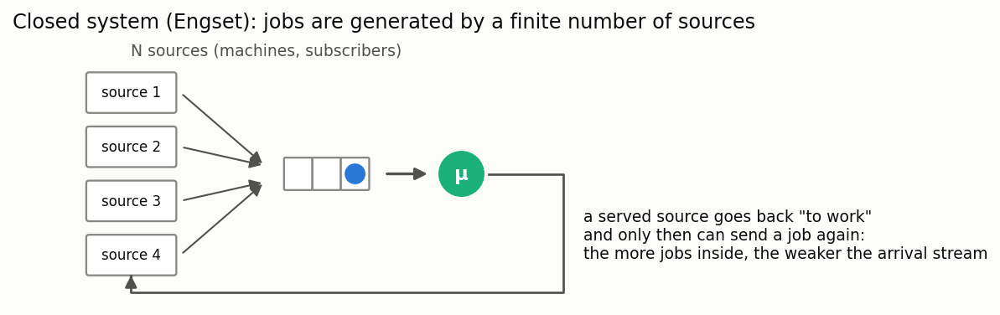

**In plain words:** jobs are generated by a finite set of N sources (machines calling a single
repairman; terminals querying a server). While a source is waiting for service, it generates no
new jobs — so the longer the queue, the weaker the arrival stream: the system "self-regulates",
and formulas assuming an infinite stream overstate the load here.

### Engset (M/M/1/N)

**Description:** A system with a finite number of job sources.

**Calculator class:** `Engset`

**Example:**

```python
from most_queue.theory.closed.engset import Engset

calc = Engset()
calc.set_sources(N=10, lambda_source=0.5)  # 10 sources
calc.set_servers(mu=1.0)
results = calc.run()
```

## Model comparison table

| Model | Calculator class | Simulation | Priorities | Notes |
|--------|--------------|-----------|------------|-------------|
| M/M/c | MMnrCalc | QsSim | - | Basic model |
| M/M/n/0 (Erlang B) | ErlangBCalc | QsSim(buffer=0) | - | Loss, M/G/n/0 insensitivity |
| M/M/n (Erlang C) | ErlangCCalc | QsSim | - | Waiting probability, W moments |
| M/G/∞ | MGInfCalc | QsSim(n>>a) | - | Infinitely many servers |
| M/G/1 | MG1Calc | QsSim | - | General service |
| M/G/1 SRPT | MG1SrptCalc | SizeBasedQsSim | - | Size-based, Schrage–Miller |
| M/G/1 SJF | MG1SjfCalc | SizeBasedQsSim | - | Non-preemptive by size |
| M/G/1 PSJF | MG1PsjfCalc | SizeBasedQsSim | - | Preemptive by original size |
| M/G/1 SPJF | MG1SpjfCalc | SizeBasedQsSim | - | By prediction Y |
| M/G/1 FB/LAS | MG1FbCalc | FBSim | - | Blind, by attained service |
| M/G/1 PS | MG1PSCalc | ProcessorSharingSim | - | Equal sharing, slowdown 1/(1−ρ) |
| M/G/1 LCFS-PR | MG1LcfsPrCalc | LcfsPRSim | - | Sojourn = busy period |
| GI/M/1 | GIM1Calc | QsSim | - | General arrivals |
| GI/G/1, GI/G/m (approx) | GIG1ApproxCalc, GIGmApproxCalc | QsSim | - | Kingman/KLB/Allen–Cunneen, w1 only |
| M/G/c/PR | MGnInvarApproximation | PriorityQueueSimulator | Yes | Preemptive priority |
| M/G/c/NP | MGnInvarApproximation | PriorityQueueSimulator | Yes | Non-preemptive priority |
| M/G/1 multiple vacations | MG1MultipleVacationsCalc | VacationQueueingSystemSimulator | - | Fuhrmann–Cooper |
| M/G/1 N-policy | MG1NPolicyCalc | NPolicyQueueSim | - | Activation threshold N |
| M/G/1 unreliable | MG1UnreliableCalc | UnreliableQueueSim | - | Breakdowns+repairs, completion time |
| Fork-Join | ForkJoinMarkovianCalc | ForkJoinSim | - | Parallel service |
| M^x/M/1 | BatchMM1 | QueueingSystemBatchSim | - | Batch arrivals |
| Erlang-A (M/M/n+M) | MMnImpatienceCalc | ImpatientQueueSim | - | Abandonment, staffing helper |
| M/M/1 retrial | MM1RetrialCalc | RetrialQueueSim | - | Orbit, exact truncated chain |
| M/G/1 retrial | MG1RetrialCalc | RetrialQueueSim | - | Falin–Templeton closed form |
| MAP/PH/1 | MapPh1Calc | QsSim("MAP", "PH") | - | Correlated arrivals, QBD |
| M/PH/1, PH/PH/1 | MPh1Calc, PhPh1Calc | QsSim | - | QBD special cases |
| MAP/M/c | MapMMcCalc | QsSim("MAP","M") | - | Multi-server, correlated arrivals |
| MAP/PH/c | MapPhCCalc | QsSim("MAP","PH") | - | Multi-server, correlated arrivals + PH service |
| BMAP/M/1 | BmapM1Calc | - | - | Batch (correlated) arrivals |
| BMAP/PH/1 | BmapPh1Calc | BmapPh1Sim | - | Batch arrivals + PH service |
| Engset | Engset | QueueingFiniteSourceSim | - | Finite number of sources |

## Choosing a model

1. **Start with a simple model** — M/M/c for a baseline understanding
2. **Account for real data** — choose distributions that match your data
3. **Use simulation for validation** — compare calculation and simulation results
4. **Account for system features** — priorities, vacations, constraints

## Usage examples

Every model has usage examples in the `tests/` folder. It is recommended to study the corresponding tests for the details of usage.

---

**See also:**
- [Queueing system simulation](simulation.md) — discrete-event simulation
- [Numerical methods](calculation.md) — analytical calculations
- [Priority systems](priorities.md) — details of working with priorities
- [Queueing networks](networks.md) — network modeling
