# Каталог поддерживаемых моделей СМО

[🇬🇧 English version](models.md)

Библиотека Most-Queue поддерживает широкий спектр моделей систем массового обслуживания. Этот каталог содержит описание всех доступных моделей с примерами использования.

Каждый раздел открывается схемой и объяснением «на пальцах». Схемы генерируются скриптом
[`figures/generate_figures.py`](figures/generate_figures.py) — при добавлении новой модели
добавьте функцию-схему туда и перегенерируйте: `python docs/figures/generate_figures.py`.

**Как читать нотацию Кендалла A/B/c:** первая буква — закон входящего потока, вторая — закон
времени обслуживания, третья — число приборов. `M` — экспоненциальный («без памяти»,
пуассоновский поток), `G`/`GI` — произвольный, `D` — детерминированный (постоянный),
`H₂` — гиперэкспоненциальный (смесь двух экспонент, большой разброс), `Ek` — Эрланга
(сумма k экспонент, малый разброс), `Ph` — фазовый.

## FIFO системы (дисциплина First In First Out)


**Простыми словами:** заявки (клиенты, задачи, пакеты) приходят в случайные моменты, встают
в общую очередь и обслуживаются в порядке прихода первым освободившимся прибором. Разница
между моделями этого раздела — только в том, насколько «случайны» поток и обслуживание:
от полностью бес­памятных M/M/c до произвольных распределений, приближаемых гиперэкспонентой
(метод Такахаси-Таками).

### M/M/c

**Описание:** Многоканальная система с пуассоновским потоком и экспоненциальным обслуживанием.

**Суть:** «идеальный колл-центр» — и промежутки между звонками, и длительности разговоров
случайны и не зависят от прошлого. Простейшая многоканальная модель, все характеристики
считаются точно; с неё стоит начинать любой анализ.

**Класс расчета:** `MMnrCalc`

**Пример:**

```python
from most_queue.theory.fifo.mmnr import MMnrCalc

calc = MMnrCalc(n=3)  # 3 канала
calc.set_sources(l=2.0)
calc.set_servers(mu=1.0)
results = calc.run()
```

### M/M/c/r

**Описание:** M/M/c с ограниченной очередью (максимум r мест в очереди).

**Суть:** то же, что M/M/c, но мест в «зале ожидания» всего r: заявка, пришедшая в полную
систему, получает отказ и теряется. Модель для систем с конечным буфером (телефония,
сетевое оборудование).

**Класс расчета:** `MMnrCalc`

**Пример:**

```python
from most_queue.theory.fifo.mmnr import MMnrCalc

calc = MMnrCalc(n=3, r=20)  # 3 канала, очередь до 20
calc.set_sources(l=2.0)
calc.set_servers(mu=1.0)
results = calc.run()
```

### M/M/n/0 — Erlang B (система с потерями)

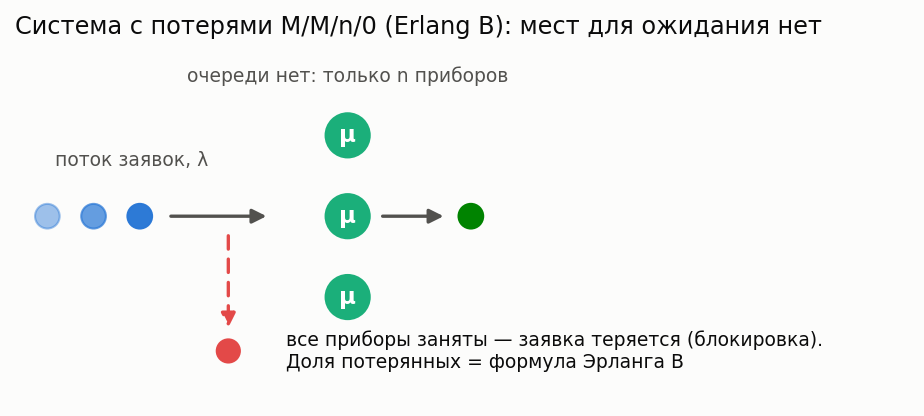

**Описание:** Классическая система с потерями: очереди нет, заявка, заставшая все n приборов занятыми, теряется. Вероятность блокировки — формула Эрланга B (устойчивая рекурсия).

**Суть:** сколько нужно телефонных линий (коек, парковочных мест), чтобы терять не больше
заданной доли клиентов. По теореме Севастьянова блокировка не зависит от формы распределения
обслуживания — только от его среднего, поэтому результат верен и для M/G/n/0.

**Класс расчета:** `ErlangBCalc` (`most_queue.theory.fifo.erlang`)

**Пример:**

```python
from most_queue.theory.fifo.erlang import ErlangBCalc

calc = ErlangBCalc(n=3)
calc.set_sources(l=2.0)
calc.set_servers(mu=1.0)
results = calc.run()
blocking = calc.get_blocking_probability()
```

### M/M/n — Erlang C (система с ожиданием)

**Описание:** Многоканальная система с бесконечной очередью. Вероятность ожидания — формула Эрланга C; моменты времени ожидания в замкнутой форме.

**Суть:** базовая модель staffing: какова вероятность, что клиенту придётся ждать, и сколько.
Ожидание либо нулевое (есть свободный прибор), либо экспоненциальное — отсюда все моменты
одной формулой.

**Класс расчета:** `ErlangCCalc` (`most_queue.theory.fifo.erlang`)

**Пример:**

```python
from most_queue.theory.fifo.erlang import ErlangCCalc

calc = ErlangCCalc(n=3)
calc.set_sources(l=2.0)
calc.set_servers(mu=1.0)
results = calc.run()
p_wait = calc.get_waiting_probability()
```

### M/G/∞ (бесконечное число приборов)

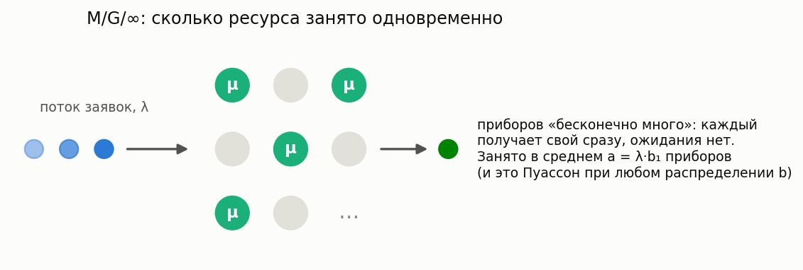

**Описание:** Каждой заявке мгновенно достаётся свой прибор: ожидания нет, число занятых приборов имеет пуассоновское распределение со средним λ·b₁ независимо от формы распределения обслуживания (нечувствительность).

**Суть:** модель «изобильного» ресурса — активные сессии, звонки в большой сети, машины
на трассе. Ответ на вопрос «сколько ресурса реально занято одновременно» и строительный
блок для staffing-аппроксимаций.

**Класс расчета:** `MGInfCalc` (`most_queue.theory.fifo.m_g_inf`)

**Пример:**

```python
from most_queue.theory.fifo.m_g_inf import MGInfCalc
from most_queue.random.distributions import GammaDistribution

calc = MGInfCalc()
calc.set_sources(l=1.0)

gamma_params = GammaDistribution.get_params_by_mean_and_cv(2.0, 1.2)
b = GammaDistribution.calc_theory_moments(gamma_params, 4)
calc.set_servers(b=b)

results = calc.run()
busy_mean = calc.get_offered_load()  # среднее число занятых приборов
```

### M/G/1

**Описание:** Одноканальная система с пуассоновским потоком и произвольным распределением времени обслуживания.

**Суть:** один прибор, время обслуживания — любое (задаётся начальными моментами). Классика
Полячека–Хинчина: очередь растёт не только от загрузки, но и от *разброса* времени
обслуживания — при одинаковом среднем система с редкими «тяжёлыми» заявками ждёт гораздо
дольше, чем с одинаковыми.

**Класс расчета:** `MG1Calc`

**Пример:**

```python
from most_queue.theory.fifo.mg1 import MG1Calc
from most_queue.random.distributions import H2Distribution

calc = MG1Calc()
calc.set_sources(l=0.5)

h2_params = H2Distribution.get_params_by_mean_and_cv(mean=2.0, cv=0.8)
b = H2Distribution.calc_theory_moments(h2_params, 5)
calc.set_servers(b)

results = calc.run()
```

Следующие четыре модели — **size-based дисциплины**: прибор выбирает, кого обслуживать,
глядя на *размер* заявки (известный или предсказанный), а не на порядок прихода. Вот как
одни и те же заявки проходят через один прибор при разных дисциплинах:

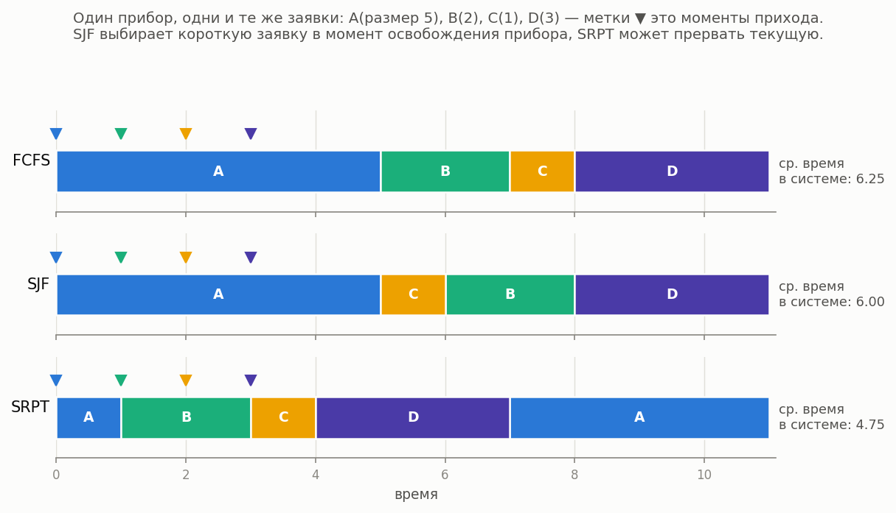

### M/G/1 SRPT

**Описание:** Одноканальная M/G/1 с дисциплиной **Shortest Remaining Processing Time** (прерывание по остатку работы). Численно: формула Schrage–Miller (1966).

**Суть:** прибор всегда занят заявкой, которой *осталось* меньше всего работы; если пришла
более короткая — текущая прерывается и ждёт (см. на схеме выше, как заявка A уступает место
и дообслуживается в конце). SRPT доказуемо минимизирует среднее время пребывания среди всех
дисциплин.

**Класс расчета:** `MG1SrptCalc`  
**Симуляция:** `SizeBasedQsSim(discipline="SRPT")` — размер заявки сэмплируется при приходе.

**Пример:**

```python
from most_queue.theory.srpt import MG1SrptCalc
from most_queue.random.distributions import H2Distribution

calc = MG1SrptCalc()
calc.set_sources(1.0)
h2 = H2Distribution.get_params_by_mean_and_cv(0.7, 1.2)
calc.set_servers(h2, "H")
results = calc.run()
```

### M/G/1 SJF (SPT)

**Описание:** Непрерываемое обслуживание по **наименьшему истинному размеру** (Shortest Job First / Shortest Processing Time).

**Суть:** без прерываний — в момент освобождения прибора из очереди берётся самая короткая
заявка, но начатое обслуживание всегда доводится до конца.

**Класс расчета:** `MG1SjfCalc`  
**Симуляция:** `SizeBasedQsSim(discipline="SJF")`

### M/G/1 PSJF

**Описание:** Прерываемое обслуживание по **исходному** размеру заявки (отличается от SRPT).

**Суть:** как SRPT, но сравнивается *полный исходный* размер, а не остаток: почти
дообслуженная длинная заявка всё равно уступит новой короткой.

**Класс расчета:** `MG1PsjfCalc`  
**Симуляция:** `SizeBasedQsSim(discipline="PSJF")`

### M/G/1 SPJF (с предсказаниями)

**Описание:** Непрерываемое обслуживание по **предсказанному** размеру \(Y\) (Mitzenmacher, 2020). Совместное распределение \((X,Y)\) задаётся объектом предиктора (`PerfectPredictor`, `ExpNoisePredictor`, …).

**Суть:** истинный размер заявки неизвестен, но есть его *предсказание* (например, от
ML-модели) — обслуживаем короткие «по прогнозу». Модель отвечает на вопрос, сколько
выигрыша от SJF сохраняется при неточных предсказаниях. При идеальном предикторе
переходит в SJF.

**Класс расчета:** `MG1SpjfCalc`  
**Симуляция:** `SizeBasedQsSim(discipline="SPJF")` + `set_predictor(...)`.

**Пример:**

```python
from most_queue.theory.srpt import MG1SpjfCalc
from most_queue.theory.srpt.utils.predictor import ExpNoisePredictor

calc = MG1SpjfCalc()
calc.set_sources(0.5)
calc.set_servers(1.0, "M")
calc.set_predictor(ExpNoisePredictor())
results = calc.run()
```

Следующие три дисциплины (FB, PS, LCFS-PR) дополняют size-based семейство. Кто из них
как обращается с заявками разного размера — считают сами калькуляторы библиотеки:


### M/G/1 FB (Foreground-Background / LAS)

**Описание:** Прерывающая **blind**-дисциплина: прибор всегда обслуживает заявку с наименьшим *полученным* обслуживанием (least attained service); при равенстве — делится поровну. Размеры заявок знать не нужно.

**Суть:** «дадим шанс новичкам»: свежая заявка сразу получает прибор и держит его, пока не
догонит по обслуженному объёму остальных. Если короткие заявки часты (убывающий hazard rate,
CV > 1) — FB приближается к SRPT, не зная размеров; если время обслуживания почти постоянное —
FB проигрывает даже FCFS. Экспоненциальное обслуживание — граница: FB совпадает с PS.

**Класс расчета:** `MG1FbCalc` (`most_queue.theory.srpt`)
**Симуляция:** `FBSim` (`most_queue.sim.single_server_disciplines`)

**Пример:**

```python
from most_queue.theory.srpt import MG1FbCalc
from most_queue.random.distributions import GammaDistribution

calc = MG1FbCalc()
calc.set_sources(1.0)
calc.set_servers(GammaDistribution.get_params_by_mean_and_cv(0.7, 1.2), "Gamma")
results = calc.run()
```

### M/G/1 PS (Processor Sharing)

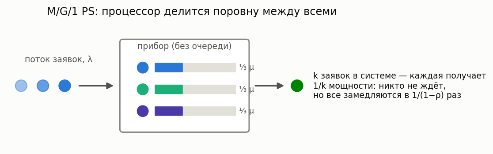

**Описание:** Прибор делится поровну между всеми находящимися заявками (каждая из k заявок обслуживается со скоростью 1/k). Вероятности состояний — геометрические, нечувствительные к форме распределения обслуживания; условное среднее время пребывания заявки размера x — ровно x/(1−ρ).

**Суть:** модель процессора, веб-сервера, разделяемого канала: никто не ждёт «в очереди»,
но все замедляются в одинаковое число раз 1/(1−ρ). Идеально справедливая дисциплина —
baseline для сравнения с SRPT/SJF (которые быстрее в среднем, но за счёт длинных заявок).
Пока считаются только средние (старшие моменты — методы Яшкова/Отта, отложено).

**Класс расчета:** `MG1PSCalc` (`most_queue.theory.fifo.mg1_ps`)
**Симуляция:** `ProcessorSharingSim` (`most_queue.sim.single_server_disciplines`)

**Пример:**

```python
from most_queue.theory.fifo.mg1_ps import MG1PSCalc

calc = MG1PSCalc()
calc.set_sources(l=1.0)
calc.set_servers([0.7, 1.2])  # моменты времени обслуживания
results = calc.run()
slowdown = calc.get_mean_slowdown()          # 1/(1-rho)
t_x = calc.get_conditional_sojourn_mean(2.0)  # x/(1-rho)
```

### M/G/1 LCFS-PR

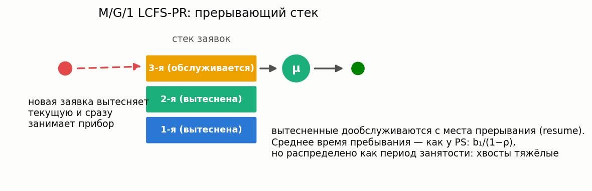

**Описание:** Прерывающий стек: новая заявка вытесняет обслуживаемую, вытесненные дообслуживаются с места прерывания. Время пребывания распределено как период занятости M/G/1 — все моменты по рекурсиям Такача; вероятности состояний — те же геометрические (BCMP).

**Суть:** «последний пришёл — первый обслужен»: свежая заявка получает прибор сразу,
но рискует быть вытесненной. Среднее время пребывания то же, что у PS (b₁/(1−ρ),
нечувствительность к форме распределения), но разброс гораздо больше — хвосты как у
периода занятости. У FCFS среднее другое: оно зависит ещё и от b₂ (Полячек–Хинчин).

**Класс расчета:** `MG1LcfsPrCalc` (`most_queue.theory.fifo.mg1_lcfs_pr`)
**Симуляция:** `LcfsPRSim` (`most_queue.sim.single_server_disciplines`)

### GI/M/1

**Описание:** Одноканальная система с общим потоком поступления и экспоненциальным обслуживанием.

**Суть:** зеркальная к M/G/1 ситуация — теперь «произвольная» сторона не обслуживание,
а входящий поток: промежутки между приходами имеют любое распределение (задаётся моментами),
обслуживание — экспоненциальное.

**Класс расчета:** `GIM1Calc`

**Пример:**

```python
from most_queue.theory.fifo.gi_m_1 import GIM1Calc
from most_queue.random.distributions import GammaDistribution

calc = GIM1Calc()

gamma_params = GammaDistribution.get_params_by_mean_and_cv(mean=2.0, cv=0.6)
a = GammaDistribution.calc_theory_moments(gamma_params)
calc.set_sources(a)

calc.set_servers(mu=0.6)
results = calc.run()
```

### GI/M/c

**Описание:** Многоканальная система с общим потоком поступления и экспоненциальным обслуживанием.

**Класс расчета:** `GiMn`

**Пример:**

```python
from most_queue.theory.fifo.gi_m_n import GiMn
from most_queue.random.distributions import GammaDistribution

calc = GiMn(n=3)  # 3 канала

gamma_params = GammaDistribution.get_params_by_mean_and_cv(mean=2.0, cv=0.6)
a = GammaDistribution.calc_theory_moments(gamma_params)
calc.set_sources(a)

calc.set_servers(mu=0.6)
results = calc.run()
```

### GI/G/1 и GI/G/m (двухмоментные аппроксимации)

**Описание:** Приближённый расчёт среднего времени ожидания по первым двум моментам потока и обслуживания: Kingman (верхняя граница), Krämer–Langenbach-Belz для GI/G/1 (точно для M/G/1), Allen–Cunneen для GI/G/m (точно для M/M/m).

**Суть:** «формулы на салфетке» для capacity planning: когда известны только средние и разбросы,
а точного решения нет. Возвращается только первый момент (это аппроксимация, а не точный
расчёт); типичная погрешность KLB — единицы процентов. Формула Кимуры (интерполяция по
D/M/s, M/D/s, M/M/s) отложена — требует точных решений D/M/s.

**Классы расчета:** `GIG1ApproxCalc`, `GIGmApproxCalc` (`most_queue.theory.fifo.gi_g_approx`)

**Пример:**

```python
from most_queue.theory.fifo.gi_g_approx import GIG1ApproxCalc
from most_queue.random.distributions import GammaDistribution

a_params = GammaDistribution.get_params_by_mean_and_cv(1.0, 0.56)
b_params = GammaDistribution.get_params_by_mean_and_cv(0.7, 1.2)

calc = GIG1ApproxCalc()  # или GIG1ApproxCalc(approximation="kingman")
calc.set_sources(GammaDistribution.calc_theory_moments(a_params, 4))
calc.set_servers(GammaDistribution.calc_theory_moments(b_params, 4))
results = calc.run()  # results.w — [w1], только первый момент
```

### H₂/M/c (метод Такахаси-Таками)

**Описание:** Многоканальная система с гиперэкспоненциальным потоком поступления (H₂) и экспоненциальным обслуживанием (M). Использует упрощённый алгоритм §7.6.1 (формулы для z_j, x_j, t_{j,i}, уровень 0).

**Суть:** H₂ («смесь двух экспонент») — универсальная заготовка: подобрав её параметры по
среднему и коэффициенту вариации, можно приблизить почти любое реальное распределение
(при CV < 1 — с комплексными параметрами). Метод Такахаси-Таками — итерационный численный
алгоритм, точно решающий такие многоканальные фазовые модели.

**Класс расчета:** `H2MnCalc`

**Пример:**

```python
from most_queue.theory.fifo.gmc_takahasi import H2MnCalc
from most_queue.random.distributions import H2Distribution

calc = H2MnCalc(n=3)

h2_params = H2Distribution.get_params_by_mean_and_cv(1.0, 1.2, is_clx=True)  # mean, cv
#
# Для CV<1 используйте complex-fit: is_clx=True.
# Важно: симулятор `QsSim` не умеет генерировать H2 с комплексными параметрами,
# поэтому сравнение с симуляцией возможно только когда параметры вещественные.
calc.set_sources(h2_params)

calc.set_servers(b=2.0)  # среднее время обслуживания

results = calc.run()
```

### H₂/H₂/c (метод Такахаси-Таками)

**Описание:** Многоканальная система с гиперэкспоненциальным потоком поступления и гиперэкспоненциальным обслуживанием. Использует алгоритм §7.6.2 (CH7).

**Класс расчета:** `HkHkNCalc`

**Пример:**

```python
from most_queue.theory.fifo.hkhk_takahasi import HkHkNCalc
from most_queue.random.distributions import H2Distribution

calc = HkHkNCalc(n=3, k=2)

h2_arr = H2Distribution.get_params_by_mean_and_cv(1.0, 1.2)
# Для CV<1 используйте complex-fit: is_clx=True (тогда параметры могут быть комплексными).
calc.set_sources(u=[h2_arr.p1, 1 - h2_arr.p1], lam=[h2_arr.mu1, h2_arr.mu2])

h2_srv = H2Distribution.get_params_by_mean_and_cv(2.0, 1.2)
calc.set_servers(y=[h2_srv.p1, 1 - h2_srv.p1], mu=[h2_srv.mu1, h2_srv.mu2])

results = calc.run()
```

**Примечание про CV<1:** при \(CV<1\) H₂ аппроксимация использует *complex-fit* (комплексные параметры).
Симулятор `QsSim` не генерирует H₂ с комплексными параметрами, поэтому для валидации удобно
сравнивать расчёт (H₂ complex-fit) с симуляцией эквивалентной по mean/CV `Gamma`-модели (см. тесты `tests/test_tt_vs_sim_gamma_cvl1.py`).

### M/D/c

**Описание:** Многоканальная система с пуассоновским потоком и детерминированным временем обслуживания.

**Суть:** обслуживание занимает строго одинаковое время (конвейер, такт автомата). Нулевой
разброс обслуживания — лучший случай для очереди: при той же загрузке ожидание вдвое короче,
чем в M/M/c.

**Класс расчета:** `MDn`

**Пример:**

```python
from most_queue.theory.fifo.m_d_n import MDn

calc = MDn(n=3)
calc.set_sources(l=2.0)
calc.set_servers(b=1.0)  # постоянное время обслуживания
results = calc.run()
```

### E_k/D/c

**Описание:** Многоканальная система с распределением Эрланга межприходных времен и детерминированным обслуживанием.

**Суть:** поток Эрланга — более «ритмичный», чем пуассоновский (заявки приходят регулярнее),
обслуживание постоянное. Модель почти детерминированных производственных линий.

**Класс расчета:** `EkDn`

**Пример:**

```python
from most_queue.theory.fifo.ek_d_n import EkDn

calc = EkDn(n=3, k=2)  # 3 канала, Эрланга порядка 2
calc.set_sources(l=2.0)
calc.set_servers(b=1.0)
results = calc.run()
```

### M/H₂/c (метод Такахаси-Таками)

**Описание:** Многоканальная система с пуассоновским потоком и гиперэкспоненциальным обслуживанием. Использует численный метод Такахаси-Таками с комплексными параметрами.

**Класс расчета:** `MGnCalc`

**Пример:**

```python
from most_queue.theory.fifo.mgn_takahasi import MGnCalc
from most_queue.random.distributions import H2Distribution

calc = MGnCalc(n=5)

calc.set_sources(l=2.0)

h2_params = H2Distribution.get_params_by_mean_and_cv(mean=2.0, cv=1.2, is_clx=True)
calc.set_servers(h2_params)

results = calc.run()
```

## Системы с приоритетами

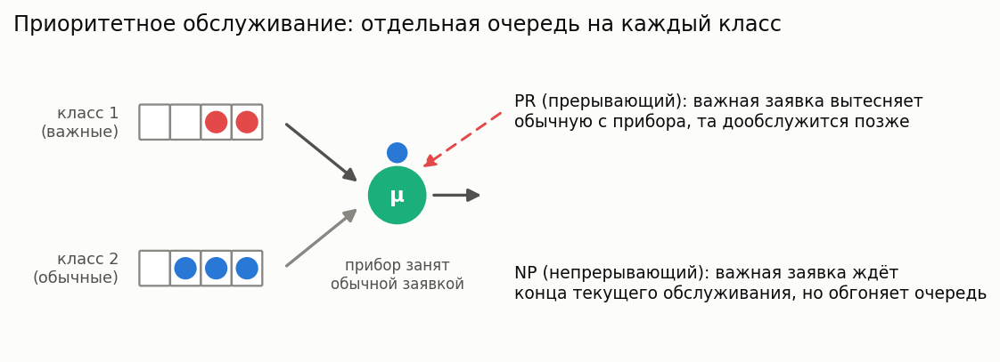

**Простыми словами:** заявки делятся на классы важности, у каждого класса — своя очередь.
Прибор всегда берёт заявку самого важного непустого класса. Два режима: **PR** (preemptive,
прерывающий) — важная заявка вытесняет обычную прямо с прибора; **NP** (non-preemptive,
непрерывающий) — начатое обслуживание доводится до конца, но дальше вне очереди идёт важная.
Плата за приоритет: младшие классы ждут дольше, при высокой загрузке — многократно.

### M/G/1/PR (прерываемый приоритет)

**Описание:** Одноканальная система с несколькими классами приоритетов. Приоритетные заявки могут прерывать обслуживание низкоприоритетных.

**Класс расчета:** `MG1PreemptiveCalc`

**Пример:**

```python
from most_queue.theory.priority.preemptive.mg1 import MG1PreemptiveCalc

calc = MG1PreemptiveCalc(num_of_classes=3)
calc.set_sources([0.1, 0.2, 0.3])  # интенсивности для каждого класса

# Моменты времени обслуживания для каждого класса
b = [
    [2.0, 4.0, 8.0],  # класс 1
    [3.0, 9.0, 27.0], # класс 2
    [4.0, 16.0, 64.0] # класс 3
]
calc.set_servers(b)

results = calc.run()
```

### M/G/1/NP (непрерываемый приоритет)

**Описание:** Одноканальная система с приоритетами, где начатое обслуживание не прерывается.

**Класс расчета:** `MG1NonPreemptiveCalc`

**Пример:**

```python
from most_queue.theory.priority.non_preemptive.mg1 import MG1NonPreemptiveCalc

calc = MG1NonPreemptiveCalc(num_of_classes=3)
calc.set_sources([0.1, 0.2, 0.3])
calc.set_servers(b)  # моменты для каждого класса
results = calc.run()
```

### M/G/c/PR и M/G/c/NP

**Описание:** Многоканальные системы с приоритетами (прерываемый и непрерываемый).

**Класс расчета:** `MGnInvarApproximation`

**Пример:**

```python
from most_queue.theory.priority.mgn_invar_approx import MGnInvarApproximation

calc = MGnInvarApproximation(n=5, priority="PR")  # или "NP"
calc.set_sources([0.1, 0.2, 0.3])
calc.set_servers(b)
results = calc.run()
```

### M/Ph/c/PR

**Описание:** Многоканальная система с фазовым распределением времени обслуживания и приоритетами.

**Класс расчета:** `MPhNPrty`

**Пример:** См. тест `test_m_ph_n_prty.py`

### M/M/2 с 3 классами приоритетов (PR)

**Описание:** Двухканальная система с тремя классами прерываемых приоритетов, аппроксимация через периоды занятости.

**Класс расчета:** `MM2BusyApprox3Classes` (`most_queue.theory.priority.preemptive.mm2_3cls_busy_approx`)

**Пример:** См. тест `test_mm2_3cls_prty_busy.py`

### M/M/n с 2 классами приоритетов (PR)

**Описание:** Многоканальная система с двумя классами прерываемых приоритетов, аппроксимация через периоды занятости.

**Класс расчета:** `MMnPR2ClsBusyApprox` (`most_queue.theory.priority.preemptive.mmn_2cls_pr_busy_approx`)

**Пример:** См. тест `test_mmn_prty_busy_approx.py`

## Системы с отпусками (Vacations)

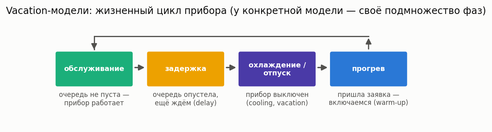

**Простыми словами:** прибор не всегда готов работать мгновенно. После простоя ему нужен
**прогрев** (warm-up — прогрев станка, холодный старт сервера), после опустошения очереди он
может уйти в **охлаждение/отпуск** (cooling/vacation — энергосбережение, регламентные работы),
иногда с **задержкой** (delay — ждём, не придёт ли ещё заявка, прежде чем выключаться).
Заявкам, пришедшим «не вовремя», приходится ждать дольше — модели этого раздела считают,
насколько.

### M/G/1 с многократными отпусками (multiple vacations)

**Описание:** Классическая vacation-модель: опустошив очередь, прибор уходит в отпуск; вернувшись в пустую систему — сразу в следующий. Точное решение через декомпозицию Fuhrmann–Cooper: ожидание = ожидание M/G/1 + остаточное время отпуска.

**Суть:** сервер, «досыпающий» пока нет работы (энергосбережение, фоновые задачи).
Плата заявок за отпуска — в среднем половина «длины» отпуска с поправкой на разброс,
независимо от загрузки.

**Класс расчета:** `MG1MultipleVacationsCalc` (`most_queue.theory.vacations.mg1_vacations`)
**Симуляция:** `VacationQueueingSystemSimulator(1, is_multiple_vacations=True)` + `set_cold(...)`

**Пример:**

```python
from most_queue.theory.vacations.mg1_vacations import MG1MultipleVacationsCalc
from most_queue.random.distributions import GammaDistribution

b = GammaDistribution.calc_theory_moments(
    GammaDistribution.get_params_by_mean_and_cv(0.7, 1.2), 5)
vac = GammaDistribution.calc_theory_moments(
    GammaDistribution.get_params_by_mean_and_cv(1.5, 1.2), 4)

calc = MG1MultipleVacationsCalc()
calc.set_sources(l=1.0)
calc.set_servers(b)
calc.set_vacations(vac)
results = calc.run()  # для k моментов W нужно k+1 моментов отпуска
```

### M/G/1 под N-policy

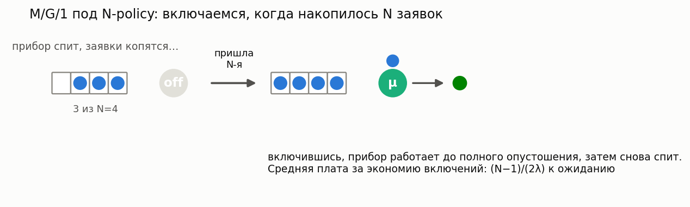

**Описание:** Прибор выключается при опустошении системы и включается, только когда накопится N заявок; далее обслуживает до опустошения. Точное решение: добавка к ожиданию M/G/1 — эрланговская смесь, в среднем (N−1)/(2λ).

**Суть:** экономия на «включениях»: чем больше N, тем реже прибор запускается, но тем дольше
ждут первые накопившиеся заявки. Модель для выбора порога N (batch-запуск оборудования,
редкие рейсы). N=1 — обычная M/G/1.

**Класс расчета:** `MG1NPolicyCalc` (`most_queue.theory.vacations.mg1_vacations`)
**Симуляция:** `NPolicyQueueSim(1, big_n=N)`

### M/G/1 с ненадёжным прибором (breakdowns & repairs)

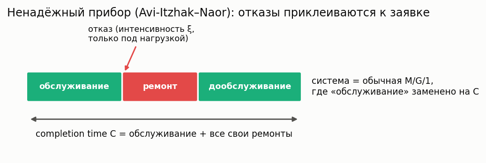

**Описание:** Прибор отказывает с пуассоновской интенсивностью ξ во время обслуживания; ремонт — произвольное распределение; прерванная заявка дообслуживается с места остановки. Точное сведение к M/G/1 с «completion time» (обслуживание + свои ремонты) — Avi-Itzhak–Naor (1963).

**Суть:** станок, который ломается под нагрузкой: заявка занимает прибор своё время
обслуживания плюс все случившиеся за это время ремонты. Кумулянты completion time
считаются в замкнутой форме, дальше работает обычная формула Полячека–Хинчина.

**Класс расчета:** `MG1UnreliableCalc` (`most_queue.theory.vacations.mg1_unreliable`)
**Симуляция:** `UnreliableQueueSim` (`most_queue.sim.unreliable`)

**Пример:**

```python
from most_queue.theory.vacations.mg1_unreliable import MG1UnreliableCalc
from most_queue.random.distributions import GammaDistribution

b = GammaDistribution.calc_theory_moments(
    GammaDistribution.get_params_by_mean_and_cv(0.5, 1.2), 5)
r = GammaDistribution.calc_theory_moments(
    GammaDistribution.get_params_by_mean_and_cv(0.4, 1.2), 5)

calc = MG1UnreliableCalc()
calc.set_sources(l=1.0)
calc.set_servers(b)
calc.set_breakdowns(xi=0.3, repair=r)
results = calc.run()
```

### M/H₂/c с прогревом

**Описание:** Многоканальная система с гиперэкспоненциальным обслуживанием и прогревом каналов.

**Класс расчета:** `MH2nH2Warm`

**Пример:**

```python
from most_queue.theory.vacations.m_h2_h2warm import MH2nH2Warm

calc = MH2nH2Warm(n=3)
# Настройка параметров прогрева и обслуживания
# (см. тест test_m_h2_h2warm.py)
```

### M/M/n с H2-охлаждением и H2-прогревом

**Описание:** Многоканальная система с экспоненциальным обслуживанием, гиперэкспоненциальными охлаждением и прогревом.

**Класс расчета:** `MMnHyperExpWarmAndCold` (`most_queue.theory.vacations.mmn_with_h2_cold_and_h2_warmup`)

**Пример:** См. тест `test_mmn_h2cold_h2warm.py`

### M/G/1 с прогревом

**Описание:** Одноканальная система с прогревом.

**Класс расчета:** `MG1WarmCalc`

### M/Ph/c с прогревом, задержкой и отпусками

**Описание:** Сложная система с H₂-обслуживанием, H₂-прогревом, H₂-задержкой и H₂-отпусками.

**Класс расчета:** `MGnH2ServingColdWarmDelay`

**Пример:** См. тест `test_mgn_with_h2_delay_cold_warm.py`

## Системы с отрицательными заявками

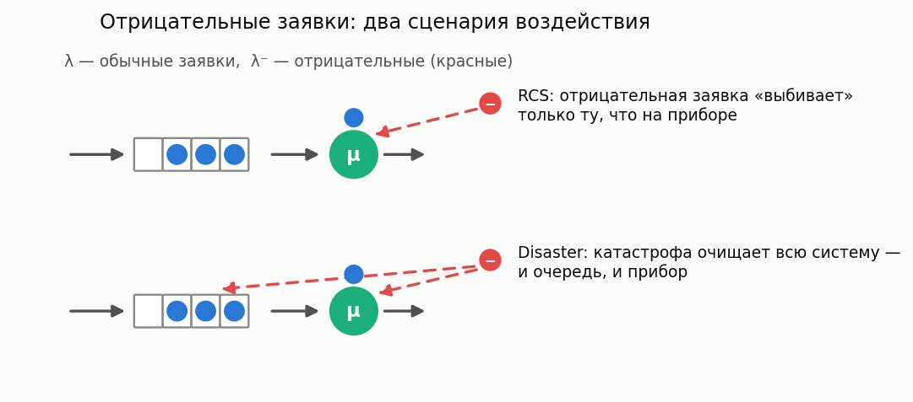

**Простыми словами:** кроме обычных заявок в систему приходит второй, «вредительский» поток —
отрицательные заявки (Gelenbe, G-networks). Такая заявка сама не обслуживается, а уничтожает
чужую работу: в варианте **RCS** — сбивает заявку с прибора (сбой, вирус, отмена задачи),
в варианте **disaster** — очищает всю систему (перезагрузка, катастрофа). Модели считают,
сколько в итоге теряется и насколько дольше живут уцелевшие заявки.

### M/G/1 RCS (Remove Customer from Service)

**Описание:** Система, где отрицательные заявки удаляют заявку из обслуживания.

**Класс расчета:** `MG1NegativeCalcRCS`

**Пример:**

```python
from most_queue.theory.negative.mg1_rcs import MG1NegativeCalcRCS

calc = MG1NegativeCalcRCS()
calc.set_sources(l=0.5, l_neg=0.1)  # l_neg - интенсивность отрицательных заявок
calc.set_servers(b)
results = calc.run()
```

### M/G/1 Disaster

**Описание:** Одноканальная система, где отрицательная заявка удаляет все заявки из системы.

**Класс расчета:** `MG1Disasters` (`most_queue.theory.negative.mg1_disasters`)

**Пример:** См. тест `test_mg1_disaster.py`

### M/G/c RCS

**Описание:** Многоканальная система с отрицательными заявками типа RCS.

**Класс расчета:** `MGnNegativeRCSCalc`

### M/G/c Disaster

**Описание:** Система, где отрицательные заявки удаляют все заявки из системы (и из очереди, и из обслуживания).

**Класс расчета:** `MGnNegativeDisasterCalc`

**Пример:** См. тесты `test_mgn_disaster.py` и `test_mg1_disaster.py`

## Fork-Join системы

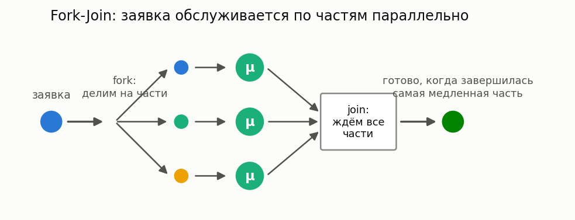

**Простыми словами:** заявка при входе разделяется (fork) на несколько частей, части
обслуживаются параллельно на разных приборах, а результат готов только когда собраны все
части (join). Так устроены параллельные вычисления, RAID-массивы, распределённые запросы
(map-reduce). Время ответа определяет *самая медленная* часть — поэтому среднее время
пребывания растёт с числом частей даже при той же суммарной работе.

### M/M/c Fork-Join

**Описание:** Система, где заявка разделяется на несколько частей, обслуживаемых параллельно, и затем объединяется.

**Класс расчета:** `ForkJoinMarkovianCalc`

**Пример:**

```python
from most_queue.theory.fork_join.m_m_n import ForkJoinMarkovianCalc

calc = ForkJoinMarkovianCalc(n=5, k=2)  # 5 каналов, требуется 2
calc.set_sources(l=1.0)
calc.set_servers(mu=1.0)
results = calc.run()
```

### M/G/c Split-Join

**Описание:** Система Split-Join с произвольным распределением времени обслуживания.

**Суть:** строгий вариант Fork-Join — следующая заявка не начинает обслуживаться, пока
полностью не собрана предыдущая (синхронный конвейер партий).

**Класс расчета:** `SplitJoinCalc`

**Пример:** См. тест `test_fj_sim.py`

## Системы с пакетным поступлением

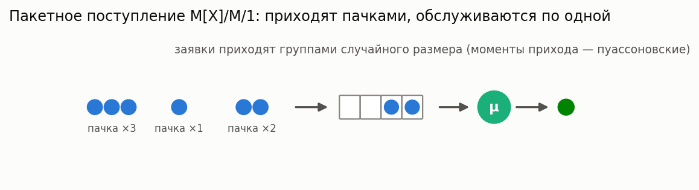

**Простыми словами:** заявки приходят не по одной, а пачками случайного размера — автобус
с туристами, пакет транзакций, batch задач от планировщика. Даже при той же средней
интенсивности пачечность заметно удлиняет очередь: пришедшие вместе вынуждены ждать друг
друга.

### M^x/M/1

**Описание:** Система, где заявки поступают пакетами случайного размера.

**Класс расчета:** `BatchMM1`

**Пример:**

```python
from most_queue.theory.batch.mm1 import BatchMM1

calc = BatchMM1()
# Вероятности размеров пакетов: [p(1), p(2), p(3), ...]
batch_probs = [0.2, 0.3, 0.1, 0.2, 0.2]
calc.set_sources(l=0.5, batch_probs=batch_probs)
calc.set_servers(mu=1.0)
results = calc.run()
```

## Системы с нетерпеливыми заявками

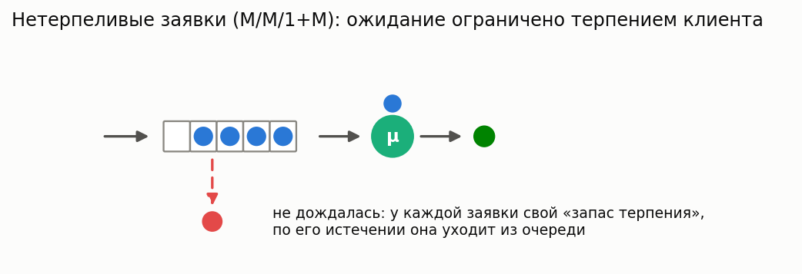

**Простыми словами:** у каждой заявки есть свой случайный «запас терпения»; если очередь
не дошла до неё вовремя — она уходит необслуженной (брошенная трубка в колл-центре, отменённый
заказ, истёкший таймаут запроса). Ключевые вопросы к модели: какая доля клиентов теряется
и как это зависит от числа приборов.

### M/M/1/D (с экспоненциальным нетерпением)

**Описание:** Система, где заявки могут покинуть очередь, если ожидание слишком долгое.

**Класс расчета:** `MM1Impatience`

**Пример:** См. тест `test_impatience.py`

### Erlang-A (M/M/n+M)

**Описание:** Многоканальная модель с уходами: n приборов, пуассоновский поток, экспоненциальные обслуживание и «терпение» каждой ждущей заявки. Всегда стабильна; рабочая лошадка staffing-расчётов колл-центров (Palm; Garnett–Mandelbaum–Reiman).

**Суть:** реалистичный колл-центр — часть звонящих вешает трубку, не дождавшись оператора.
Модель отвечает сразу на оба staffing-вопроса: какая доля клиентов теряется и сколько нужно
операторов, чтобы удержать её ниже цели (`find_min_servers`).

**Класс расчета:** `MMnImpatienceCalc` (`most_queue.theory.impatience.mmn`)
**Симуляция:** `ImpatientQueueSim`

## Retrial-очереди (повторные попытки)

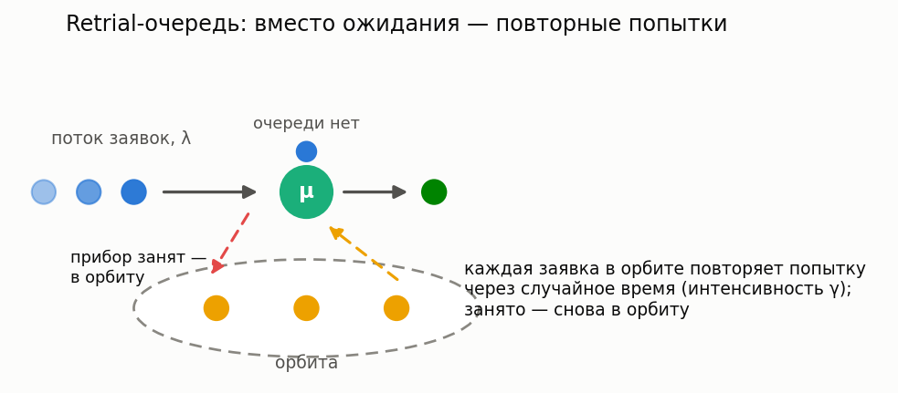

**Суть:** зала ожидания нет вовсе: заявка, заставшая прибор занятым, уходит в невидимую
**орбиту** и повторяет попытку через случайное время (абонент, услышавший «занято», перезванивает).
По сравнению с обычной очередью прибор иногда простаивает, пока заявки сидят в орбите, —
ожидания длиннее, и чем ленивее повторы (меньше γ), тем хуже.

### M/M/1 retrial

**Описание:** Классическая (линейная) retrial-политика: каждая из j заявок орбиты повторяет с интенсивностью γ. Решается точно адаптивным усечением level-dependent цепи.

**Класс расчета:** `MM1RetrialCalc` (`most_queue.theory.retrial`)
**Симуляция:** `RetrialQueueSim` (`most_queue.sim.retrial`)

### M/G/1 retrial

**Описание:** Произвольное обслуживание; средний размер орбиты и ожидание в замкнутой форме (Falin–Templeton): E[N_o] = λ²b₂/(2(1−ρ)) + λρ/(γ(1−ρ)). При γ→∞ восстанавливается обычная M/G/1.

**Суть:** плата за повторные попытки — аддитивная добавка к обычной длине очереди M/G/1,
растущая при ленивых повторах. Формула проверена в библиотеке против точного решения
M/M/1 retrial и симуляции.

**Класс расчета:** `MG1RetrialCalc` (`most_queue.theory.retrial`)

## Матрично-аналитические модели (MAP/PH)

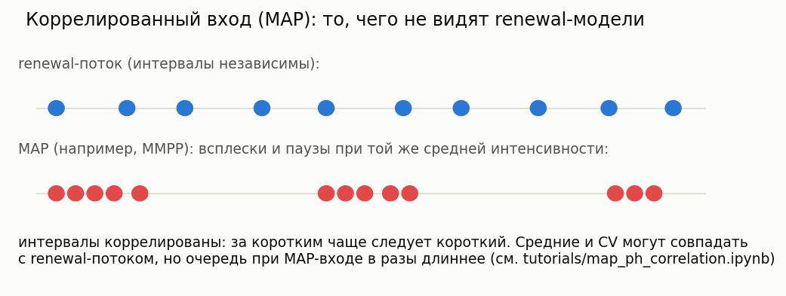

**Суть:** реальный трафик пульсирует — за коротким интервалом чаще следует короткий.
Марковский поток (MAP) ловит эту корреляцию парой матриц (D₀, D₁); фазовые (PH) распределения
играют ту же роль для обслуживания. Очередь MAP/PH/1 решается **точно** матрично-геометрическим
(QBD) методом — и ответ может отличаться от renewal-модели с теми же mean/CV в разы
(см. [`tutorials/map_ph_correlation.ipynb`](../tutorials/map_ph_correlation.ipynb)).

Впервые видите PH и MAP? Они разобраны по шагам — со схемами того, как Exp, Эрланг, H₂ и Кокса
оказываются частными случаями PH, и как устроен MMPP — в
[справочнике распределений](distributions.ru.md#фазовые-распределения-ph).

### MAP/PH/1

**Описание:** Коррелированный вход, фазовое обслуживание, один прибор. Стационарное распределение — QBD с logarithmic reduction (Latouche–Ramaswami); моменты ожидания — дифференцированием LST прибывающей заявки.

**Класс расчета:** `MapPh1Calc` (`most_queue.theory.matrix.map_ph1`)
**Симуляция:** `QsSim` c `set_sources(map_params, "MAP")` и `set_servers(ph_params, "PH")`

### M/PH/1 и PH/PH/1

**Описание:** Частные случаи на том же QBD-ядре: `MPh1Calc` (пуассоновский вход) в точности воспроизводит Полячека–Хинчина; `PhPh1Calc` (renewal PH-вход) покрывает одноканальные системы типа GI/PH.

**Классы расчета:** `MPh1Calc`, `PhPh1Calc` (`most_queue.theory.matrix.map_ph1`)

### MAP/M/c

**Описание:** Коррелированный вход и **c** экспоненциальных приборов, решается как QBD с уровне-зависимой границей (уровни 0..c-1 — число занятых приборов, однородный блок от уровня c). Реалистичная модель колл-центра или ЦОД с bursty-трафиком.

**Суть:** многоканальный аналог MAP/PH/1 — Erlang C, но с пульсацией входа, которую Erlang C
игнорирует. Однофазный (пуассоновский) MAP в точности воспроизводит Erlang C; bursty-MAP с той
же интенсивностью даёт заметно большее ожидание.

**Класс расчета:** `MapMMcCalc` (`most_queue.theory.matrix.map_mmc`)
**Симуляция:** `QsSim(c)` c `set_sources(map_params, "MAP")` и `set_servers(mu, "M")`

**Пример:**

```python
import numpy as np
from most_queue.random.map_ph import MAP
from most_queue.theory.matrix.map_mmc import MapMMcCalc

mmpp = MAP.mmpp([2.5, 0.5], np.array([[-0.15, 0.15], [0.25, -0.25]]))  # bursty-вход

calc = MapMMcCalc(n=3)  # 3 прибора
calc.set_sources(mmpp)
calc.set_servers(mu=1.0)
results = calc.run()  # вероятности состояний + средние по Литтлу
```

### MAP/PH/c

**Описание:** Самая общая одностанционная модель раздела: коррелированный MAP-вход, фазовое обслуживание и c приборов. Решается как QBD, где фаза — фаза MAP × мультимножество фаз занятых приборов.

**Суть:** совмещает всё — пульсирующий вход *и* вариативное (фазовое) обслуживание *и*
несколько приборов. В точности сводится к MAP/M/c (exp-обслуживание), MAP/PH/1 (один прибор)
и M/H₂/c по Такахаси-Таками (пуассоновский вход). Пространство фаз обслуживания растёт
комбинаторно, поэтому держите порядок PH и c умеренными (например, 2-фазное обслуживание, c ≤ 6).

**Класс расчета:** `MapPhCCalc` (`most_queue.theory.matrix.map_phc`)
**Симуляция:** `QsSim(c)` c `set_sources(map_params, "MAP")` и `set_servers(ph_params, "PH")`

## Закрытые системы

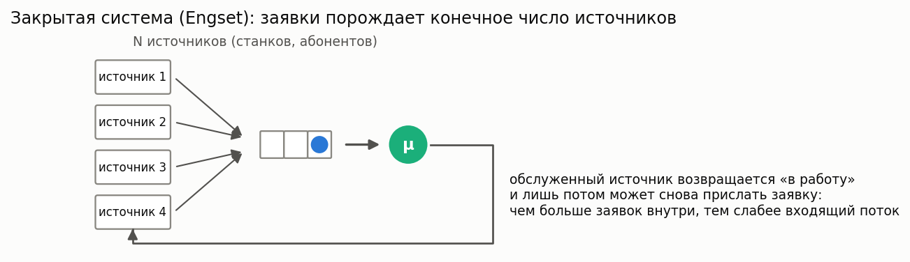

**Простыми словами:** заявки порождает конечный набор из N источников (станки, обращающиеся
к одному наладчику; терминалы, обращающиеся к серверу). Пока источник ждёт обслуживания,
новых заявок он не создаёт — поэтому чем длиннее очередь, тем слабее входящий поток: система
«саморегулируется», и формулы для бесконечного потока здесь завышают нагрузку.

### Engset (M/M/1/N)

**Описание:** Система с конечным числом источников заявок.

**Класс расчета:** `Engset`

**Пример:**

```python
from most_queue.theory.closed.engset import Engset

calc = Engset()
calc.set_sources(N=10, lambda_source=0.5)  # 10 источников
calc.set_servers(mu=1.0)
results = calc.run()
```

## Сравнительная таблица моделей

| Модель | Класс расчета | Симуляция | Приоритеты | Особенности |
|--------|--------------|-----------|------------|-------------|
| M/M/c | MMnrCalc | QsSim | - | Базовая модель |
| M/M/n/0 (Erlang B) | ErlangBCalc | QsSim(buffer=0) | - | Потери, нечувствительность M/G/n/0 |
| M/M/n (Erlang C) | ErlangCCalc | QsSim | - | Вероятность ожидания, моменты W |
| M/G/∞ | MGInfCalc | QsSim(n>>a) | - | Бесконечно много приборов |
| M/G/1 | MG1Calc | QsSim | - | Произвольное обслуживание |
| M/G/1 SRPT | MG1SrptCalc | SizeBasedQsSim | - | Size-based, Schrage–Miller |
| M/G/1 SJF | MG1SjfCalc | SizeBasedQsSim | - | Non-preemptive по размеру |
| M/G/1 PSJF | MG1PsjfCalc | SizeBasedQsSim | - | Preemptive по исходному размеру |
| M/G/1 SPJF | MG1SpjfCalc | SizeBasedQsSim | - | По предсказанию Y |
| M/G/1 FB/LAS | MG1FbCalc | FBSim | - | Blind, по attained service |
| M/G/1 PS | MG1PSCalc | ProcessorSharingSim | - | Равное разделение, slowdown 1/(1−ρ) |
| M/G/1 LCFS-PR | MG1LcfsPrCalc | LcfsPRSim | - | Сojourn = busy period |
| GI/M/1 | GIM1Calc | QsSim | - | Общий поток |
| GI/G/1, GI/G/m (approx) | GIG1ApproxCalc, GIGmApproxCalc | QsSim | - | Kingman/KLB/Allen–Cunneen, только w1 |
| M/G/c/PR | MGnInvarApproximation | PriorityQueueSimulator | Да | Прерываемый приоритет |
| M/G/c/NP | MGnInvarApproximation | PriorityQueueSimulator | Да | Непрерываемый приоритет |
| M/G/1 multiple vacations | MG1MultipleVacationsCalc | VacationQueueingSystemSimulator | - | Fuhrmann–Cooper |
| M/G/1 N-policy | MG1NPolicyCalc | NPolicyQueueSim | - | Порог включения N |
| M/G/1 unreliable | MG1UnreliableCalc | UnreliableQueueSim | - | Отказы+ремонты, completion time |
| Fork-Join | ForkJoinMarkovianCalc | ForkJoinSim | - | Параллельное обслуживание |
| M^x/M/1 | BatchMM1 | QueueingSystemBatchSim | - | Пакетное поступление |
| Erlang-A (M/M/n+M) | MMnImpatienceCalc | ImpatientQueueSim | - | Уходы, staffing-помощник |
| M/M/1 retrial | MM1RetrialCalc | RetrialQueueSim | - | Орбита, точное усечение цепи |
| M/G/1 retrial | MG1RetrialCalc | RetrialQueueSim | - | Формула Falin–Templeton |
| MAP/PH/1 | MapPh1Calc | QsSim("MAP", "PH") | - | Коррелированный вход, QBD |
| M/PH/1, PH/PH/1 | MPh1Calc, PhPh1Calc | QsSim | - | Частные случаи QBD |
| MAP/M/c | MapMMcCalc | QsSim("MAP","M") | - | Многоканальный, коррелированный вход |
| MAP/PH/c | MapPhCCalc | QsSim("MAP","PH") | - | Многоканальный, коррелированный вход + PH-обслуживание |
| Engset | Engset | QueueingFiniteSourceSim | - | Конечное число источников |

## Рекомендации по выбору модели

1. **Начните с простой модели** — M/M/c для базового понимания
2. **Учитывайте реальные данные** — выберите распределения, соответствующие вашим данным
3. **Используйте симуляцию для проверки** — сравните результаты расчета и симуляции
4. **Учитывайте особенности системы** — приоритеты, отпуска, ограничения

## Примеры использования

Все модели имеют примеры использования в папке `tests/`. Рекомендуется изучить соответствующие тесты для понимания деталей использования.

---

**См. также:**
- [Симуляция СМО](simulation.ru.md) — имитационное моделирование
- [Численные методы](calculation.ru.md) — аналитические расчеты
- [Приоритетные системы](priorities.ru.md) — детали работы с приоритетами
- [Сети очередей](networks.ru.md) — моделирование сетей

