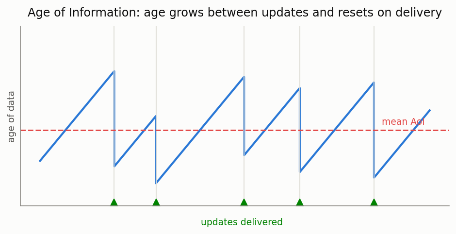

# Age of Information (AoI)

[🇷🇺 Русская версия](aoi.ru.md) · [← Model catalog](../models.md)



**In plain words:** in monitoring and status-update systems (IoT sensors, telemetry, networked
control) what matters is not throughput but **freshness** — how old is the newest piece of
information the receiver holds. The *age* Δ(t) grows linearly since the last delivered update and
drops at each fresh delivery. The **time-average AoI** and the **peak AoI** (PAoI, the average of
the pre-delivery peaks) quantify staleness. Sending too rarely leaves data stale; sending too often
congests the queue and *also* makes data stale — there is an optimal update rate.

### M/M/1 and general single-server FCFS AoI

**Description:** Time-average AoI and peak AoI. For M/M/1: Δ̄ = (1/μ)(1 + 1/ρ + ρ²/(1−ρ)). For any
single-server FCFS queue every update is delivered in order, so the peak AoI equals the mean sojourn
plus the mean interarrival: **PAoI = E[T] + 1/λ** (exact; the mean sojourn comes from
Pollaczek–Khinchine for M/G/1). The general M/G/1 *average* AoI is not a function of the service
moments alone — use the simulator for it.

**Calculator class:** `AoICalc` (`most_queue.theory.aoi`)

**Example:**

```python
from most_queue.theory.aoi import AoICalc

calc = AoICalc()
calc.set_sources(0.6)          # update generation rate lambda
calc.set_servers(mu=1.0)       # exponential service (or b=[E[S], E[S^2], ...] for M/G/1)
res = calc.run()
# res.avg_aoi (M/M/1 only), res.peak_aoi = E[T] + 1/lambda
```

### Preemptive-LCFS M/M/1 AoI

**Description:** A fresh update preempts and discards the stale one in service — minimises age and is
stable for **any** load. Time-average AoI Δ̄ = (1/μ)(1 + 1/ρ).

**Calculator class:** `LcfsPreemptiveAoICalc` (`most_queue.theory.aoi`)

### AoI simulator

**Description:** Discrete-event AoI simulator tracking the sawtooth age process; supports FCFS, LCFS
(non-preemptive) and LCFS-PR (preemptive) on one or more servers, any arrival/service distribution.
Ground truth for average AoI where no moment-closed formula exists (M/G/1, M/M/c, D/M/1).

**Simulator class:** `AoISim` (`most_queue.sim.aoi`)
