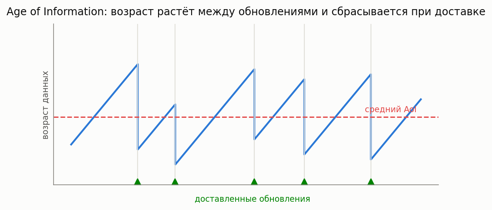

# Age of Information (AoI, свежесть информации)

[🇬🇧 English version](aoi.md) · [← Каталог моделей](../models.ru.md)



**Простыми словами:** в системах мониторинга и статус-апдейтов (IoT-сенсоры, телеметрия, сетевое
управление) важна не пропускная способность, а **свежесть** — насколько устарела самая новая
информация у получателя. Возраст Δ(t) линейно растёт с последней доставки и падает при каждой свежей
доставке. **Средний AoI** и **пиковый AoI** (PAoI — среднее пиков перед доставками) измеряют
устаревание. Слать редко — данные устаревают; слать часто — очередь перегружается и данные *тоже*
устаревают: существует оптимальная частота обновления.

### AoI для M/M/1 и общей одноканальной FCFS

**Описание:** Средний и пиковый AoI. Для M/M/1: Δ̄ = (1/μ)(1 + 1/ρ + ρ²/(1−ρ)). Для любой
одноканальной FCFS-очереди все апдейты доставляются по порядку, поэтому пиковый AoI = среднее время
пребывания + средний интервал прихода: **PAoI = E[T] + 1/λ** (точно; E[T] для M/G/1 — по
Полячеку–Хинчину). Общий средний AoI для M/G/1 не выражается через моменты обслуживания — для него
используйте симулятор.

**Класс расчета:** `AoICalc` (`most_queue.theory.aoi`)

**Пример:**

```python
from most_queue.theory.aoi import AoICalc

calc = AoICalc()
calc.set_sources(0.6)          # интенсивность генерации апдейтов lambda
calc.set_servers(mu=1.0)       # экспоненциальное обслуживание (или b=[E[S], E[S^2], ...] для M/G/1)
res = calc.run()
# res.avg_aoi (только M/M/1), res.peak_aoi = E[T] + 1/lambda
```

### AoI для preemptive-LCFS M/M/1

**Описание:** Свежий апдейт прерывает и отбрасывает устаревший в обслуживании — минимизирует возраст
и устойчив при **любой** загрузке. Средний AoI Δ̄ = (1/μ)(1 + 1/ρ).

**Класс расчета:** `LcfsPreemptiveAoICalc` (`most_queue.theory.aoi`)

### Симулятор AoI

**Описание:** Дискретно-событийный AoI-симулятор, отслеживающий пилообразный процесс возраста;
поддерживает FCFS, LCFS (без прерывания) и LCFS-PR (с прерыванием) на одном и более серверах, любые
распределения. Эталон для среднего AoI там, где нет замкнутой формулы по моментам (M/G/1, M/M/c).

**Класс симулятора:** `AoISim` (`most_queue.sim.aoi`)
