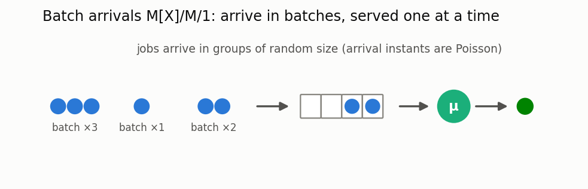

# Systems with batch arrivals

[🇷🇺 Русская версия](batch.ru.md) · [← Model catalog](../models.md)



**In plain words:** jobs arrive not one at a time but in batches of random size — a bus full of
tourists, a bundle of transactions, a batch of tasks from a scheduler. Even at the same average
arrival rate, batching noticeably lengthens the queue: jobs that arrive together are forced to
wait for one another.

### Mˣ/M/1

**Description:** A system where jobs arrive in batches of random size.

**Calculator class:** `BatchMM1`

**Example:**

```python
from most_queue.theory.batch.mm1 import BatchMM1

calc = BatchMM1()
# Batch size probabilities: [p(1), p(2), p(3), ...]
batch_probs = [0.2, 0.3, 0.1, 0.2, 0.2]
calc.set_sources(l=0.5, batch_probs=batch_probs)
calc.set_servers(mu=1.0)
results = calc.run()
```

### M/M^[a,b]/1 — bulk (batch) service

**Description:** The server serves customers in **batches**: it starts once at least `a` are queued
and takes up to `b` of them, finishing the whole batch after one exponential batch-service time. This
is the base model for **request batching in LLM inference serving** — the batch-service rate may
depend on the batch size (a bigger batch is slower per batch but amortises fixed cost across
requests, so there is an optimal maximum batch size). Solved as an exact CTMC on (batch-in-service,
number waiting).

**Calculator class:** `BulkServiceMM1Calc` (`most_queue.theory.batch.bulk_service`) ·
**Simulator:** `BulkServiceSim` (`most_queue.sim.bulk_service`)

**Example:**

```python
from most_queue.theory.batch.bulk_service import BulkServiceMM1Calc

calc = BulkServiceMM1Calc(a=1, b=8)   # serve up to 8 at a time
calc.set_sources(2.0)
calc.set_servers(lambda size: 1.0 / (0.3 + 0.08 * size))  # LLM-style: batch time grows with size
results = calc.run()  # results.v[0] mean sojourn, results.w[0] mean wait
```

### Exact waiting-time moments (not just the mean)

**Description:** `run()`'s `w` used to be a coarse mean-only estimate (`E[V] - 1/mu(fixed size)`,
inaccurate whenever the batch size actually varies, i.e. whenever `a<b`). `get_w(num=4)` gives the
**exact** raw moments of the waiting time instead, via PASTA: an arriving customer sees the
stationary `(batch-in-service, waiting)` state; if the server is busy, their wait is the remaining
current batch (`Exp(mu(i))`, memoryless) plus however many *full* batches of size `b` are ahead —
a hypoexponential distribution (or, when the remainder falls below the threshold `a`, an
idle-refill RACE between new arrivals and the remaining service, see below). `run()` uses this
exact result automatically for any `1<=a<=b` (EPIC-067 closed the earlier `a=1`-only
restriction — see
[`docs/epics/EPIC-067-bulk-service-idle-refill.md`](../epics/EPIC-067-bulk-service-idle-refill.md)).
`get_n_moments(num=4)` gives exact raw moments of the number in system for **any** `a`, `b` —
trivial, direct summation over the already-solved stationary distribution.

```python
calc = BulkServiceMM1Calc(a=1, b=8)          # any 1 <= a <= b works (EPIC-067)
calc.set_sources(2.0)
calc.set_servers(lambda size: 1.0 / (0.3 + 0.08 * size))
w_moments = calc.get_w(num=4)                 # E[W], E[W^2], E[W^3], E[W^4] -- exact
n_moments = calc.get_n_moments(num=4)         # E[N], E[N^2], ... -- exact for any a, b
p_violation = calc.get_tail(3.0)              # P(W > 3.0) -- EXACT, not moment-fitted (EPIC-066)
```

**Accuracy boundary:** for `a>1`, if the remainder after the full batches ahead is below the
threshold `a`, the tagged customer's own batch cannot start the instant the batches ahead of it
clear. A naive fix (one more sequential Erlang refill phase, assuming no new arrivals occur
while the batches ahead are still in service) was confirmed numerically WRONG (~18% error at
`a=2`) before `get_w()`/`get_tail()` were restricted to `a=1` only. EPIC-067 derives and
validates the correct construction — a RACE between new Poisson arrivals and the remaining
service-phase sequence — closing the restriction entirely; `get_w()`/`get_tail()`/`run()` are now
exact for any `1<=a<=b`. Sojourn-time (`V`) moments beyond the mean are still not provided — a
tagged customer's own eventual batch size depends on arrivals during their own wait, correlated
with `W` itself, so `V ≠ W + S` by simple convolution (see the research doc's "reserve" section).

### General (Erlang-fitted) batch-service time

**Description:** `BulkServiceMM1Calc` above assumes **exponential** batch-service time. This
closes that reserve for a **general** distribution — fitted to an Erlang(`k`, `rate`) phase-type
representation from its raw moments (the same moment-fitting convention used throughout the
library: `MaxDistribution`, the SLA layer). Erlang naturally represents low-CV (`≤1`) batch-service
times — a realistic regime for GPU/LLM batching, where per-batch processing time is fairly
predictable rather than highly variable. The CTMC state gets an extra phase dimension:
`(batch size i, Erlang phase p, waiting j)`. `k=1` (Erlang collapses to Exponential) reduces
**exactly** to `BulkServiceMM1Calc` — the primary regression check.

**A units bug caught before shipping:** the phase-transition rate was first set to `k*rate`
(intending an aggregate rate across `k` phases), which actually gives total mean `1/rate` instead
of the correct `k/rate` — off by a factor of `k²`. This coincidentally still passed the `k=1`
regression check (`k*rate=rate` when `k=1`) but diverged sharply from an independent DES at `k=3`
— caught before committing to the derivation. See
[`docs/research/bulk-service-general-erlang-2026.md`](../research/bulk-service-general-erlang-2026.md)
for the full account, including why the classical embedded-chain/PGF method (Neuts 1975,
Chaudhry-Templeton) was set aside in favor of this lower-risk, phase-type approach.

**Calculator class:** `BulkServiceErlangCalc` (`most_queue.theory.batch.bulk_service_erlang`)

```python
from most_queue.theory.batch.bulk_service_erlang import BulkServiceErlangCalc

calc = BulkServiceErlangCalc(a=1, b=4, k=3)   # Erlang(3, rate): CV = 1/sqrt(3)
calc.set_sources(1.0)
calc.set_servers(rate=1.5)                     # mean batch service = k/rate = 2.0
res = calc.run()                                # res.v[0] mean; res.w -- exact moments, any a (see below)

# exact raw moments of W (not just the mean), any 1 <= a <= b:
w_moments = calc.get_w(num=4)                   # [E[W], E[W^2], E[W^3], E[W^4]]

# or fit (k, rate) from raw moments directly:
calc2 = BulkServiceErlangCalc(a=1, b=4, k=1)   # k is overwritten by the fit
calc2.set_sources(1.0)
calc2.set_servers_from_moments([2.0, 4.5])     # [mean, E[S^2]] of batch-service time

# rate may also be a callable rate(batch_size) -- k (phase count) stays fixed,
# only the per-phase rate varies with the size of the batch currently in service:
calc3 = BulkServiceErlangCalc(a=1, b=4, k=3)
calc3.set_sources(1.0)
calc3.set_servers(lambda size: 3.0 + 0.2 * size)  # bigger batches slower per phase (LLM/GPU-style)
```

**Accuracy and scope:** exact given the Erlang-fitted family, for any `1<=a<=b` (EPIC-067).
`get_w()` gives EXACT raw moments of `W` (EPIC-043, porting EPIC-032's
PASTA/hypoexponential-decomposition technique to this phase-augmented case — the remaining
service of the batch an arrival finds in progress is `Erlang(k-p, rate)`, `p` = the phase found,
plus `j//b` full batches ahead each `Erlang(k, rate(b))`, convolved, plus an idle-refill race
phase when the remainder is short of the threshold `a`); `run()` uses this exact mean for any
`a`. `get_tail(D)`/`get_cdf(D)` (EPIC-066) give the EXACT SLA-violation probability `P(W>D)` for
any `a` too — matrix-exponential-action on the same per-state phase-type decomposition, reducing
exactly to `BulkServiceMM1Calc.get_tail` at `k=1`; see
[batch-service exact tail](../research/batch-service-sla-exact-tail-results-2026.md). Not covered
(reserve): batch-size-dependent phase COUNT (`k`) — EPIC-042 ported the exponential model's
callable-rate convention to this phase-type case, but `k` itself stays fixed across batch sizes (a
materially harder extension, same class of difficulty as EPIC-041's per-server phase counts).

### General (H2-fitted) batch-service time (CV ≥ 1)

**Description:** the CV`≥1` complement to the Erlang case above — batch-service time fitted to an
H2(`p1`,`mu1`,`mu2`) (hyperexponential, 2-phase mixture) representation from its raw moments, for
batch-service times that are more variable than exponential. Unlike Erlang (a sequential chain of
phases), H2 is a **branch**: at the moment a batch starts service, one of two exponential phases is
chosen once (phase 0 w.p. `p1`, rate `mu1`; phase 1 w.p. `p2=1-p1`, rate `mu2`) and the batch stays
in that phase until it completes — no mid-service phase transitions. The CTMC state gets an extra
phase dimension: `(batch size i, phase ∈ {0,1}, waiting j)`; every "batch starts" transition splits
into two weighted sub-transitions (`×p1`, `×p2`) instead of Erlang's single deterministic one.
`p1=1` (H2 collapses to `Exp(mu1)`) reduces **exactly** to `BulkServiceMM1Calc` — the primary
regression check, verified to full float64 precision. Unlike the Erlang case, the general
(genuinely two-phase) case matched an independent DES on the first attempt — no bug found, likely
because "choose-once-at-start" branching is structurally simpler to get right than Erlang's
sequential-phase-advance rate convention. See
[`docs/research/bulk-service-general-h2-2026.md`](../research/bulk-service-general-h2-2026.md) for
the full account.

**Calculator class:** `BulkServiceH2Calc` (`most_queue.theory.batch.bulk_service_h2`)

```python
from most_queue.theory.batch.bulk_service_h2 import BulkServiceH2Calc

calc = BulkServiceH2Calc(a=1, b=4)
calc.set_sources(1.0)
calc.set_servers(p1=0.5, mu1=1.0, mu2=3.0)     # mean batch service = p1/mu1 + p2/mu2
res = calc.run()                                # res.v[0], res.w[0] -- mean only (see below)

# or fit (p1, mu1, mu2) from raw moments directly:
calc2 = BulkServiceH2Calc(a=1, b=4)
calc2.set_sources(1.0)
calc2.set_servers_from_moments([2.0, 12.0, 100.0])   # [mean, E[S^2], E[S^3]], CV >= 1

# p1/mu1/mu2 may each be a callable f(batch_size) -- the two-branch structure stays
# fixed, only the branch probability/rates vary with the size of the NEW batch starting:
calc3 = BulkServiceH2Calc(a=1, b=4)
calc3.set_sources(1.0)
calc3.set_servers(lambda size: 0.3 + 0.1 * size, mu1=1.5, mu2=3.0)
```

**Accuracy and scope:** exact given the H2-fitted family (mean-only via `run()`; no exact `get_w()`
for H2, unlike Erlang/MM1 -- a reserve item, independent of `a`). `get_tail(D)`/`get_cdf(D)`
(EPIC-066, generalized to any `1<=a<=b` by EPIC-067) give the EXACT `P(W>D)`: the one place this
case is harder than Erlang's — each full batch AHEAD independently redraws its own H2 phase (a
genuine branch, not Erlang's sequential phase advance), so the phase-type sub-generator is built
explicitly rather than reusing a simple bidiagonal chain (and the idle-refill race, when needed,
only branches at the LAST layer before the tagged customer's own batch); reduces exactly to
`BulkServiceMM1Calc.get_tail` at `p1=1`. See
[batch-service exact tail](../research/batch-service-sla-exact-tail-results-2026.md). Not covered
(reserve): exact raw MOMENTS beyond the mean (needs a PASTA argument that also tracks which phase
an arrival finds the batch in — a different derivation than the tail); batch-size-dependent
branch COUNT (the two-branch structure itself stays fixed — EPIC-042 only made the per-branch
probability/rates batch-size-dependent).

### Impatient customers (abandonment / reneging)

**Description:** Markovian (memoryless) patience -- each of the `j` currently-waiting
customers independently reneges at rate `gamma` (same convention as
`most_queue.theory.impatience.mm1.MM1Impatience`). Passed as the `gamma` constructor
parameter on `BulkServiceMM1Calc`/`BulkServiceErlangCalc`/`BulkServiceH2Calc`
(`gamma=0.0` by default -- no behavior change). At `gamma>0`:

- `get_abandonment_prob()` (MM1, Erlang) -- exact probability that a PASTA-arriving
  tagged customer abandons before their own batch starts.
- `get_w()`/`get_tail()` (MM1, Erlang) switch to the variant CONDITIONAL on "served"
  (normalized by `1 - get_abandonment_prob()`); use both together for the full
  unconditional picture.
- `BulkServiceH2Calc` ([EPIC-071](../epics/EPIC-071-bulk-service-h2-impatience.md))
  also supports `get_abandonment_prob()` and served-conditional `get_w()`/`get_tail()`
  at `gamma>0`, via a dedicated H2-branching construction
  (`_h2_abandonment_chain`): unlike MM1/Erlang's sequential phase chain, each batch
  ahead of the tagged customer independently RE-CHOOSES its branch when it starts,
  so the chain carries 3 segments per `(R,K)` pair ("first" -- the batch already
  observed, resolved to one definite phase by PASTA -- and "ahead" phase 0/phase 1,
  each looping back into itself) instead of a phase count that grows with the
  number of batches ahead. At `gamma==0`, `get_w()` still raises
  `NotImplementedError` -- exact moments for the no-abandonment case remain a
  separate, unrelated reserve (see the "General (Erlang/H₂)" section above).

**Why the naive hypothesis failed:** the count of customers ahead of the tagged one
(`R`) becomes a genuine death process under abandonment (each of the `R` survivors
reneges independently) running CONCURRENTLY with batch formation, not a fixed
quantity as in EPIC-067's pure race construction without abandonment. The simple
hypothesis ("EPIC-067's race chain + a standalone competing gamma exit") was off by
17-38% on different states. The correct construction
(`most_queue.theory.batch._idle_refill.abandonment_chain`) adds `R` and `K` (new
arrivals behind the tagged customer) as explicit state dimensions; see
[EPIC-068](../epics/EPIC-068-bulk-service-impatience.md) for the full derivation,
including a real bug (a missing `(-A)^-1` application in the moment formula) caught
by a DES test before shipping.

```python
from most_queue.theory.batch.bulk_service import BulkServiceMM1Calc

calc = BulkServiceMM1Calc(a=2, b=4, gamma=0.4)   # patience rate
calc.set_sources(0.6)
calc.set_servers(1.5)

p_abandon = calc.get_abandonment_prob()   # exact probability of abandoning before batch starts
w_given_served = calc.get_w(num=1)[0]     # E[W | served]
```

H2 works the same way (p1=1 reduces exactly to the MM1 result above):

```python
from most_queue.theory.batch.bulk_service_h2 import BulkServiceH2Calc

calc = BulkServiceH2Calc(a=2, b=4, gamma=0.4)
calc.set_sources(0.6)
calc.set_servers(p1=0.3, mu1=0.9, mu2=2.5)

p_abandon = calc.get_abandonment_prob()
w_given_served = calc.get_w(num=1)[0]
```

### M/M^[a,b]/c -- multiple independent servers sharing one queue

**Description:** `c` IDENTICAL servers serve batches from ONE shared FCFS queue -- a direct model
for a multi-GPU replica pool (each with its own continuous-batching engine) behind one shared
request router. Whenever at least one server is idle, a batch is dispatched the instant the
queue reaches `a`; once all `c` servers are busy, the queue can build up and a newly-freed server
picks up to `b`.

**Class:** `BulkServiceMultiserverCalc` (`most_queue.theory.batch.bulk_service_multiserver`)

```python
from most_queue.theory.batch.bulk_service_multiserver import BulkServiceMultiserverCalc

calc = BulkServiceMultiserverCalc(a=2, b=4, c=3)   # 3 servers, shared queue
calc.set_sources(1.0)
calc.set_servers(1.2)                               # per server; can be callable(size)
res = calc.run()                                    # res.v[0], res.w[0]

n_moments = calc.get_n_moments(num=4)   # exact, any a<=b, c, including batch-size-dependent mu
w_moments = calc.get_w(num=4)           # exact -- batch-size-INDEPENDENT mu ONLY
p_violation = calc.get_tail(3.0)        # P(W > 3.0) -- exact, same caveat
```

**Accuracy and scope:** `get_n_moments()` is exact for ANY `a<=b`, `c>=1`, including
batch-size-dependent `mu(size)`. `get_w()`/`get_tail()` are exact but ONLY for batch-size-
INDEPENDENT `mu` (raises `NotImplementedError` otherwise) -- the key finding: with constant
`mu`, the aggregate "next completion" rate among all `c` busy servers is always exactly `c*mu`,
regardless of which sizes they're currently serving, so a tagged customer's wait needs no
occupancy-vector tracking at all -- the construction reuses
[EPIC-068](../epics/EPIC-068-bulk-service-impatience.md)'s "ahead" chain segment at zero
patience. With batch-size-dependent `mu` the aggregate rate genuinely depends on the full
occupancy vector -- a real state-space blowup, left as a reserve (not implemented). `c=1` is an
exact regression to `BulkServiceMM1Calc`. See
[EPIC-069](../epics/EPIC-069-bulk-service-multiserver.md) for the full derivation.

**Impatient customers ([EPIC-070](../epics/EPIC-070-bulk-service-multiserver-impatience.md)):**
the `gamma` parameter (patience rate, `MM1Impatience` convention) gives `get_abandonment_prob()`
and served-conditional `get_w()`/`get_tail()` -- batch-size-independent `mu` only. This
combination needed no new construction: the same "aggregate rate `c*mu`" finding reduces the
problem to EPIC-068's own `abandonment_chain`, which already supports `gamma>0` natively.

```python
calc = BulkServiceMultiserverCalc(a=2, b=4, c=3, gamma=0.3)
calc.set_sources(1.0)
calc.set_servers(0.5)
p_abandon = calc.get_abandonment_prob()   # exact probability of abandoning before batch starts
w_given_served = calc.get_w(num=1)[0]     # E[W | served]
```

### Auto-dispatch (don't compute CV by hand)

**Description:** `fit_bulk_service_calc(a, b, moments, family="auto")`
(`most_queue.theory.batch.bulk_service_general`) picks between the two calculators above
automatically from the CV of the given raw moments — `cv ≤ 1` → `BulkServiceErlangCalc`, `cv > 1`
→ `BulkServiceH2Calc` — mirroring `theory.utils.sla.fit_from_moments`'s `family="auto"` convention.
Returns a calculator with `set_servers()` already applied from the moments; the caller still calls
`set_sources()` then `run()`. Explicit `family="erlang"`/`"h2"` overrides validate CV-feasibility
and raise `ValueError` rather than silently producing a wrong fit.

```python
from most_queue.theory.batch.bulk_service_general import fit_bulk_service_calc

calc = fit_bulk_service_calc(a=1, b=4, moments=[2.0, 4.5])        # cv < 1 -> Erlang
calc = fit_bulk_service_calc(a=1, b=4, moments=[2.0, 12.0, 100.0])  # cv > 1 -> H2 (needs 3 moments)
calc.set_sources(1.0)
res = calc.run()
```

**See also:** [SLA / deadline-violation probability](sla.md) — turn these moments into a deadline-violation probability or SLO quantile.
