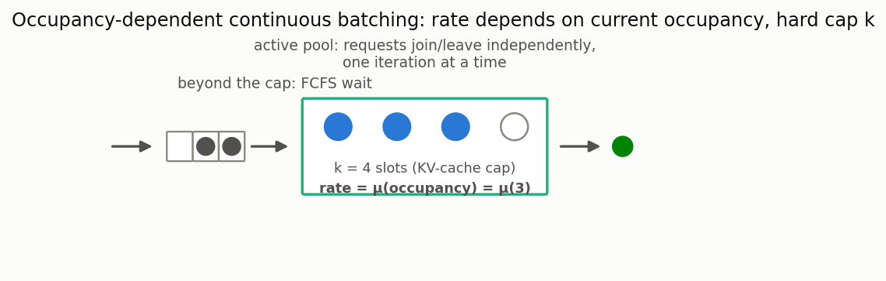

# Systems with occupancy-dependent continuous batching

[🇷🇺 Русская версия](continuous-batching.ru.md) · [← Model catalog](../models.md)



**In plain words:** modern LLM-inference engines (vLLM/SGLang-style "continuous batching")
don't serve a fixed group of requests atomically like classical bulk service (see
[batch arrivals](batch.md)) — a request joins and leaves a shared, capacity-capped pool
independently, one token-generation step at a time. The cap (`k`) on how many requests can be
resident at once comes from available accelerator memory (KV-cache), and the per-request
completion rate commonly *depends on how many others are currently resident* — a bigger shared
batch means more amortized throughput per step, but also more contention for compute/memory
bandwidth.

### Occupancy-dependent queue with a concurrency cap

**Description:** Poisson arrivals; up to `k` requests are served concurrently with a per-request
completion rate `mu(occupancy)` that may depend on how many are *currently* resident (not fixed per
server, as in classical M/M/c); requests beyond the cap wait FCFS. The state-dependent birth-death
chain this produces has an exact (closed-form) stationary distribution, and — because occupancy is
pinned at exactly `k` whenever anyone waits — the waiting time of a newly-arriving request is an
exact mixture of Erlang distributions, giving exact raw moments *and* an exact tail `P(W>t)`, not
just the mean (unlike the one directly comparable recent treatment of this exact system class,
which is explicitly approximate and mean-only).

**Calculator class:** `OccupancyDependentQueueCalc`
(`most_queue.theory.continuous_batching.occupancy_dependent`)

```python
from most_queue.theory.continuous_batching import OccupancyDependentQueueCalc

calc = OccupancyDependentQueueCalc(k=8, queue_truncation=200)   # k = concurrency cap (KV-cache slots)
calc.set_sources(l=4.0)
calc.set_servers(lambda occupancy: 2.0 / (0.5 + 0.3 * occupancy))  # slower per-request as batch grows
res = calc.run()                                 # res.w -- exact raw moments of waiting time
p_wait = calc.get_p_wait()                       # exact P(W > 0) -- cap already full on arrival
p_violation = calc.get_tail(0.5)                 # exact P(W > 0.5) -- SLA-style tail, not approximated
```

`mu` may also be a plain scalar (occupancy-independent) — this exactly reduces to the classical
`M/M/k/N` queue (`most_queue.theory.fifo.mmnr.MMnrCalc`), and `k=1` reduces to classical `M/M/1/N`.

**Related model (unbounded sibling):** if the concurrency cap is removed entirely (`k → ∞`) and
the rate is divided equally among however many are present, admission is never blocked and the
waiting time before service collapses to zero — the system becomes classical **egalitarian
processor sharing**, already in the library as [`MG1PSCalc`](size-based.md)
(single server) and its `n`-server generalization `MGnPSCalc`. This model's genuinely new
ingredient relative to that classical lineage is the finite cap `k` together with an external
FCFS queue — which is exactly what makes a nonzero, exact waiting-time distribution possible in
the first place.

### Occupancy-modulated two-branch service (heterogeneous output lengths)

**Description:** real LLM requests differ sharply in output length (short answers vs long ones),
which a single exponential rate cannot express. Here each admitted request additionally carries a
**branch** (0 or 1), drawn once on admission, with its own occupancy-dependent rate. State is
`(j, m)` where `m` counts how many of the active requests are in branch 0 — requests are
exchangeable, so this keeps the per-level state count at `min(j,k)+1` rather than `2**j`.

**Naming caveat:** because an admitted request's rate changes whenever occupancy changes, its
service time is *not* an H₂ random variable — it is an occupancy-**modulated** two-branch
exponential. (The same caveat applies to the single-rate model above: there the service time is
piecewise-exponential, not Exp — standard "load-dependent service rate" semantics.)

**Calculator class:** `OccupancyDependentH2QueueCalc`
(`most_queue.theory.continuous_batching.occupancy_dependent_h2`)

```python
from most_queue.theory.continuous_batching import OccupancyDependentH2QueueCalc

calc = OccupancyDependentH2QueueCalc(k=8, queue_truncation=400)
calc.set_sources(l=4.0)
calc.set_servers(                       # each may be a scalar or f(occupancy)
    p1=0.5,                             # probability of taking branch 0 on admission
    mu1=lambda occ: 6.0 / (0.5 + 0.3 * occ),   # "short" branch
    mu2=lambda occ: 1.2 / (0.5 + 0.3 * occ),   # "long" branch
)
e_w = calc.get_w_mean()        # exact mean wait before admission (Little's law on the queue)
p_wait = calc.get_p_wait()
e_n = calc.get_n_moments(1)[0]
```

Reduces exactly to the single-rate model above in two independent ways: at `p1=1` (everyone takes
branch 0) and at `mu1 == mu2` (the branch label becomes irrelevant).

**Accuracy and scope:** exact level distribution, mean wait and `E[N]` for any `k` and any
occupancy-dependent branch parameters. The full waiting-time *distribution* is an explicit reserve
here (unlike the single-rate model): above the cap the departure rate depends on the current branch
composition, which itself keeps changing, so the wait is a genuine phase-type distribution rather
than an Erlang mixture — `_wait_phase_generator()` raises `NotImplementedError` with that
explanation.

**What it buys you.** At matched load (same *mean service time*, varying only heterogeneity),
modelling heterogeneous output lengths as exponential understates mean wait by roughly **1.1x at
SCV≈1.2 and up to ~1.9x at SCV≈2.8**. Note the comparison must match mean service *time*, not mean
*rate* — matching rates silently changes the load (see EPIC-074 for that trap).

**Accuracy and scope (single-rate model):** exact for any `k` and any occupancy-dependent rate function. Models a fixed
(exogenous) concurrency cap `k` and an occupancy-independent per-request memory footprint — the
*growing* per-request KV-cache footprint seen in real engines, and non-exponential (phase-type)
remaining-service-length, are explicit, documented reserves for future work (see EPIC-073). `W` is
the queueing delay before admission into the active pool only, not the full sojourn time.
