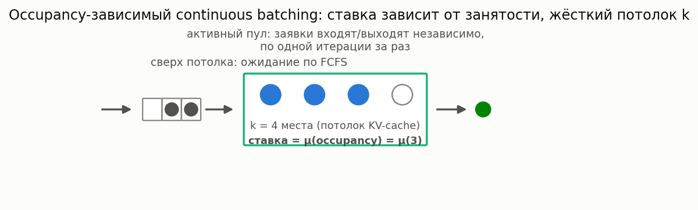

# Системы с occupancy-зависимым continuous batching

[🇬🇧 English version](continuous-batching.md) · [← Каталог моделей](../models.ru.md)



**Простыми словами:** современные инференс-движки для LLM (в стиле vLLM/SGLang,
«continuous batching») не обслуживают фиксированную группу заявок атомарно, как
классическое пакетное обслуживание (см. [пакетные приходы](batch.ru.md)) — заявка
присоединяется к общему, ограниченному по ёмкости пулу и покидает его независимо от
остальных, по одному шагу генерации токена за раз. Потолок (`k`) на число одновременно
резидентных заявок задаётся доступной памятью ускорителя (KV-cache), а интенсивность
обслуживания каждой заявки обычно *зависит от того, сколько заявок сейчас резидентно* —
больший общий батч даёт больше амортизированной пропускной способности за шаг, но и
больше конкуренции за вычисления/пропускную способность памяти.

### Очередь с occupancy-зависимым обслуживанием и потолком занятости

**Описание:** пуассоновский входной поток; до `k` заявок обслуживаются одновременно с
интенсивностью завершения `mu(occupancy)`, которая может зависеть от ТЕКУЩЕГО числа
резидентных заявок (а не быть фиксированной на канал, как в классическом M/M/c); заявки
сверх потолка ждут по FCFS. Такая occupancy-зависимая цепь гибели-размножения имеет
точное (замкнутое) стационарное распределение, и — поскольку занятость жёстко
зафиксирована на уровне `k`, пока кто-то ждёт, — время ожидания вновь прибывшей заявки
есть точная смесь эрланговских распределений: точные моменты И точный хвост `P(W>t)`,
а не только среднее (в отличие от единственной найденной напрямую сопоставимой
современной работы по этому же классу систем, которая даёт лишь приближённое и только
среднее значение).

**Класс калькулятора:** `OccupancyDependentQueueCalc`
(`most_queue.theory.continuous_batching.occupancy_dependent`)

```python
from most_queue.theory.continuous_batching import OccupancyDependentQueueCalc

calc = OccupancyDependentQueueCalc(k=8, queue_truncation=200)   # k = потолок занятости (слоты KV-cache)
calc.set_sources(l=4.0)
calc.set_servers(lambda occupancy: 2.0 / (0.5 + 0.3 * occupancy))  # медленнее на заявку при росте батча
res = calc.run()                                 # res.w -- точные начальные моменты времени ожидания
p_wait = calc.get_p_wait()                       # точная P(W > 0) -- потолок уже занят при приходе
p_violation = calc.get_tail(0.5)                 # точная P(W > 0.5) -- SLA-хвост, не приближённый
```

`mu` может быть и обычным скаляром (occupancy-независимым) — тогда точно сводится к
классической очереди `M/M/k/N` (`most_queue.theory.fifo.mmnr.MMnrCalc`), а `k=1` — к
классической `M/M/1/N`.

**Родственная модель (безграничный предел):** если убрать потолок занятости совсем
(`k → ∞`) и делить ставку поровну между всеми присутствующими, допуск никогда не
блокируется, и время ожидания до начала обслуживания вырождается в ноль — система
становится классическим **egalitarian processor sharing**, уже есть в библиотеке как
[`MG1PSCalc`](size-based.ru.md) (один сервер) и её обобщение на `n` серверов
`MGnPSCalc`. Действительно новый
ингредиент этой модели относительно классической линии — именно конечный потолок `k`
вместе с внешней FCFS-очередью, которые и делают ненулевое, точное распределение
времени ожидания вообще возможным.

### Occupancy-модулированное двухветвевое обслуживание (неоднородные длины вывода)

**Описание:** реальные LLM-запросы резко различаются по длине вывода (короткие ответы
против длинных), чего одна экспоненциальная интенсивность выразить не может. Здесь
каждая допущенная заявка дополнительно несёт **ветвь** (0 или 1), выбираемую один раз
при допуске, со своей occupancy-зависимой интенсивностью. Состояние — `(j, m)`, где
`m` — сколько активных заявок в ветви 0; заявки неразличимы, поэтому состояний на
ярусе `min(j,k)+1`, а не `2**j`.

**Терминологическая оговорка:** поскольку интенсивность уже допущенной заявки меняется
при каждом изменении занятости, её время обслуживания **не является** $H_2$-величиной —
это occupancy-**модулированное** двухветвевое экспоненциальное обслуживание. (Та же
оговорка относится и к модели выше: там время обслуживания не Exp, а
кусочно-экспоненциальное — стандартная семантика load-dependent service rate.)

**Класс калькулятора:** `OccupancyDependentH2QueueCalc`
(`most_queue.theory.continuous_batching.occupancy_dependent_h2`)

```python
from most_queue.theory.continuous_batching import OccupancyDependentH2QueueCalc

calc = OccupancyDependentH2QueueCalc(k=8, queue_truncation=400)
calc.set_sources(l=4.0)
calc.set_servers(                       # каждый параметр — скаляр или f(occupancy)
    p1=0.5,                             # вероятность выбрать ветвь 0 при допуске
    mu1=lambda occ: 6.0 / (0.5 + 0.3 * occ),   # «короткая» ветвь
    mu2=lambda occ: 1.2 / (0.5 + 0.3 * occ),   # «длинная» ветвь
)
e_w = calc.get_w_mean()        # точное среднее ожидание до допуска (формула Литтла для очереди)
p_wait = calc.get_p_wait()
e_n = calc.get_n_moments(1)[0]
```

Точно сводится к модели выше двумя независимыми путями: при `p1=1` (все выбирают
ветвь 0) и при `mu1 == mu2` (метка ветви становится нерелевантной).

**Точность и объём:** точные уровневое распределение, среднее время ожидания и `E[N]`
при любом `k` и любых occupancy-зависимых параметрах ветвей. Полное *распределение*
времени ожидания здесь — явный резерв (в отличие от модели с одной интенсивностью):
выше потолка интенсивность ухода зависит от текущего состава ветвей, который сам
меняется, поэтому ожидание — настоящее фазовое распределение, а не смесь эрлангов;
`_wait_phase_generator()` бросает `NotImplementedError` с этим объяснением.

**Что это даёт.** При одинаковой нагрузке (совпадающее среднее *время* обслуживания,
меняется только неоднородность) моделирование неоднородных по длине вывода запросов
экспоненциальным обслуживанием занижает среднее время ожидания примерно **в 1.1 раза
при SCV≈1.2 и до ~1.9 раза при SCV≈2.8**. Важно: сравнивать надо при совпадающем
среднем *времени* обслуживания, а не средней *интенсивности* — матчинг интенсивностей
незаметно меняет нагрузку (эта ловушка описана в EPIC-074).

**Точность и объём (модель с одной интенсивностью):** точно для любого `k` и любой occupancy-зависимой функции ставки.
Моделируется фиксированный (экзогенный) потолок занятости `k` и occupancy-независимый
объём памяти на заявку — РАСТУЩИЙ во времени объём KV-cache на заявку, как в реальных
движках, и нефазовое (не экспоненциальное) остаточное время обслуживания — явные,
задокументированные резервы для дальнейшей работы (см. EPIC-073). `W` здесь — только
задержка в очереди до допуска в активный пул, не полное время пребывания.
