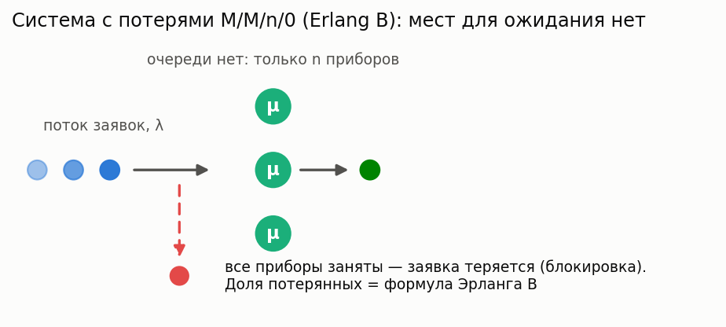
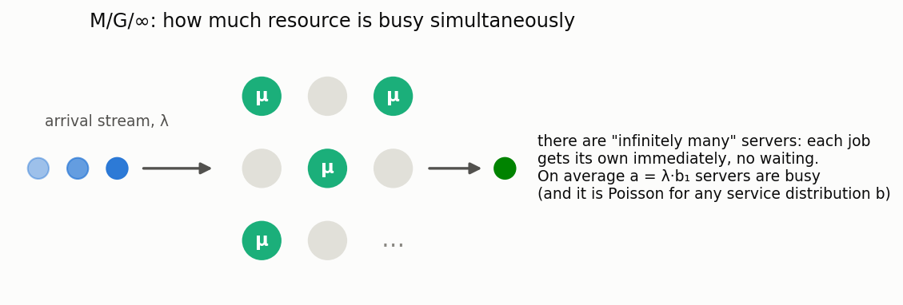

# FIFO systems (First In First Out discipline)

[🇷🇺 Русская версия](fifo.ru.md) · [← Model catalog](../models.md)


**In plain words:** jobs (customers, tasks, packets) arrive at random moments, join a common
queue, and are served in order of arrival by the first server to become free. The models below
cover the "classic" FIFO spectrum: from fully memoryless M/M/c through general-distribution M/G/1
and GI/M/1 to two-moment GI/G approximations.

Two related families have their own pages: **[size-based scheduling](size-based.md)** (the server
picks jobs by size instead of arrival order — SRPT/SJF/PSJF/SPJF/FB/PS/LCFS-PR) and
**[multiserver H₂ systems](multiserver-h2.md)** (the Takahashi–Takami method for multi-channel
systems with hyperexponential arrivals/service).

### M/M/c

**Description:** Multi-server system with Poisson arrivals and exponential service.

**In plain words:** the "ideal call center" — both the gaps between calls and the call durations
are random and independent of the past. The simplest multi-server model; all characteristics
are computed exactly, and it is the right starting point for any analysis.

**Calculator class:** `MMnrCalc`

**Example:**

```python
from most_queue.theory.fifo.mmnr import MMnrCalc

calc = MMnrCalc(n=3)  # 3 servers
calc.set_sources(l=2.0)
calc.set_servers(mu=1.0)
results = calc.run()
```

### M/M/c/r

**Description:** M/M/c with a finite queue (at most r waiting positions).

**In plain words:** same as M/M/c, but the "waiting room" has only r seats: a job that arrives
to a full system is rejected and lost. A model for systems with a finite buffer (telephony,
network equipment).

**Calculator class:** `MMnrCalc`

**Example:**

```python
from most_queue.theory.fifo.mmnr import MMnrCalc

calc = MMnrCalc(n=3, r=20)  # 3 servers, queue capacity 20
calc.set_sources(l=2.0)
calc.set_servers(mu=1.0)
results = calc.run()
```

### M/M/n/0 — Erlang B (loss system)



**Description:** The classical loss system: there is no queue, and a job that finds all n servers busy is lost. The blocking probability is given by the Erlang B formula (a numerically stable recursion).

**In plain words:** how many phone lines (hospital beds, parking spots) are needed to lose no
more than a given fraction of customers. By Sevastyanov's theorem the blocking probability does
not depend on the shape of the service distribution — only on its mean — so the result also
holds for M/G/n/0.

**Calculator class:** `ErlangBCalc` (`most_queue.theory.fifo.erlang`)

**Example:**

```python
from most_queue.theory.fifo.erlang import ErlangBCalc

calc = ErlangBCalc(n=3)
calc.set_sources(l=2.0)
calc.set_servers(mu=1.0)
results = calc.run()
blocking = calc.get_blocking_probability()
```

### M/M/n — Erlang C (waiting system)

**Description:** Multi-server system with an infinite queue. The waiting probability is given by the Erlang C formula; the waiting time moments are available in closed form.

**In plain words:** the basic staffing model: what is the probability that a customer has to wait,
and for how long. The wait is either zero (a server is free) or exponential — which is why all
the moments follow from a single formula.

**Calculator class:** `ErlangCCalc` (`most_queue.theory.fifo.erlang`)

**Example:**

```python
from most_queue.theory.fifo.erlang import ErlangCCalc

calc = ErlangCCalc(n=3)
calc.set_sources(l=2.0)
calc.set_servers(mu=1.0)
results = calc.run()
p_wait = calc.get_waiting_probability()
```

### M/G/∞ (infinitely many servers)



**Description:** Every job instantly gets its own server: there is no waiting, and the number of busy servers has a Poisson distribution with mean λ·b₁, regardless of the shape of the service distribution (insensitivity).

**In plain words:** a model of an "abundant" resource — active sessions, calls in a large network,
cars on a highway. It answers the question "how much of the resource is actually in use at once"
and serves as a building block for staffing approximations.

**Calculator class:** `MGInfCalc` (`most_queue.theory.fifo.m_g_inf`)

**Example:**

```python
from most_queue.theory.fifo.m_g_inf import MGInfCalc
from most_queue.random.distributions import GammaDistribution

calc = MGInfCalc()
calc.set_sources(l=1.0)

gamma_params = GammaDistribution.get_params_by_mean_and_cv(2.0, 1.2)
b = GammaDistribution.calc_theory_moments(gamma_params, 4)
calc.set_servers(b=b)

results = calc.run()
busy_mean = calc.get_offered_load()  # mean number of busy servers
```

### M/G/1

**Description:** Single-server system with Poisson arrivals and a general service time distribution.

**In plain words:** one server, arbitrary service time (specified via raw moments). The classical
Pollaczek–Khinchine setting: the queue grows not only with the load but also with the *variability*
of the service time — for the same mean, a system with rare "heavy" jobs waits far longer than
one with identical jobs.

**Calculator class:** `MG1Calc`

**Example:**

```python
from most_queue.theory.fifo.mg1 import MG1Calc
from most_queue.random.distributions import H2Distribution

calc = MG1Calc()
calc.set_sources(l=0.5)

h2_params = H2Distribution.get_params_by_mean_and_cv(mean=2.0, cv=0.8)
b = H2Distribution.calc_theory_moments(h2_params, 5)
calc.set_servers(b)

results = calc.run()
```

### GI/M/1

**Description:** Single-server system with general arrivals and exponential service.

**In plain words:** the mirror image of M/G/1 — now the "general" side is not the service but
the arrival process: the interarrival times may have any distribution (specified via moments),
while service is exponential.

**Calculator class:** `GIM1Calc`

**Example:**

```python
from most_queue.theory.fifo.gi_m_1 import GIM1Calc
from most_queue.random.distributions import GammaDistribution

calc = GIM1Calc()

gamma_params = GammaDistribution.get_params_by_mean_and_cv(mean=2.0, cv=0.6)
a = GammaDistribution.calc_theory_moments(gamma_params)
calc.set_sources(a)

calc.set_servers(mu=0.6)
results = calc.run()
```

### GI/M/c

**Description:** Multi-server system with general arrivals and exponential service.

**Calculator class:** `GiMn`

**Example:**

```python
from most_queue.theory.fifo.gi_m_n import GiMn
from most_queue.random.distributions import GammaDistribution

calc = GiMn(n=3)  # 3 servers

gamma_params = GammaDistribution.get_params_by_mean_and_cv(mean=2.0, cv=0.6)
a = GammaDistribution.calc_theory_moments(gamma_params)
calc.set_sources(a)

calc.set_servers(mu=0.6)
results = calc.run()
```

### GI/M/2 with a busy-server-dependent service rate

**Description:** two servers sharing one FCFS queue, general (renewal) arrivals, exponential
service — but the rate depends on how many servers are busy. While both are busy each works at
`μ`; while only one is busy it works at `μ_single`, which need not equal `μ`. Bhat's motivating
picture is two repairmen who help each other when one is free (`μ_single > μ`), and the opposite
case where a lone operator slows down.

**In plain words:** real servers are not independent. A lone worker may be helped by an idle
colleague, or may slack off; a lone GPU process may get the whole memory bandwidth instead of
half. The ordinary GI/M/2 cannot express any of that, because it fixes one rate per server
regardless of what the other is doing.

**Calculator class:** `GiM2StateDependentCalc` (`most_queue.theory.fifo.gi_m2_state_dependent`)

```python
from most_queue.theory.fifo.gi_m2_state_dependent import GiM2StateDependentCalc
from most_queue.random.distributions import GammaDistribution

calc = GiM2StateDependentCalc()
gamma_params = GammaDistribution.get_params_by_mean_and_cv(f1=0.83, cv=0.5)
calc.set_sources(GammaDistribution.calc_theory_moments(gamma_params))
calc.set_servers(mu=1.0, mu_single=1.6)   # a lone server is helped by the idle one

calc.get_p()            # time-stationary number in system
calc.get_pi()           # what an ARRIVING customer sees -- different, no PASTA here
calc.get_w(4)           # exact raw moments of the waiting time
calc.get_w_tail(2.0)    # exact P(W > 2)
calc.get_wait_prob()    # P(W > 0)
calc.get_q()            # mean number in system
calc.get_v()[0]         # mean sojourn, by Little
```

**Method.** Implementation of Bhat U.N., *The queue GI/M/2 with service rate depending on the
number of busy servers*, Annals of the Institute of Statistical Mathematics 18:211–221, 1966,
[doi:10.1007/BF02869531](https://doi.org/10.1007/BF02869531). **The model and the solution are
his.** He works out the time-dependent behaviour in double transforms; what is implemented here
is the steady state, obtained as his section 5 prescribes — `P_j = lim_{θ→0} θ·φ₀ⱼ(θ)` applied to
his equations (45)–(47). He carries that limit out himself only for Poisson arrivals at three
particular rate ratios (his table (56)), and those are among the references this is checked
against.

**Two things worth knowing, neither of them in the paper.**

*The state dependence changes how often you wait, not how long.* The root `γ` of
`z = ψ(2μ(1−z))` mentions only the both-busy rate, so it does not depend on `μ_single` at all.
The waiting time therefore comes out as an atom at zero plus `Exp(2μ(1−γ))` — the same
exponential as in an ordinary GI/M/2. All the `μ_single` dependence sits in the size of the atom.
That is convenient for capacity work: helping the lone server reduces the *probability* of
queueing without touching the tail decay, so it cannot fix a heavy tail.

*Stability is decided by `μ` alone*, `arrival rate < 2μ`. However fast the lone server is, a long
enough queue keeps both servers busy and the drain rate is `2μ` regardless.

**What helping the lone server actually buys** (`μ = 1`, Gamma arrivals with mean 0.83, cv 0.5):

| `μ_single` | `P(W>0)` | `E[W]` | `P(W>2)` | `E[Q]` |
|---|---|---|---|---|
| 0.6 (slowdown) | 0.3399 | 0.2954 | 0.034036 | 1.721 |
| 1.0 (ordinary GI/M/2) | 0.2868 | 0.2492 | 0.028713 | 1.505 |
| 1.4 | 0.2392 | 0.2079 | 0.023953 | 1.305 |
| 1.8 | 0.1983 | 0.1723 | 0.019855 | 1.127 |

Note that `P(W>0)`, `E[W]` and `P(W>2)` all fall by the *same* factor (−42% across the range):
only the atom moves, the exponential behind it does not. That is the structural point above made
numerical — and it says plainly that this lever rescales the whole waiting-time curve rather than
reshaping its tail.

**Two degenerate ratios, both used as regression targets:**

- `μ_single = μ` is the ordinary GI/M/2 and reproduces `GiMn(n=2)` — states and waiting times.
- `μ_single = 2μ` keeps the total drain rate at `2μ` in every state, so the *occupancy process* is
  exactly a GI/M/1 of rate `2μ`. The *waiting times* are deliberately **not** the same: there are
  still two servers, so a customer finding one job in system goes straight to the free one
  instead of queueing. Same occupancy, different per-customer experience.

**Validation:** Bhat's published table (56); the elementary M/M/2 birth-death chain at arbitrary
ratio, including the `μ_single > 2μ` region his table does not cover; an **exact CTMC** (Erlang
interarrivals make the system a finite-phase Markov chain), matching both the time-stationary and
the arrival-observed distributions to `1e-12`; the library's own `GiMn` at the two degenerate
ratios; and simulation. See [EPIC-078](../epics/EPIC-078-gi-m2-state-dependent-rate.md).

### GI/G/1 and GI/G/m (two-moment approximations)

**Description:** Approximate computation of the mean waiting time from the first two moments of the arrival and service processes: Kingman (upper bound), Krämer–Langenbach-Belz for GI/G/1 (exact for M/G/1), Allen–Cunneen for GI/G/m (exact for M/M/m).

**In plain words:** "back-of-the-napkin formulas" for capacity planning: for when only the means
and variabilities are known and no exact solution exists. Only the first moment is returned
(this is an approximation, not an exact solution); the typical KLB error is a few percent. The
Kimura formula (interpolation over D/M/s, M/D/s, M/M/s) is deferred — it requires exact D/M/s
solutions.

**Calculator classes:** `GIG1ApproxCalc`, `GIGmApproxCalc` (`most_queue.theory.fifo.gi_g_approx`)

**Example:**

```python
from most_queue.theory.fifo.gi_g_approx import GIG1ApproxCalc
from most_queue.random.distributions import GammaDistribution

a_params = GammaDistribution.get_params_by_mean_and_cv(1.0, 0.56)
b_params = GammaDistribution.get_params_by_mean_and_cv(0.7, 1.2)

calc = GIG1ApproxCalc()  # or GIG1ApproxCalc(approximation="kingman")
calc.set_sources(GammaDistribution.calc_theory_moments(a_params, 4))
calc.set_servers(GammaDistribution.calc_theory_moments(b_params, 4))
results = calc.run()  # results.w — [w1], first moment only
```

### M/D/c

**Description:** Multi-server system with Poisson arrivals and deterministic service time.

**In plain words:** service takes exactly the same time for every job (an assembly line, a
machine cycle). Zero service variability is the best case for a queue: at the same load the
wait is half as long as in M/M/c.

**Calculator class:** `MDn`

**Example:**

```python
from most_queue.theory.fifo.m_d_n import MDn

calc = MDn(n=3)
calc.set_sources(l=2.0)
calc.set_servers(b=1.0)  # constant service time
results = calc.run()
```

### Eₖ/D/c

**Description:** Multi-server system with Erlang-distributed interarrival times and deterministic service.

**In plain words:** an Erlang arrival stream is more "rhythmic" than a Poisson one (jobs arrive
more regularly), and the service time is constant. A model of nearly deterministic production
lines.

**Calculator class:** `EkDn`

**Example:**

```python
from most_queue.theory.fifo.ek_d_n import EkDn

calc = EkDn(n=3, k=2)  # 3 servers, Erlang of order 2
calc.set_sources(l=2.0)
calc.set_servers(b=1.0)
results = calc.run()
```

**Next:** [Size-based scheduling](size-based.md) (SRPT/SJF/PSJF/SPJF/FB/PS/LCFS-PR) ·
[Multiserver H₂ systems (Takahashi–Takami)](multiserver-h2.md)
