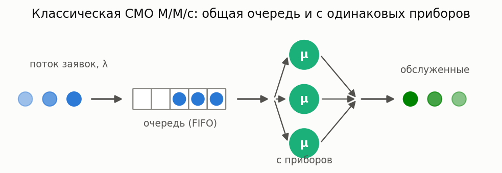
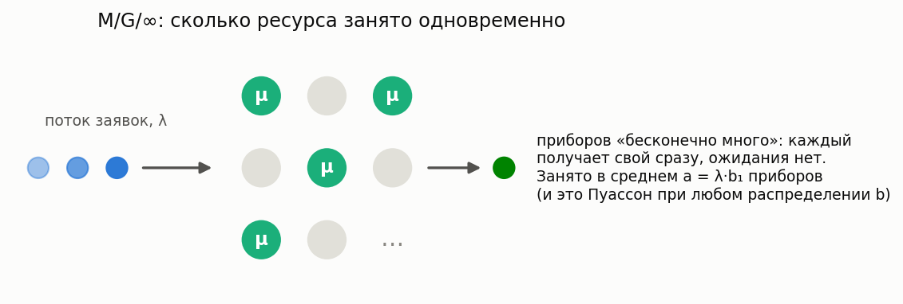

# FIFO системы (дисциплина First In First Out)

[🇬🇧 English version](fifo.md) · [← Каталог моделей](../models.ru.md)



**Простыми словами:** заявки (клиенты, задачи, пакеты) приходят в случайные моменты, встают
в общую очередь и обслуживаются в порядке прихода первым освободившимся прибором. Модели ниже
покрывают «классический» спектр FIFO: от полностью бес­памятного M/M/c через общее распределение
M/G/1 и GI/M/1 до двухмоментных GI/G-аппроксимаций.

Две смежные темы вынесены на отдельные страницы: **[size-based дисциплины](size-based.ru.md)**
(прибор выбирает заявки по размеру, а не по порядку прихода — SRPT/SJF/PSJF/SPJF/FB/PS/LCFS-PR) и
**[многоканальные H₂-системы](multiserver-h2.ru.md)** (метод Такахаси-Таками для многоканальных
систем с гиперэкспоненциальным потоком/обслуживанием).

### M/M/c

**Описание:** Многоканальная система с пуассоновским потоком и экспоненциальным обслуживанием.

**Суть:** «идеальный колл-центр» — и промежутки между звонками, и длительности разговоров
случайны и не зависят от прошлого. Простейшая многоканальная модель, все характеристики
считаются точно; с неё стоит начинать любой анализ.

**Класс расчета:** `MMnrCalc`

**Пример:**

```python
from most_queue.theory.fifo.mmnr import MMnrCalc

calc = MMnrCalc(n=3)  # 3 канала
calc.set_sources(l=2.0)
calc.set_servers(mu=1.0)
results = calc.run()
```

### M/M/c/r

**Описание:** M/M/c с ограниченной очередью (максимум r мест в очереди).

**Суть:** то же, что M/M/c, но мест в «зале ожидания» всего r: заявка, пришедшая в полную
систему, получает отказ и теряется. Модель для систем с конечным буфером (телефония,
сетевое оборудование).

**Класс расчета:** `MMnrCalc`

**Пример:**

```python
from most_queue.theory.fifo.mmnr import MMnrCalc

calc = MMnrCalc(n=3, r=20)  # 3 канала, очередь до 20
calc.set_sources(l=2.0)
calc.set_servers(mu=1.0)
results = calc.run()
```

### M/M/n/0 — Erlang B (система с потерями)


**Описание:** Классическая система с потерями: очереди нет, заявка, заставшая все n приборов занятыми, теряется. Вероятность блокировки — формула Эрланга B (устойчивая рекурсия).

**Суть:** сколько нужно телефонных линий (коек, парковочных мест), чтобы терять не больше
заданной доли клиентов. По теореме Севастьянова блокировка не зависит от формы распределения
обслуживания — только от его среднего, поэтому результат верен и для M/G/n/0.

**Класс расчета:** `ErlangBCalc` (`most_queue.theory.fifo.erlang`)

**Пример:**

```python
from most_queue.theory.fifo.erlang import ErlangBCalc

calc = ErlangBCalc(n=3)
calc.set_sources(l=2.0)
calc.set_servers(mu=1.0)
results = calc.run()
blocking = calc.get_blocking_probability()
```

### M/M/n — Erlang C (система с ожиданием)

**Описание:** Многоканальная система с бесконечной очередью. Вероятность ожидания — формула Эрланга C; моменты времени ожидания в замкнутой форме.

**Суть:** базовая модель staffing: какова вероятность, что клиенту придётся ждать, и сколько.
Ожидание либо нулевое (есть свободный прибор), либо экспоненциальное — отсюда все моменты
одной формулой.

**Класс расчета:** `ErlangCCalc` (`most_queue.theory.fifo.erlang`)

**Пример:**

```python
from most_queue.theory.fifo.erlang import ErlangCCalc

calc = ErlangCCalc(n=3)
calc.set_sources(l=2.0)
calc.set_servers(mu=1.0)
results = calc.run()
p_wait = calc.get_waiting_probability()
```

### M/G/∞ (бесконечное число приборов)



**Описание:** Каждой заявке мгновенно достаётся свой прибор: ожидания нет, число занятых приборов имеет пуассоновское распределение со средним λ·b₁ независимо от формы распределения обслуживания (нечувствительность).

**Суть:** модель «изобильного» ресурса — активные сессии, звонки в большой сети, машины
на трассе. Ответ на вопрос «сколько ресурса реально занято одновременно» и строительный
блок для staffing-аппроксимаций.

**Класс расчета:** `MGInfCalc` (`most_queue.theory.fifo.m_g_inf`)

**Пример:**

```python
from most_queue.theory.fifo.m_g_inf import MGInfCalc
from most_queue.random.distributions import GammaDistribution

calc = MGInfCalc()
calc.set_sources(l=1.0)

gamma_params = GammaDistribution.get_params_by_mean_and_cv(2.0, 1.2)
b = GammaDistribution.calc_theory_moments(gamma_params, 4)
calc.set_servers(b=b)

results = calc.run()
busy_mean = calc.get_offered_load()  # среднее число занятых приборов
```

### M/G/1

**Описание:** Одноканальная система с пуассоновским потоком и произвольным распределением времени обслуживания.

**Суть:** один прибор, время обслуживания — любое (задаётся начальными моментами). Классика
Полячека–Хинчина: очередь растёт не только от загрузки, но и от *разброса* времени
обслуживания — при одинаковом среднем система с редкими «тяжёлыми» заявками ждёт гораздо
дольше, чем с одинаковыми.

**Класс расчета:** `MG1Calc`

**Пример:**

```python
from most_queue.theory.fifo.mg1 import MG1Calc
from most_queue.random.distributions import H2Distribution

calc = MG1Calc()
calc.set_sources(l=0.5)

h2_params = H2Distribution.get_params_by_mean_and_cv(mean=2.0, cv=0.8)
b = H2Distribution.calc_theory_moments(h2_params, 5)
calc.set_servers(b)

results = calc.run()
```

### GI/M/1

**Описание:** Одноканальная система с общим потоком поступления и экспоненциальным обслуживанием.

**Суть:** зеркальная к M/G/1 ситуация — теперь «произвольная» сторона не обслуживание,
а входящий поток: промежутки между приходами имеют любое распределение (задаётся моментами),
обслуживание — экспоненциальное.

**Класс расчета:** `GIM1Calc`

**Пример:**

```python
from most_queue.theory.fifo.gi_m_1 import GIM1Calc
from most_queue.random.distributions import GammaDistribution

calc = GIM1Calc()

gamma_params = GammaDistribution.get_params_by_mean_and_cv(mean=2.0, cv=0.6)
a = GammaDistribution.calc_theory_moments(gamma_params)
calc.set_sources(a)

calc.set_servers(mu=0.6)
results = calc.run()
```

### GI/M/c

**Описание:** Многоканальная система с общим потоком поступления и экспоненциальным обслуживанием.

**Класс расчета:** `GiMn`

**Пример:**

```python
from most_queue.theory.fifo.gi_m_n import GiMn
from most_queue.random.distributions import GammaDistribution

calc = GiMn(n=3)  # 3 канала

gamma_params = GammaDistribution.get_params_by_mean_and_cv(mean=2.0, cv=0.6)
a = GammaDistribution.calc_theory_moments(gamma_params)
calc.set_sources(a)

calc.set_servers(mu=0.6)
results = calc.run()
```

### GI/G/1 и GI/G/m (двухмоментные аппроксимации)

**Описание:** Приближённый расчёт среднего времени ожидания по первым двум моментам потока и обслуживания: Kingman (верхняя граница), Krämer–Langenbach-Belz для GI/G/1 (точно для M/G/1), Allen–Cunneen для GI/G/m (точно для M/M/m).

**Суть:** «формулы на салфетке» для capacity planning: когда известны только средние и разбросы,
а точного решения нет. Возвращается только первый момент (это аппроксимация, а не точный
расчёт); типичная погрешность KLB — единицы процентов. Формула Кимуры (интерполяция по
D/M/s, M/D/s, M/M/s) отложена — требует точных решений D/M/s.

**Классы расчета:** `GIG1ApproxCalc`, `GIGmApproxCalc` (`most_queue.theory.fifo.gi_g_approx`)

**Пример:**

```python
from most_queue.theory.fifo.gi_g_approx import GIG1ApproxCalc
from most_queue.random.distributions import GammaDistribution

a_params = GammaDistribution.get_params_by_mean_and_cv(1.0, 0.56)
b_params = GammaDistribution.get_params_by_mean_and_cv(0.7, 1.2)

calc = GIG1ApproxCalc()  # или GIG1ApproxCalc(approximation="kingman")
calc.set_sources(GammaDistribution.calc_theory_moments(a_params, 4))
calc.set_servers(GammaDistribution.calc_theory_moments(b_params, 4))
results = calc.run()  # results.w — [w1], только первый момент
```

### M/D/c

**Описание:** Многоканальная система с пуассоновским потоком и детерминированным временем обслуживания.

**Суть:** обслуживание занимает строго одинаковое время (конвейер, такт автомата). Нулевой
разброс обслуживания — лучший случай для очереди: при той же загрузке ожидание вдвое короче,
чем в M/M/c.

**Класс расчета:** `MDn`

**Пример:**

```python
from most_queue.theory.fifo.m_d_n import MDn

calc = MDn(n=3)
calc.set_sources(l=2.0)
calc.set_servers(b=1.0)  # постоянное время обслуживания
results = calc.run()
```

### Eₖ/D/c

**Описание:** Многоканальная система с распределением Эрланга межприходных времен и детерминированным обслуживанием.

**Суть:** поток Эрланга — более «ритмичный», чем пуассоновский (заявки приходят регулярнее),
обслуживание постоянное. Модель почти детерминированных производственных линий.

**Класс расчета:** `EkDn`

**Пример:**

```python
from most_queue.theory.fifo.ek_d_n import EkDn

calc = EkDn(n=3, k=2)  # 3 канала, Эрланга порядка 2
calc.set_sources(l=2.0)
calc.set_servers(b=1.0)
results = calc.run()
```

**Далее:** [Size-based дисциплины](size-based.ru.md) (SRPT/SJF/PSJF/SPJF/FB/PS/LCFS-PR) ·
[Многоканальные H₂-системы (Такахаси-Таками)](multiserver-h2.ru.md)
