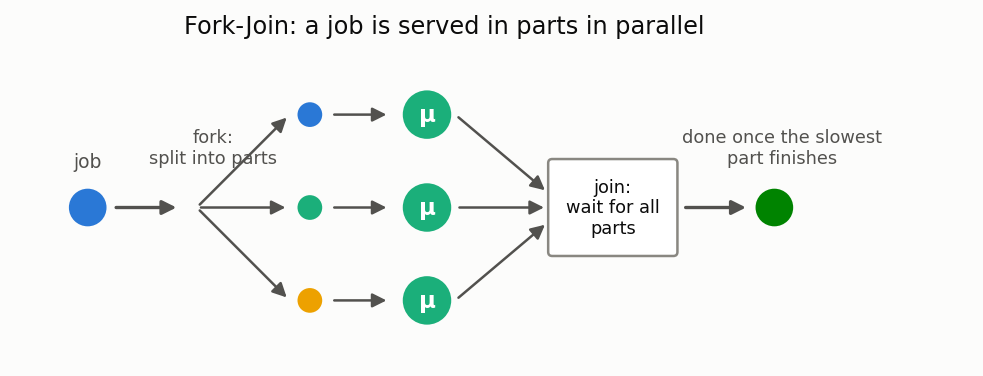

# Fork-Join systems

[🇷🇺 Русская версия](fork-join.ru.md) · [← Model catalog](../models.md)



**In plain words:** on arrival, a job splits (fork) into several parts, the parts are served
in parallel on different servers, and the result is ready only when all parts are collected
(join). This is how parallel computing, RAID arrays, and distributed queries (map-reduce) work.
The response time is determined by the *slowest* part — which is why the mean sojourn time
grows with the number of parts even for the same total amount of work.

### M/M/c Fork-Join

**Description:** A system where a job splits into several parts served in parallel and then rejoined.

**Calculator class:** `ForkJoinMarkovianCalc`

**Example:**

```python
from most_queue.theory.fork_join.m_m_n import ForkJoinMarkovianCalc

calc = ForkJoinMarkovianCalc(n=5, k=2)  # 5 servers, 2 required
calc.set_sources(l=1.0)
calc.set_servers(mu=1.0)
results = calc.run()
```

### M/G/c Split-Join

**Description:** A Split-Join system with a general service time distribution.

**In plain words:** the strict variant of Fork-Join — the next job does not begin service until
the previous one has been fully reassembled (a synchronous batch pipeline).

**Calculator class:** `SplitJoinCalc`

**Example:** See the test `test_fj_sim.py`

### Heavy-tailed sub-task service time (Pareto) — exact, not approximated

**In plain words:** the light-tailed path above approximates the max of n sub-task service times
by moment-matching an H2/Gamma/Erlang distribution and numerically integrating (Gauss-Laguerre
quadrature). For **Pareto**-distributed sub-tasks that approximation is both unnecessary and wrong
— the max of n iid Pareto(α, K) has an exact closed form (substituting `U = F(X) ~ Uniform(0,1)`
turns the max of n Pareto into the max of n Uniform, whose moments are a Beta-function integral):

```
P(max_n > x) = 1 - (1 - (K/x)^α)^n                (exact tail/CDF, any α > 0)
E[max_n^k]   = K^k · n · B(n, 1 - k/α)             (exact moments, only for k < α)
```

Moments of order ≥ α do not exist (same as for a single Pareto) — `pareto_max_moments` raises a
clear error rather than returning `NaN`/`inf`. `SplitJoinCalc(approximation="pareto")` composes
this exact maximum with the exact M/G/1 Pollaczek-Khinchine formula for the full sojourn time —
valid when α > 2 (finite variance, required by P-K). For α ≤ 2, use `pareto_max_tail` directly for
the exact tail of the slowest sub-task; the full-queue sojourn-time asymptotic in that
infinite-variance regime ("one big jump" — Boxma et al., Queueing Systems 2022) is not yet
implemented, see [`docs/research/fork-join-heavy-tail-2026.md`](../research/fork-join-heavy-tail-2026.md).

**Functions/classes:** `pareto_max_moments`, `pareto_max_tail`
(`most_queue.theory.utils.max_dist`); `SplitJoinCalc(calc_params=CalcParams(approx_distr="pareto"))`

**Example:**

```python
from most_queue.random.utils.params import ParetoParams
from most_queue.theory.calc_params import CalcParams
from most_queue.theory.fork_join.split_join import SplitJoinCalc

calc = SplitJoinCalc(n=4, calc_params=CalcParams(approx_distr="pareto"))
calc.set_sources(l=0.3)
calc.set_servers(ParetoParams(alpha=3.5, K=1.0))   # alpha > 2: finite variance
results = calc.run()   # exact sojourn-time moments
```

**See also:** [SLA / deadline-violation probability](sla.md) — its H2/Gamma fit assumes finite
variance and is **not valid** for α ≤ 2; use `pareto_max_tail` (exact) instead for heavy-tailed
fork-join deadlines.
