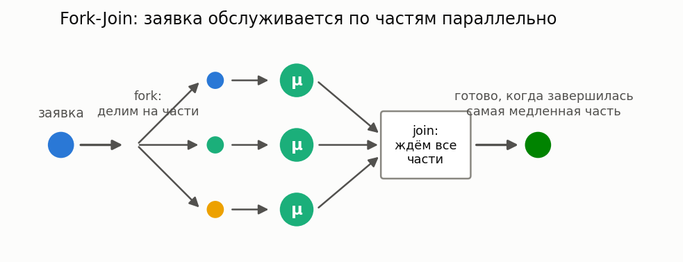

# Fork-Join системы

[🇬🇧 English version](fork-join.md) · [← Каталог моделей](../models.ru.md)



**Простыми словами:** заявка при входе разделяется (fork) на несколько частей, части
обслуживаются параллельно на разных приборах, а результат готов только когда собраны все
части (join). Так устроены параллельные вычисления, RAID-массивы, распределённые запросы
(map-reduce). Время ответа определяет *самая медленная* часть — поэтому среднее время
пребывания растёт с числом частей даже при той же суммарной работе.

### M/M/c Fork-Join

**Описание:** Система, где заявка разделяется на несколько частей, обслуживаемых параллельно, и затем объединяется.

**Класс расчета:** `ForkJoinMarkovianCalc`

**Пример:**

```python
from most_queue.theory.fork_join.m_m_n import ForkJoinMarkovianCalc

calc = ForkJoinMarkovianCalc(n=5, k=2)  # 5 каналов, требуется 2
calc.set_sources(l=1.0)
calc.set_servers(mu=1.0)
results = calc.run()
```

### M/G/c Split-Join

**Описание:** Система Split-Join с произвольным распределением времени обслуживания.

**Суть:** строгий вариант Fork-Join — следующая заявка не начинает обслуживаться, пока
полностью не собрана предыдущая (синхронный конвейер партий).

**Класс расчета:** `SplitJoinCalc`

**Пример:** См. тест `test_fj_sim.py`

### Тяжёлые хвосты подзадач (Pareto) — точно, без аппроксимации

**Простыми словами:** light-tailed путь выше приближает максимум n времён обслуживания подзадач
подгонкой H2/Gamma/Erlang по моментам и численным интегрированием (квадратура Гаусса–Лагерра). Для
**Pareto**-распределённых подзадач эта аппроксимация и не нужна, и неверна — максимум n
независимых Pareto(α, K) имеет точную замкнутую форму (замена `U = F(X) ~ Uniform(0,1)` превращает
максимум n Pareto в максимум n Uniform, чьи моменты — интеграл через Beta-функцию):

```
P(max_n > x) = 1 - (1 - (K/x)^α)^n                (точный хвост/CDF, любой α > 0)
E[max_n^k]   = K^k · n · B(n, 1 - k/α)             (точные моменты, только при k < α)
```

Моменты порядка ≥ α не существуют (как и у одного Pareto) — `pareto_max_moments` кидает понятную
ошибку, а не тихо возвращает `NaN`/`inf`. `SplitJoinCalc(approximation="pareto")` сшивает этот
точный максимум с точной формулой Поллачека–Хинчина M/G/1 для полного времени пребывания —
корректно при α > 2 (конечная дисперсия, нужна для P-K). При α ≤ 2 используйте `pareto_max_tail`
напрямую для точного хвоста самой медленной подзадачи; асимптотика полного времени отклика очереди
в режиме бесконечной дисперсии («one big jump» — Boxma и др., Queueing Systems 2022) пока не
реализована, см. [`docs/research/fork-join-heavy-tail-2026.md`](../research/fork-join-heavy-tail-2026.md).

**Функции/классы:** `pareto_max_moments`, `pareto_max_tail`
(`most_queue.theory.utils.max_dist`); `SplitJoinCalc(calc_params=CalcParams(approx_distr="pareto"))`

**Пример:**

```python
from most_queue.random.utils.params import ParetoParams
from most_queue.theory.calc_params import CalcParams
from most_queue.theory.fork_join.split_join import SplitJoinCalc

calc = SplitJoinCalc(n=4, calc_params=CalcParams(approx_distr="pareto"))
calc.set_sources(l=0.3)
calc.set_servers(ParetoParams(alpha=3.5, K=1.0))   # alpha > 2: конечная дисперсия
results = calc.run()   # точные моменты времени пребывания
```

**См. также:** [SLA / вероятность нарушения дедлайна](sla.ru.md) — её подгонка H2/Gamma
предполагает конечную дисперсию и **неверна** при α ≤ 2; используйте вместо неё точный
`pareto_max_tail` для дедлайнов в тяжёлохвостом fork-join.
