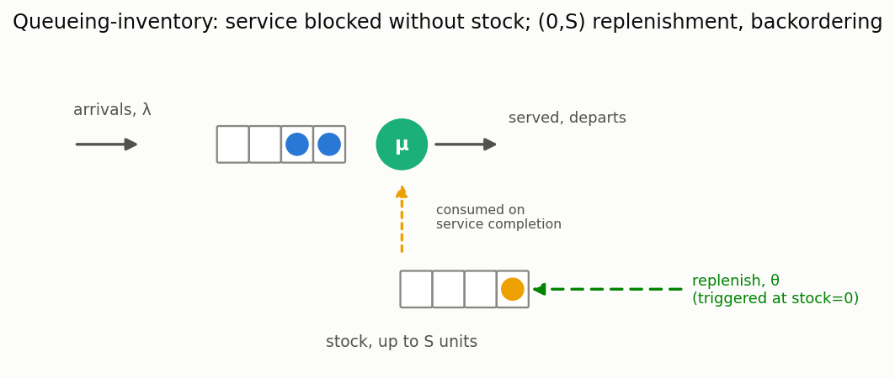

# Queueing-inventory systems

[🇷🇺 Русская версия](inventory.ru.md) · [← Model catalog](../models.md)



**In plain words:** a repair shop, a pharmacy counter, a 3D-printing bureau — anywhere a server
needs a physical (or licensed, or reserved) **unit of stock** to complete each job, not just its
own time. When stock runs out, the server can't work even if it's free and a customer is waiting —
the customer *backorders* (waits) until a replenishment order arrives. This is qualitatively
different from vacations (server idles by its own schedule) or breakdowns (server itself fails):
here an *external resource* gates service, and its own replenishment dynamics couple back into
queue delay.

### M/M/1, (0,S) policy, backordering

**Description:** Poisson arrivals, exponential service that consumes one stock unit on
completion. Stock is capped at `S`; the moment it hits 0, a replenishment order for `S` units is
placed automatically and arrives after `Exp(θ)` ("positive lead time"). While stock is 0, arriving
customers still queue (**backorder** — never lost) but the server is blocked until restock. Exact
solution: the system is precisely a QBD process — level = number of customers `n` (unbounded),
phase = stock level `i ∈ {0,...,S}` — solved via the library's general QBD solver (the same
logarithmic-reduction machinery behind the MAP/PH stack), not a new numerical method. Classic
formulation: Schwarz & Daduna, *M/M/1 Queueing systems with inventory*, Queueing Systems, 2006.

Reduces exactly to plain M/M/1 as `S` and `θ` grow large (stock essentially never runs out) — a
useful sanity check when tuning parameters.

**Calculator class:** `MM1QueueingInventoryCalc` (`most_queue.theory.inventory`)
**Simulation:** `MM1QueueingInventorySim` (`most_queue.sim.inventory`)

**Example:**

```python
from most_queue.theory.inventory import MM1QueueingInventoryCalc

calc = MM1QueueingInventoryCalc(s_max=4)     # stock capped at 4
calc.set_sources(l=0.5)                       # arrival rate
calc.set_servers(mu=1.0, theta=0.5)           # service rate, replenishment rate
res = calc.run()
# res.v[0] mean sojourn, res.w[0] mean wait (V = W + 1/mu exactly, FCFS)
# res.stockout_prob = P(stock == 0), res.fill_rate = 1 - stockout_prob
# res.stock_distribution[i] = P(stock level == i)
```

### Waiting-time distribution (not just the mean)

**Description:** `MM1QueueingInventoryCalc` also gives the exact **distribution** of the waiting
time, not only `E[W]`. The quantity that makes this model different from an ordinary M/M/1 is that
a customer may wait *even with an empty queue* — if the stock is out, service cannot start until a
replenishment arrives. The tail `P(W > t)` captures exactly that risk.

```python
calc = MM1QueueingInventoryCalc(s_max=5, s=1)
calc.set_sources(l=0.6)
calc.set_servers(mu=1.0, theta=0.8)

moments = calc.get_w_moments(4)   # exact raw moments of W
p_wait = calc.get_tail(0.0)       # P(W > 0) -- probability of any wait at all
p_late = calc.get_tail(10.0)      # P(W > 10) -- deadline-violation probability
```

**Attribution.** That the waiting-time distribution is obtainable for queueing-inventory systems is
established theory, not a result of this library: Jeganathan K. et al., *Electronics* 10(5):576,
2021 ([doi:10.3390/electronics10050576](https://doi.org/10.3390/electronics10050576)) derive its
LST via the matrix-geometric technique; Keerthana M., Sangeetha N., Sivakumar B., *Annals of
Operations Research* 331(2):739–762, 2023 treat arbitrary service times. Surveys:
Krishnamoorthy A. et al., *OPSEARCH* 48:153–169, 2011; Krishnamoorthy A., Shajin D.,
Narayanan V.C., "Inventory with Positive Service Time: a Survey", in *Queueing Theory 2*, Wiley,
2021, pp. 201–237. Our implementation takes a different computational route to the same quantity —
a tagged-customer absorbing chain solved by matrix-exponential action, as used throughout this
library's batch-service family — rather than numerical Laplace inversion.

**Cross-checks.** The first moment from the absorbing chain agrees with `get_w()` to machine
precision, which is a strong test because `get_w()` goes through a completely independent path
(Little's law on the matrix-geometric stationary distribution); `∫P(W>t)dt` matches `E[W]`; and the
tail is validated against an independent from-scratch discrete-event simulation.

**Scope:** all seven calculators of the family — `MM1QueueingInventoryCalc`,
`MMcQueueingInventoryCalc`, and the four heterogeneous-server classes
(`MM2QueueingInventoryHeterogeneousCalc`, `MMcQueueingInventoryHeterogeneousCalc`, and the
per-server Erlang and H2 service variants). Each exposes `get_w_moments`, `get_tail`, `get_cdf`,
and `get_service_time_mean()` (the mean time a customer *occupies* a server, which exceeds the
actively-served time when `c > 1` and stockouts bind).

**Heterogeneous servers need no extra machinery**, which is worth stating because it is not
obvious. While the tagged customer waits there are always at least `c` customers ahead of it, so
*every* server is busy — which server is doing what never enters the calculation. The busy-subset
dimension that the stationary solution needs for `n < c` is irrelevant to the wait. For the Erlang
and H2 variants the completion rate does depend on the service phases, and those are read straight
off the QBD blocks `A0`/`A1`/`A2` of the repeating part (arrivals *behind* the tagged customer keep
its level unchanged, so the within-level generator is `A0 + A1`), which is why one construction
serves all four classes.

**This replaced a real defect.** Until EPIC-075 every multi-server class computed
`E[W] = E[V] - E[S_active]`. That overstates the wait: with `c > 1`, one server can take the last
stock unit while another customer is mid-service, suspending that service until a replenishment
arrives — the suspension belongs to the sojourn, not to the wait. Independent simulation
(8 seeds × 900 000 customers, `c = 2`, `mu = (0.8, 1.5)`, `S = 4`, `s = 1`, `theta = 1`) put the
exact value at −0.07σ from the measured `E[W]` and the old formula at **+23σ**, an 8.9 % error. The
single-server model was never affected: with one server the stock cannot drop while that service
runs.

### Lost-sales variant

**Description:** Set `policy="lost_sales"`: an arrival that finds the stock empty (`i = 0`) is
turned away instead of queueing — more realistic for retail/e-commerce, where a customer seeing
"out of stock" leaves rather than joining a virtual queue. The difference from backordering is
**exactly one transition**: an arrival at `i = 0` is not a state change at all under lost sales (it
never enters the CTMC), so `A0`/`B01` lose their phase-0 row and the `i = 0` diagonal entry of
`A1`/`B00` loses the `λ` term — everything else (service, replenishment) is identical. Implemented
as a parameter on the same calculator, not a separate class. Classic formulation: Saffari, Haji &
Hassanzadeh, *The M/M/1 queue with inventory, lost sale, and general lead times*, Queueing
Systems, 2013.

Mean sojourn/queue length are computed via Little's law using the **effective** (accepted)
arrival rate `λ·(1 − loss_prob)`, not the nominal `λ` — a subtlety worth knowing if you reuse the
internals: `level n` under lost sales only counts customers that were actually admitted.

```python
calc = MM1QueueingInventoryCalc(s_max=4, policy="lost_sales")
calc.set_sources(l=0.5)
calc.set_servers(mu=1.0, theta=0.5)
res = calc.run()
# res.loss_prob = P(an arriving customer is turned away) -- equals stockout_prob by PASTA
```

### General (s,S) policy

**Description:** pass `s` (reorder point, `0 <= s < s_max`) to either calculator: replenishment
triggers as soon as stock drops to `s`, not only when it hits 0 — the usual generalization used to
keep a safety-stock buffer instead of running all the way to a stockout before reordering.
Surprisingly, this needs **no extra state dimension**: because the lead time is exponential
(memoryless), "an order is currently in transit" is fully determined by `i <= s` alone, exactly as
`i == 0` alone determined it in the `(0,S)` special case — so the QBD phase space stays
`i ∈ {0,...,S}` and only the replenishment transition's active range changes (`i <= s` instead of
`i == 0`). `s=0` reproduces the `(0,S)` models above exactly. Compatible with both `policy`
values. See [`docs/research/queueing-inventory-general-sS-2026.md`](../research/queueing-inventory-general-sS-2026.md).

```python
calc = MM1QueueingInventoryCalc(s_max=4, s=2, policy="backorder")  # reorder as soon as stock hits 2
calc.set_sources(l=0.5)
calc.set_servers(mu=1.0, theta=0.5)
res = calc.run()
# larger s (more safety stock) never increases stockout_prob or mean wait
```

### Erlang-fitted (non-exponential) replenishment lead time

**Description:** `MM1QueueingInventoryErlangReplenishmentCalc(s_max, s=0, policy="backorder")`
drops the "exponential lead time" assumption: unlike every other phase-type augmentation in this
library (which adds a phase dimension to *every* state), this one only needs a phase dimension
where an order can be in transit — stock levels `i <= s`; levels `i > s` have no pending order and
need no phase at all. A service completion crossing from `i=s+1` into `i=s` is exactly the moment
an order is placed (phase initialized to 0); further service completions while the order is
pending preserve its phase (the order's own progress doesn't care how low stock drifts meanwhile);
the only way back to the no-order zone is the order's last phase completing, which restocks to `S`
directly. `r=1` (Erlang collapses to `Exp(rate)`) reproduces `MM1QueueingInventoryCalc` exactly.
See [`docs/research/queueing-inventory-phase-type-replenishment-2026.md`](../research/queueing-inventory-phase-type-replenishment-2026.md)
and
[`docs/roadmaps/queueing_inventory_phase_type_replenishment_roadmap.md`](../roadmaps/queueing_inventory_phase_type_replenishment_roadmap.md)
for the block derivation, including a validation trap worth knowing: holding the Erlang `rate`
fixed while increasing `r` *increases the mean lead time* (`mean = r/rate`), not just lowers its
CV — comparisons across `r` must hold `r/rate` fixed, exactly like EPIC-035's `k`-vs-`k*rate`
pitfall for bulk-service.

```python
from most_queue.theory.inventory import MM1QueueingInventoryErlangReplenishmentCalc

calc = MM1QueueingInventoryErlangReplenishmentCalc(s_max=4, s=1)
calc.set_sources(l=1.0)
calc.set_servers(mu=2.0, r=3, rate=2.4)  # mean lead time = r/rate = 1.25
res = calc.run()

# or fit (r, rate) from the lead time's raw moments directly:
calc2 = MM1QueueingInventoryErlangReplenishmentCalc(s_max=4, s=1)
calc2.set_sources(l=1.0)
calc2.set_replenishment_from_moments(mu=2.0, moments=[1.25, 1.8])
```

**Accuracy and scope:** exact given the Erlang-fitted family (mean-only). Scoped to the M/M/1
base case — not yet ported to the M/M/c or heterogeneous-server calculators above (reserve; the
augmentation is local to the stock/phase block and doesn't touch the server-busy dimension, so
should port directly). H2 replenishment (CV≥1) is also reserve.

### Multi-server case (M/M/c)

**Description:** `MMcQueueingInventoryCalc(c, s_max, s=0, policy="backorder")` generalizes the
`(s,S)` model above to `c` identical servers, each service still consuming one unit from the same
shared stock. The number of busy servers is `min(n, c)` — a deterministic function of the number
of customers `n` in the system, exactly as in the ordinary `M/M/c` queue — so no extra state
dimension is needed. What *does* change is that the service rate depends on `n` while `n < c`
(rate `n·μ`, not all servers saturated yet) and only becomes level-independent (`c·μ`) once
`n ≥ c`, giving `c` distinct boundary levels instead of one; these are stacked into a single
super-block for the QBD solver (still the same `QBDSolver`, no new numerical method). `c=1`
reproduces `MM1QueueingInventoryCalc` exactly. See
[`docs/research/queueing-inventory-multiserver-2026.md`](../research/queueing-inventory-multiserver-2026.md)
(Yue, Zhao & Yue 2016; Krishnamoorthy, Manikandan & Dhanya 2015) and
[`docs/roadmaps/queueing_inventory_multiserver_roadmap.md`](../roadmaps/queueing_inventory_multiserver_roadmap.md)
for the block derivation.

```python
from most_queue.theory.inventory import MMcQueueingInventoryCalc

calc = MMcQueueingInventoryCalc(c=2, s_max=4, s=1)  # 2 servers, reorder at stock=1
calc.set_sources(l=1.0)
calc.set_servers(mu=1.0, theta=0.5)
res = calc.run()
# rho = l / (c*mu) must be < 1 -- necessary, not sufficient (stockouts can block all servers)
```

### Heterogeneous servers (c=2)

**Description:** `MM2QueueingInventoryHeterogeneousCalc(s_max, s=0, policy="backorder")` drops the
"identical servers" assumption of the `M/M/c` model above for the `c=2` case: server 1 and server 2
may have different rates `mu1 != mu2`, sharing the same stock pool. Combines two already-validated
techniques rather than new math: the state-splitting technique for two heterogeneous exponential
servers (Krishnamoorthi 1963, already used for [machine repair](reliability.md) and
[priority queues](priority-dynamic.md)) with the stacked-boundary-superblock QBD trick from the
`M/M/c` model above. State tracks *which* server is the sole busy one only when there's exactly one
customer in the system (`n=1`) — for `n=0` nobody is busy, for `n≥2` both are, so no ambiguity
there. `mu1=mu2` reproduces `MMcQueueingInventoryCalc(c=2, ...)` exactly. See
[`docs/research/queueing-inventory-heterogeneous-servers-2026.md`](../research/queueing-inventory-heterogeneous-servers-2026.md)
and
[`docs/roadmaps/queueing_inventory_heterogeneous_servers_roadmap.md`](../roadmaps/queueing_inventory_heterogeneous_servers_roadmap.md)
for the block derivation.

```python
from most_queue.theory.inventory import MM2QueueingInventoryHeterogeneousCalc

calc = MM2QueueingInventoryHeterogeneousCalc(s_max=4, s=1)
calc.set_sources(l=1.0)
calc.set_servers(mu1=1.5, mu2=0.7, theta=1.0)  # server 1 faster than server 2
res = calc.run()
```

### Heterogeneous servers, general c

**Description:** `MMcQueueingInventoryHeterogeneousCalc(c, s_max, s=0, policy="backorder")`
generalizes the `c=2` model above to an arbitrary number of heterogeneous servers. For
heterogeneous servers, state-splitting must track *which* servers are busy, not just how many —
at boundary level `n` (`n < c` customers, all in service), the busy set is one of `C(c,n)`
subsets of `{0,...,c-1}`, so the boundary phase space grows as `2^c - 1` (combinatorial in `c`,
tractable for realistic `c`, say up to 6-8). Built mechanically (the canonicalize-style pure-
function pattern from [priority queues with heterogeneous servers](priority-dynamic.md)) from
three small functions — which idle server an arrival joins (lowest-index/highest-priority idle
server, deterministic), which subset results from each possible departure, and the aggregate
service rate of a subset — rather than a hand-derived transition table. Once `n >= c`, all
servers are always busy (any freed server instantly grabs the next queued customer), so the
repeating part of the QBD needs no subset tracking at all, same shape as the identical-server
`M/M/c` model. `c=2` reproduces `MM2QueueingInventoryHeterogeneousCalc` exactly; `mu_1=...=mu_c`
reproduces `MMcQueueingInventoryCalc` exactly. See
[`docs/research/queueing-inventory-heterogeneous-servers-general-c-2026.md`](../research/queueing-inventory-heterogeneous-servers-general-c-2026.md)
and
[`docs/roadmaps/queueing_inventory_heterogeneous_servers_general_c_roadmap.md`](../roadmaps/queueing_inventory_heterogeneous_servers_general_c_roadmap.md)
for the block derivation.

```python
from most_queue.theory.inventory import MMcQueueingInventoryHeterogeneousCalc

calc = MMcQueueingInventoryHeterogeneousCalc(c=3, s_max=4, s=1)
calc.set_sources(l=1.0)
calc.set_servers(mus=[1.5, 1.0, 0.7], theta=1.0)  # priority-order rates: server 0 preferred first
res = calc.run()
```

### Heterogeneous servers, each with H2-fitted (non-exponential) service

**Description:** `MMcQueueingInventoryHeterogeneousH2Calc(c, s_max, s=0, policy="backorder")`
drops the "exponential service" assumption of the general-`c` model above: each server has its
OWN H2(`p1_k`,`mu1_k`,`mu2_k`) service-time distribution, not just a scalar rate — a more
realistic model, since real service times are rarely exponential. Combines EPIC-036's H2
phase-type CTMC augmentation with the subset-tracking above: each server's state is extended from
binary (idle/busy) to ternary (idle / busy-branch-0 / busy-branch-1), where the branch is chosen
once when that server starts a customer's service and stays fixed until departure (H2's defining
property — unlike Erlang's sequential phase-advance, which was deliberately deferred as a harder
reserve item). Boundary phase count grows to `3^c - 2^c`; the repeating part (`n >= c`) gets a
genuinely non-scalar `2^c`-sized phase space (branch combinations across all servers), since
completion rate now depends on which branch each busy server is running — but still has NO
transitions *within* a level, since a branch never changes except at departure, keeping the same
QBD shape as the plain-exponential model. `p1_k=1` for every server (H2 collapses to
`Exp(mu1_k)`) reproduces `MMcQueueingInventoryHeterogeneousCalc` exactly.

**Why not complex-valued H2 parameters:** a CTMC generator's rates and branch probabilities must
be real and non-negative by construction, or the "chain" isn't a valid stochastic process.
`fit_h2_clx` (the complex-capable moment-matching method) is used elsewhere in this library only
for approximate CDF/tail fitting (the [SLA layer](sla.md)), never to build an actual Markov chain.
`set_servers_from_moments` here uses `H2Distribution.get_params` (`fit_h2`, Aliev's method),
which is real by construction and degenerates gracefully outside the H2-feasible region — the
same convention as every other H2-based CTMC augmentation in this library (EPIC-036). See
[`docs/research/queueing-inventory-heterogeneous-servers-h2-service-2026.md`](../research/queueing-inventory-heterogeneous-servers-h2-service-2026.md)
and
[`docs/roadmaps/queueing_inventory_heterogeneous_servers_h2_service_roadmap.md`](../roadmaps/queueing_inventory_heterogeneous_servers_h2_service_roadmap.md)
for the block derivation.

```python
from most_queue.random.utils.params import H2Params
from most_queue.theory.inventory import MMcQueueingInventoryHeterogeneousH2Calc

calc = MMcQueueingInventoryHeterogeneousH2Calc(c=2, s_max=4, s=1)
calc.set_sources(l=1.0)
calc.set_servers(
    [H2Params(p1=0.5, mu1=1.5, mu2=3.0), H2Params(p1=0.3, mu1=0.8, mu2=2.5)],  # own H2 per server
    theta=1.0,
)
res = calc.run()

# or fit each server's H2 independently from its own raw moments:
calc2 = MMcQueueingInventoryHeterogeneousH2Calc(c=2, s_max=4, s=1)
calc2.set_sources(l=1.0)
calc2.set_servers_from_moments([[1.0, 4.0, 30.0], [1.5, 6.0, 50.0]], theta=1.0)
```

**Accuracy and scope:** exact given the per-server H2-fitted family (mean-only, same scope as
every other model in this section). Not covered (reserve): mixed families; exact moments beyond
the mean.

### Heterogeneous servers, each with Erlang-fitted (non-exponential) service

**Description:** `MMcQueueingInventoryHeterogeneousErlangCalc(c, s_max, s=0, policy="backorder")`
is the CV≤1 complement to the H2 model above: each server has its own Erlang(`r_k`,`rate_k`)
service-time distribution. Unlike H2 (branch fixed at service start), Erlang's sequential-phase-
advance means a busy server's phase CAN change without a departure — a same-level ("stay")
transition the H2 model never needed, making this the first heterogeneous-server model in this
family whose repeating QBD part has within-level transitions. `r_k=1` for every server (Erlang
collapses to `Exp(rate_k)`) reproduces `MMcQueueingInventoryHeterogeneousCalc` exactly.

**A bug caught before shipping, via the non-degenerate `r_k>1` check, not the degenerate `r_k=1`
one:** a config's total outflow at stock=0 must exclude only the rate of servers *at their last
phase* (whose completion actually consumes a stock unit — the usual "blocked at zero stock"
convention); a server's *intermediate* phase advance doesn't touch stock and must never be
blocked. Reusing the existing `diag_block` helper unmodified lumped both rate components together
and silently dropped outflow from the generator's diagonal at `i=0` — the resulting matrix failed
a basic row-sum-to-zero check and made the QBD solver diverge for any `r_k>1`, while `r_k=1`
(where "last phase" and "the whole server" coincide) passed by coincidence. Fixed by splitting
outflow into a `departure_rate` (blocked at `i=0`) and an `advance_rate` (never blocked). See
[`docs/research/queueing-inventory-heterogeneous-servers-erlang-service-2026.md`](../research/queueing-inventory-heterogeneous-servers-erlang-service-2026.md)
and
[`docs/roadmaps/queueing_inventory_heterogeneous_servers_erlang_service_roadmap.md`](../roadmaps/queueing_inventory_heterogeneous_servers_erlang_service_roadmap.md)
for the full account.

```python
from most_queue.random.utils.params import ErlangParams
from most_queue.theory.inventory import MMcQueueingInventoryHeterogeneousErlangCalc

calc = MMcQueueingInventoryHeterogeneousErlangCalc(c=2, s_max=4, s=1)
calc.set_sources(l=1.0)
calc.set_servers(
    [ErlangParams(r=2, mu=2.4), ErlangParams(r=3, mu=3.2)],  # own Erlang per server
    theta=1.0,
)
res = calc.run()

# or fit each server's Erlang independently from its own raw moments:
calc2 = MMcQueueingInventoryHeterogeneousErlangCalc(c=2, s_max=4, s=1)
calc2.set_sources(l=1.0)
calc2.set_servers_from_moments([[1.0, 1.2], [1.5, 2.4]], theta=1.0)
```

**Accuracy and scope:** exact given the per-server Erlang-fitted family (mean-only). Not covered
(reserve): mixed families (some servers Erlang, some H2); phase-type replenishment lead time
(EPIC-040 covers the M/M/1 base case only); exact moments beyond the mean.

### Accuracy and scope

Exact (matrix-geometric QBD, not an approximation) for `(0,S)`/general `(s,S)`, `c=1`, identical
`c>1` servers, or heterogeneous servers (any `c`, exponential, per-server Erlang-, or
per-server H2-fitted), backorder
or lost-sales — all of the models
above.
