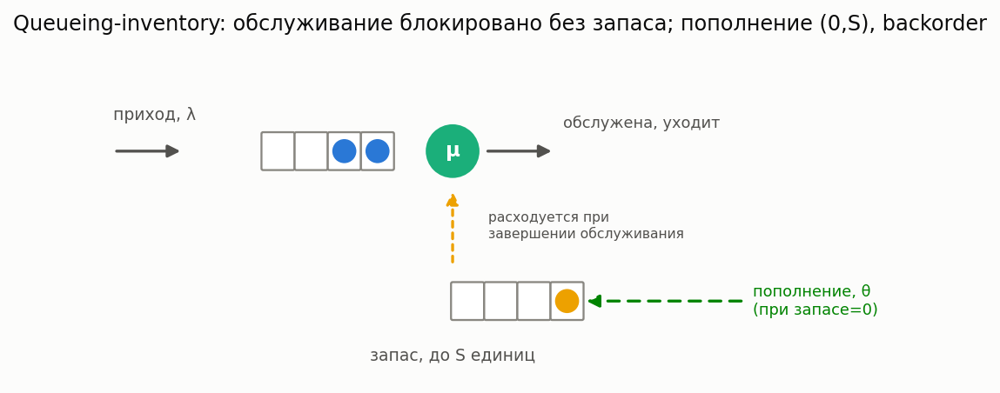

# Queueing-inventory системы (очередь + управление запасами)

[🇬🇧 English version](inventory.md) · [← Каталог моделей](../models.ru.md)



**Простыми словами:** ремонтная мастерская, аптечный прилавок, бюро 3D-печати — везде, где
серверу для завершения работы нужна не только время, но и **физическая единица со склада**
(запчасть, лицензия, зарезервированный ресурс). Когда склад пуст, сервер не может работать, даже
если он свободен и клиент ждёт — клиент **ждёт поставки** (backorder), а не теряется. Это
качественно отличается от отпусков (сервер простаивает по своему расписанию) или отказов (сервер
сам ломается): здесь обслуживание блокирует **внешний ресурс**, и динамика его пополнения
возвращается обратно в задержку очереди.

### M/M/1, политика (0,S), backorder

**Описание:** пуассоновский приход, экспоненциальное обслуживание, расходующее одну единицу
склада при завершении. Запас ограничен `S`; как только он падает до 0, автоматически размещается
заказ на `S` единиц, приходящий через `Exp(θ)` («положительное время поставки»). Пока запас
нулевой, приходящие клиенты по-прежнему встают в очередь (**backorder** — никогда не теряются), но
сервер заблокирован до пополнения. Точное решение: система — это ровно QBD-процесс (уровень =
число клиентов `n`, неограничено; фаза = уровень запаса `i ∈ {0,...,S}`), решаемый через уже
существующий в библиотеке общий QBD-солвер (та же logarithmic-reduction машинерия, что у
MAP/PH-стека), а не новый численный метод. Классическая постановка: Schwarz & Daduna, *M/M/1
Queueing systems with inventory*, Queueing Systems, 2006.

Точно сводится к обычному M/M/1 при больших `S` и `θ` (запас практически никогда не заканчивается)
— удобная проверка при подборе параметров.

**Класс расчета:** `MM1QueueingInventoryCalc` (`most_queue.theory.inventory`)
**Симуляция:** `MM1QueueingInventorySim` (`most_queue.sim.inventory`)

**Пример:**

```python
from most_queue.theory.inventory import MM1QueueingInventoryCalc

calc = MM1QueueingInventoryCalc(s_max=4)     # запас ограничен 4
calc.set_sources(l=0.5)                       # интенсивность прихода
calc.set_servers(mu=1.0, theta=0.5)           # интенсивность обслуживания, пополнения
res = calc.run()
# res.v[0] среднее пребывание, res.w[0] среднее ожидание (V = W + 1/mu точно, FCFS)
# res.stockout_prob = P(запас == 0), res.fill_rate = 1 - stockout_prob
# res.stock_distribution[i] = P(уровень запаса == i)
```

### Точность и охват

Точно (matrix-geometric QBD, не аппроксимация) для модели `(0,S)` с backorder выше. Два
естественных расширения **пока не реализованы** (см.
[`docs/research/queueing-inventory-2026.md`](../research/queueing-inventory-2026.md) для
gap-анализа и литературы): вариант **lost-sales** (приходы во время дефицита теряются, а не
встают в очередь) и общая политика **`(s,S)`** (`s > 0`, требует дополнительный бит состояния «заказ
уже размещён»). Оба — QBD-совместимые расширения того же солвера, просто другая структура блоков.
