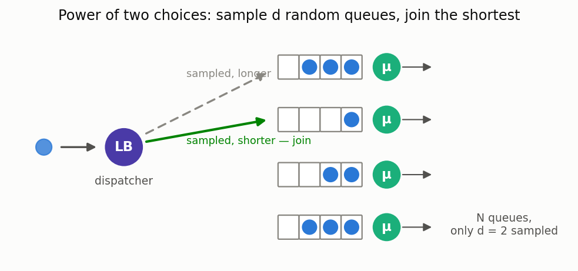

# Load balancing / dispatching (mean-field)

[🇷🇺 Русская версия](load-balancing.ru.md) · [← Model catalog](../models.md)



**In plain words:** with a large pool of servers, a dispatcher decides where each job goes. The
policy matters enormously: sending to a **random** server is far worse than sampling a few and
picking the shortest (**power-of-d** / "power of two choices"), which in turn is nearly as good as
polling all of them (**JSQ**) or always picking an idle one (**JIQ**). In the large-pool
(mean-field) limit these have closed forms.

### Power-of-d, JSQ, JIQ — mean-field response time

**Description:** For per-server load ρ, the stationary fraction of servers with ≥ k jobs is
`s_k = ρ^((d^k−1)/(d−1))` for power-of-d (d=1 = random = M/M/1 geometric tail; d≥2 decays *doubly*
exponentially — the power of two choices), and `s_k = 0` for k ≥ 2 under JSQ/JIQ below capacity
(asymptotically zero waiting). Mean number per server `L = Σ s_k`, response time `W = L/(ρμ)`.

**Calculator class:** `LoadBalancingMeanField` (`most_queue.theory.load_balancing`) ·
**Simulator:** `LoadBalancingSim` (`most_queue.sim.load_balancing`)

```python
from most_queue.theory.load_balancing import LoadBalancingMeanField

calc = LoadBalancingMeanField(policy="power-of-d", d=2)   # or "jsq", "jiq", "random"
calc.set_sources(0.9)     # per-server load rho
calc.set_servers(1.0)     # service rate mu
res = calc.run()          # res.w mean response, res.tail = [s_0, s_1, s_2, ...]
```

See the [power-of-two-choices tutorial](../../tutorials/power_of_two_choices.ipynb).
