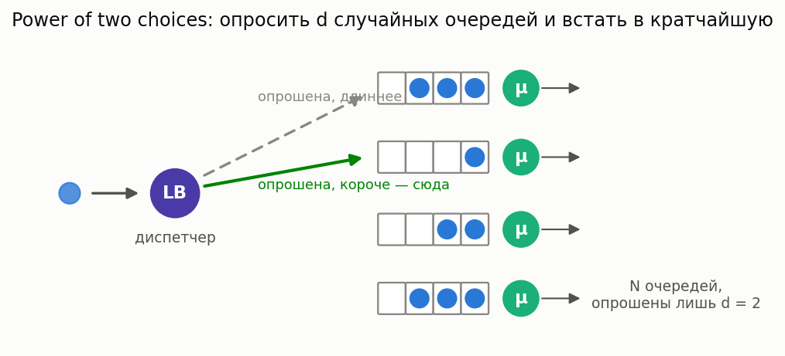

# Балансировка нагрузки / диспетчеризация (mean-field)

[🇬🇧 English version](load-balancing.md) · [← Каталог моделей](../models.ru.md)



**Простыми словами:** при большом пуле серверов диспетчер решает, куда отправить каждую заявку.
Политика критично важна: **случайный** сервер сильно хуже, чем опросить несколько и выбрать
короткий (**power-of-d** / «power of two choices»), что почти так же хорошо, как опрос всех
(**JSQ**) или выбор простаивающего (**JIQ**). В пределе большого пула (mean-field) есть замкнутые
формулы.

### Power-of-d, JSQ, JIQ — время отклика в mean-field

**Описание:** При нагрузке на сервер ρ доля серверов с ≥ k заявками — `s_k = ρ^((d^k−1)/(d−1))` для
power-of-d (d=1 = случайный = геометрия M/M/1; d≥2 спадает **двойной** экспонентой — power of two
choices), и `s_k = 0` при k ≥ 2 для JSQ/JIQ ниже ёмкости (асимптотически нулевое ожидание). Среднее
число на сервер `L = Σ s_k`, отклик `W = L/(ρμ)`.

**Класс расчета:** `LoadBalancingMeanField` (`most_queue.theory.load_balancing`) ·
**Симулятор:** `LoadBalancingSim` (`most_queue.sim.load_balancing`)

```python
from most_queue.theory.load_balancing import LoadBalancingMeanField

calc = LoadBalancingMeanField(policy="power-of-d", d=2)   # или "jsq", "jiq", "random"
calc.set_sources(0.9)     # нагрузка на сервер rho
calc.set_servers(1.0)     # интенсивность обслуживания mu
res = calc.run()          # res.w среднее время отклика, res.tail = [s_0, s_1, s_2, ...]
```

См. [туториал power-of-two-choices](../../tutorials/power_of_two_choices.ipynb).
