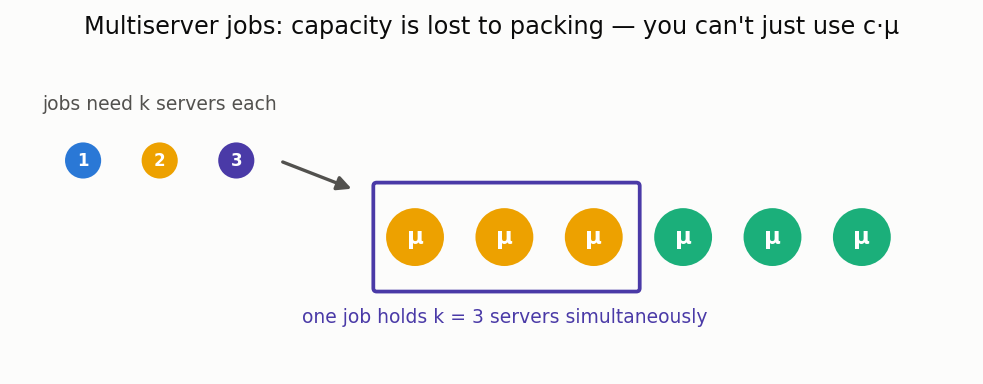

# Multiserver-job systems (MSJ)

[🇷🇺 Русская версия](msj.ru.md) · [← Model catalog](../models.md)



**In plain words:** in modern datacenters and GPU clusters a single job often needs **several
servers at once** (cores, GPUs) for its whole run — unlike the classic M/M/c where one job uses one
server. A job waits until enough servers are simultaneously free. This "multiserver-job" model is a
very active research topic (its mean response time was, until recently, largely unknown), and no
other open-source package provides it.

### FCFS MSJ — exact response time (small systems)

**Description:** k servers; each job class has a **server need** (servers held simultaneously) and an
exponential rate. FCFS with head-of-line blocking: the oldest jobs fill the servers greedily and the
first job that does not fit stops the scan. Exact mean response time (overall and per class) via a
CTMC on the arrival-ordered job sequence — for small k / few classes / moderate load.

**Calculator class:** `MsjExactCalc` (`most_queue.theory.msj`) ·
**Simulator:** `MsjSim` (`most_queue.sim.msj`)

```python
from most_queue.theory.msj import MsjExactCalc, MsjClass

calc = MsjExactCalc(k=2, classes=[MsjClass(0.4, 1, 1.0), MsjClass(0.2, 2, 1.0)])
r = calc.run()          # r.v[0] overall mean sojourn; r.v_per_class per class
```

### Saturated MSJ — throughput and stability threshold

**Description:** The stability region of an MSJ system is characterised by its *saturated*
(always-backlogged) version. `MsjSaturatedCalc` solves the saturated CTMC exactly and returns the
throughput `X_sat`, which is the **maximum total arrival rate** the open system can sustain — it is
stable iff Λ < X_sat. Reproduces the product-form stability results of Grosof, Harchol-Balter &
Scheller-Wolf.

**Calculator class:** `MsjSaturatedCalc` (`most_queue.theory.msj`)

```python
from most_queue.theory.msj import MsjSaturatedCalc, MsjClass

sat = MsjSaturatedCalc(k=2, classes=[MsjClass(1.0, 1, 1.0), MsjClass(1.0, 2, 1.0)])
x_sat = sat.run()       # max sustainable total arrival rate (class mix from arrival ratios)
```
