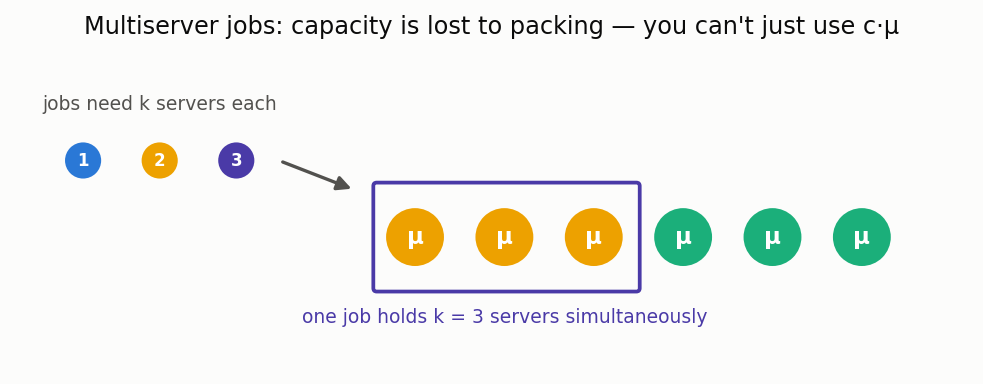

# Multiserver-job systems (MSJ)

[🇷🇺 Русская версия](msj.ru.md) · [← Model catalog](../models.md)



**In plain words:** in modern datacenters and GPU clusters a single job often needs **several
servers at once** (cores, GPUs) for its whole run — unlike the classic M/M/c where one job uses one
server. A job waits until enough servers are simultaneously free. Service distributions,
resource fragmentation and the scheduling discipline jointly determine its delay.

### FCFS MSJ — exact response time (small systems)

**Description:** k servers; each job class has a **server need** (servers held simultaneously) and an
exponential rate. FCFS with head-of-line blocking: the oldest jobs fill the servers greedily and the
first job that does not fit stops the scan. Exact mean response time (overall and per class) via a
CTMC on the arrival-ordered job sequence — for small k / few classes / moderate load.

**Calculator class:** `MsjExactCalc` (`most_queue.theory.msj`) ·
**Simulator:** `MsjSim` (`most_queue.sim.msj`)

```python
from most_queue.theory.msj import MsjExactCalc, MsjClass

calc = MsjExactCalc(k=2, classes=[MsjClass(0.4, 1, 1.0), MsjClass(0.2, 2, 1.0)])
r = calc.run()          # r.v[0] overall mean sojourn; r.v_per_class per class
```

### Saturated MSJ — throughput and stability threshold

**Description:** The stability region of an MSJ system is characterised by its *saturated*
(always-backlogged) version. `MsjSaturatedCalc` solves the saturated CTMC exactly and returns the
throughput `X_sat`, which is the **maximum total arrival rate** the open system can sustain — it is
stable iff Λ < X_sat. Reproduces the product-form stability results of Grosof, Harchol-Balter &
Scheller-Wolf.

**Calculator class:** `MsjSaturatedCalc` (`most_queue.theory.msj`)

```python
from most_queue.theory.msj import MsjSaturatedCalc, MsjClass

sat = MsjSaturatedCalc(k=2, classes=[MsjClass(1.0, 1, 1.0), MsjClass(1.0, 2, 1.0)])
x_sat = sat.run()       # max sustainable total arrival rate (class mix from arrival ratios)
```

### General phase-type service — small FCFS systems

**In plain words:** a job still holds all its servers until it finishes, but its duration
can have several stages or a mixture of short and long modes. The first waiting job
blocks later jobs that might otherwise fit.

**Calculator:** `MsjPHCalc` (`most_queue.theory.msj`). This new API does not change
`MsjClass`, `MsjExactCalc`, `MsjSaturatedCalc` or `MsjSim`.

```python
from most_queue.random.map_ph import PHDistribution
from most_queue.random.utils.params import Cox2Params, ErlangParams
from most_queue.theory.msj import MsjPHCalc

services = [
    PHDistribution.from_erlang(ErlangParams(r=2, mu=2.0)),
    PHDistribution.from_cox(Cox2Params(mu1=2.0, mu2=1.5, p1=0.75)),
]
calc = MsjPHCalc(k=2, truncation=10, max_states=50000)
calc.set_sources([0.25, 0.15])
calc.set_servers([1, 2], services)
result = calc.run()
print(result.w_per_class, result.v_per_class)
print(result.boundary_mass, result.state_count, result.stationary_residual)
print(result.stability_threshold)  # saturated FCFS throughput for this class mix
```

The numerical solution is for a finite system admitting at most `truncation` jobs
in total. At the boundary arrivals are rejected. `throughput` is the **admitted**
rate; Little's law uses that rate. Increase the truncation and compare means and
boundary mass before using it as an open-queue approximation. Boundary mass alone
is not an error bound. Only first moments are returned in `w`/`v` (lists of length 1).

The calculator checks `sum(rates) < saturated_throughput()` for the open FCFS queue.
Resource load `sum(lambda_i * need_i * E[S_i]) / k < 1` alone is insufficient.
The threshold is not an EASY stability result. `max_states` bounds enumeration;
large server counts, phase counts or truncations can be impractical. PH must be
real, proper and transient; complex moment fits are rejected. General G is not
automatically fitted to PH by this calculator.

### General-service simulation and backfilling

**In plain words:** EASY allows a later job to use idle resources only when it does
not delay the **predicted** start of the first waiting job. It protects only that
head job, not every waiting job. Conservative backfilling reserves a start for
every waiting job; new jobs and calendar compression must respect all existing
reservations. Jobs remain nonpreemptive.

```python
from most_queue.sim.msj_general import MsjGeneralSim

source = MsjGeneralSim(k=2, seed=47)
source.set_sources([0.25, 0.15])
source.set_servers([1, 2], [(service, "PH") for service in services])
trace = source.make_trace(11000, estimates="oracle")  # explicit perfect information
for policy in ("fcfs", "easy", "conservative"):
    sim = MsjGeneralSim(k=2, discipline=policy)
    sim.set_servers([1, 2])  # replay does not need a service generator
    measured = sim.run_trace(trace, warmup_jobs=1000)
    print(policy, measured.v[0], measured.v_quantiles[0.99], measured.idle_with_queue)
```

`set_servers` accepts library `(params, notation)` pairs or a `sampler(rng)` callable,
e.g. `lambda rng: rng.lognormal(0, 0.8)`. `make_trace` accepts explicit `"oracle"`,
one positive duration estimate per class, or `None` for FCFS without predictions.
For measured/noisy estimates use immutable `MsjTraceJob(arrival, cls, service, estimate)`
records and `run_trace`. Arrivals must be nonnegative and ordered; durations must
be positive. A trace can represent dependent jobs and non-Poisson arrivals.

Actual service is sampled before scheduling and is used only by the completion
event engine. Forecast overruns do not kill jobs: new backfilling is suspended
while any running job is overdue. Conservative invalidates its infeasible current
calendar and temporarily uses FCFS, rebuilding reservations after overruns end.
The historical promises are retained. `reservation_violations` counts jobs that
start after their best recorded finite reservation (head jobs for EASY, all
reserved waiting jobs for conservative). `reserved_start_times` maps their
zero-based trace IDs to those best promises, including warm-up jobs. It is not a
history of all schedule revisions. Underestimated durations can violate promises;
static oracle or upper-bound estimates preserve them. The guarantee concerns promised
start times, not dominance over FCFS or EASY in response time.

Conservative keeps a resource calendar and compresses one reservation at a time,
in planned-start order, without moving any other reservation later. It schedules
explicit wake-ups at reserved starts, even without an arrival/completion then.
This reference implementation uses repeated scans/sorts of the waiting calendar;
large backlogs can be expensive. The separate FCFS PH calculator does not provide
an analytical solution or stability threshold for either backfilling discipline.

`run(num_of_jobs, warmup_fraction=0.05, estimates=...)` generates an extra warm-up
cohort and measures exactly `num_of_jobs` arrivals. Replay drains all measured jobs.
Response moments and empirical p95/p99 cover the post-warmup arrival cohort;
time averages use the interval from its first arrival to the last input arrival,
excluding final draining. `utilization` is the occupied-resource fraction, and
`idle_with_queue` the idle-resource fraction while somebody waits. Quantiles are
empirical, not certified stationary SLOs. Missing class samples yield NaN; a
zero-length time window yields `None` time averages. Backfill/reservation counters
cover the whole input, including warm-up. Finite replay does not prove stability.

Methods, limitations and validation: [PH-MSJ methods](../msj_ph_methods.md).
Reproducible comparison: [experiment](../../examples/msj_backfilling_experiment.py).
Controlled-load FCFS/EASY/conservative comparison:
[experiment](../../examples/msj_conservative_experiment.py),
[protocol and results](../research/msj-conservative-results-2026-10.md).

### Runtime estimates from submission features

**In plain words:** learn from already completed historical jobs, predict a new
job's runtime from features available before service, and calibrate a statistical
upper estimate on a separate dataset. The scheduler uses that estimate, without
access to the actual duration. Statistical coverage does not protect every
reservation or every resource class, especially after a workload change.

`LogLinearRuntimePredictor` (`most_queue.sim.utils.runtime_prediction`) provides
`fit(X, service)`, `calibrate(X_cal, service_cal, coverage=0.95)` and
`predict(X, upper=False)`. Feed predictions into `MsjTraceJob.estimate`; the
existing schedulers do not change. Training, calibration and future evaluation
must be disjoint; feature provenance remains the caller's responsibility.
See the [complete example, formulas and limits](../msj_runtime_prediction.md),
[experiment](../../examples/msj_runtime_prediction_experiment.py), and
[results](../research/msj-runtime-prediction-results-2026-10.md).

Resource-group calibration is available through `calibrate_by_group(X_cal, S_cal, groups)`
and `predict(X, upper=True, groups=groups)`. The regression is shared; score
thresholds are separate for each observed, submission-time group. Insufficient
or unseen groups cause an explicit prediction error, never an automatic pooled
fallback. See the [group API and limits](../msj_runtime_prediction.md#calibration-by-resource-group)
and [EPIC-050 results](../research/msj-group-calibration-results-2026-10.md).

### Age-aware forecasts and censored history

In plain words: already running for age a changes the distribution of the
remaining duration. `KaplanMeierRuntimeEstimator` fits `min(S,C)` and a boolean
completion flag, retaining still-running historical observations as censored.
It estimates conditional residual quantiles/means and returns `None` for
unsupported tails; these are plug-in estimates, not conformal coverage bounds.

`run_trace(..., remaining_predictor=lambda cls, age: models[cls].remaining_quantile(age))`
opts into active-job updates for EASY/conservative; `run` accepts it too.
Waiting jobs keep explicit initial estimates. Extensions invalidate the current
calendar, not historical promises. Unknown residuals suspend new backfills but
allow FCFS starts and full draining. Refresh uses existing events only.
Rebuilding after an extension may violate an old promise even if the new
forecast is an upper bound; the static reservation guarantee does not extend
to this opt-in calendar-reset policy.
See the [runnable example, timing contract and counters](../msj_age_runtime.md),
[pilot](../../examples/msj_age_runtime_experiment.py), and
[EPIC-051 results](../research/msj-age-runtime-results-2026-10.md).

### Prediction-free packing and explicit preemption

In plain words: FirstFit lets fitting jobs bypass a blocked head; MSF tries wide
jobs first; Quickswap sometimes pauses new admissions so wide work can start.
ServerFilling instead repacks a short FCFS prefix, interrupting and later
resuming work. That last capability is an explicitly different operational model.

`MsjGeneralSim(k, discipline=...)` now also accepts `first_fit`, `msf`,
`msfq`, `adaptive_quickswap`, and `server_filling`, without runtime estimates.
MSFQ requires needs in {1,k} and accepts keyword-only `msfq_threshold=0` (ell=0
is MSF). ServerFilling requires power-of-two k and needs; it models zero-cost
preemptive-resume, not restart or SRPT. Unsupported domains raise errors.

ServerFilling's `wait_samples`/W moments include interrupted time; `start_times`
remain first starts. `service_segments`, `preemptions` and `preemptions_per_job`
make delivered work auditable. Packing has no reservation promises and rejects
`remaining_predictor`. The original defaults and APIs remain compatible.
See [exact rules, edge conventions and runnable example](../msj_packing.md),
[experiment](../../examples/msj_packing_experiment.py), and
[EPIC-052 results and trade-offs](../research/msj-packing-results-2026-10.md).

### Resource-holding checkpoint and resume

Interrupting work is not free in `MsjCheckpointSim(k, checkpoint_time=c,
resume_time=r)`, from `most_queue.sim.msj_checkpoint`. It retains the power-of-two
domain and prediction-free prefix rule, but holds K servers during each
deterministic overhead phase, with no useful progress. First starts pay no r;
all completed useful work survives interruption. New preemption batches wait
until every active overhead finishes; fitting selected jobs can still start.
This gate is an explicit experimental extension, not the original SF algorithm
or a Slurm model. Both costs zero with default protection delegate exactly to the original SF replay.

The inherited `set_servers`, `set_sources`, `run` and `run_trace` interfaces
remain available. `MsjCheckpointResults` splits W into queue/checkpoint/resume
and first-wait/interruption, exposes three interval logs and distinguishes
allocated from productive utilization. Finite draining does not prove stability.
See the [runnable example, event rules and accounting](../msj_checkpoint.md),
[experiment](../../examples/msj_checkpoint_experiment.py), and
[EPIC-053 results](../research/msj-checkpoint-results-2026-10.md).

### Minimum useful service before another preemption

In plain words: let a newly started or restored job do useful work for at least
q time units before it can be interrupted again. This can reduce overhead, but
another job may wait longer for its servers. A short job can still finish before
q, and protection expiry does not force a switch.

Use `MsjCheckpointSim(..., min_service_time=q)`, a keyword-only nonnegative
duration. The episode clock starts after resume finishes; it does not include
overhead or prior useful episodes. Expiry events reconsider blocked preemption
even without a new arrival. The original prefix and overhead gate remain;
zero q preserves EPIC-053. `protected_preemptions` counts rejected job/event
attempts, not counterfactual saved interruptions; `protection_expirations`
counts fired review times. All other latency/resource accounting is unchanged.

The experiment selects q=h(c+r) on independent, completed historical traces
and freezes h before held-out evaluation. It retains every fixed candidate and
does not turn a favorable training score into a performance guarantee.
See [API, exact example and limits](../msj_protected_service.md),
[experiment](../../examples/msj_protected_service_experiment.py), and
[EPIC-054 results](../research/msj-protected-service-results-2026-10.md).

### Historical trace calibration

`parse_swf` in `most_queue.sim.utils.workload_trace` audits a completed rigid-job
cohort; `chronological_split` fits only outcomes available before the cutoff.
`ServiceCalibration` provides empirical, Exp, PH and moment-lognormal baselines.
The experiment preserves recorded arrivals and exact K, then compares the same
six nonpreemptive policies on observed and modelled durations. No new scheduling
API or stability result is introduced. Historical waiting is never replay input.

In plain words: take past completed jobs to estimate durations, then ask whether
those estimates reproduce delays and scheduler choices on later jobs. Cancellation
filtering and missing initial backlog limit what can be inferred about production.

See [contract and reproduction](../real_trace_calibration.md),
[experiment](../../examples/real_trace_calibration_experiment.py) and
[results](../research/real-trace-calibration-results-2026-10.md).

### Temporal history and dependent service

`ConditionalEmpirical` in `most_queue.random.trace_resampling` fits exact-K or
coarse ECDFs with audited fallback and computes tie-aware conditional midranks.
`circular_block_indices` resamples chronological rank blocks without transferring
historical arrivals or K. Rank-iid, not uniform-iid, is the matched marginal
control for this dependent generator. These are workload tools, not schedulers.

In plain words: learn durations from several points in history and test whether
using more recent jobs, finer resource classes or clusters of long/short jobs
makes future delay estimates better. All variants share arrival/K sequences and
a fixed historical forecast; none uses future service to fit or rescale workload.

The 1368-run study favors recent coarse history in aggregate, but not in every
period. Finer K and closer lag correlation need not improve delay or p99 choices.
Initial backlog and cancellation remain outside this completed-job experiment.
See [protocol/API](../real_trace_temporal.md),
[experiment](../../examples/real_trace_temporal_experiment.py),
and [EPIC-056 results](../research/real-trace-temporal-results-2026-10.md).

### Initial state and labelled resource releases

`MsjLifecycleSim.run_lifecycle` is a separate opt-in API using the same six
nonpreemptive dispatchers. `MsjCarryIn` seeds running jobs with elapsed age;
initial waiting jobs retain their supplied order. `MsjLifecycleJob` carries a
completed/cancelled terminal label and optional runtime limit, measured from
service start. Ordinary `MsjGeneralSim.run_trace` remains unchanged.

In plain words: start with some resources already occupied, let completed and
cancelled jobs compete, and report whether each target finished or was stopped.
A shorter time to termination under a hard limit need not mean better service.
Running resource-time counts only remaining occupation, not service before replay.

The real-trace experiment supplies a partial retrospective snapshot and recorded
cancelled occupation; it does not infer latent completion demand, cancellation
deadlines while waiting, priorities or original scheduler memory. Policy forecasts
never receive actual residual durations. [Contract and executable example](../real_trace_lifecycle.md),
[experiment](../../examples/real_trace_lifecycle_experiment.py),
[EPIC-057 results](../research/real-trace-lifecycle-results-2026-10.md).

### Modern GPU workload audit and calibration

`parse_acme_kalos` / `AcmeTrace` validate timezone-aware timestamps, preserve
integer GPU requests and audit exclusions. Execution is end-start, not the
released duration column, which includes waiting. `acme_snapshot` supplies
partial retrospective state. `MsjLifecycleJob` now also preserves failed,
node_failed and recorded timed_out labels; a timeout label does not infer a budget.

In plain words: replay modern LLM-development jobs while keeping successful
execution distinct from time spent on cancelled or failed jobs. Missing endings
and resource limits are not invented; GPU requests are not hardware utilization.

The 1224-run Kalos study found large duration-model errors, but no observed
target waiting at nominal pool capacity. All six reference policies tie: zero
regret cannot validate their ranking. Quotas, placement and effective capacity
need separate evidence. [Protocol/API](../modern_gpu_trace.md),
[experiment](../../examples/modern_gpu_trace_experiment.py),
[results](../research/modern-gpu-trace-results-2026-10.md).

### Feature-conditional empirical service

In plain words: jobs keep their recorded arrival, resource request and context.
Their service is drawn from completed historical jobs with matching resource/type
or requested-time group; sparse groups fall back to broader history. Optional
S/request ratios preserve the relationship with a target's runtime budget without
clipping excess demand. This changes workload generation, not the dispatcher.

`FeatureConditionalEmpirical` supports exact/coarse context cells, audited fallback
and full-CDF CRPS. EPIC-059 selects candidates on early validation before late
replay: SDSC ratio improves distribution scoring and timeout calibration but can
worsen queue latency and p99 policy choice; Kalos type does not transfer reliably.
It is a retrospective feature scenario, not an online deployment claim.
The rigid-job flow shown above is unchanged.
[Protocol/API](../feature_service.md), [experiment](../../examples/feature_service_experiment.py),
[results](../research/feature-service-results-2026-10.md).

### GPU and exclusive-node resource envelopes

In plain words: a job either reserves its requested GPUs from a common pool or
holds every requested node exclusively. The same arrivals and service tape are
replayed at prescribed pool sizes. If a job or initial running set cannot fit,
the whole scenario is reported as infeasible; no job is shrunk or discarded.

`ResourceRequest`, `assess_envelope` and `observed_occupancy` separate demand
projection, replay feasibility and compatibility with recorded execution intervals.
The rigid-job flow above is unchanged; only scalar demand/capacity are projected.
Requested GPU work is kept separate from reserved GPU-equivalent work. This is
resource sensitivity, not quota estimation or reconstructed physical placement.
[Protocol/API](../gpu_resource_envelope.md),
[experiment](../../examples/gpu_resource_envelope_experiment.py),
[results](../research/gpu-resource-envelope-results-2026-10.md).

### Queue-aware service model selection

In plain words: historical jobs are replayed with several service generators.
Select the generator whose early mean/p99 queue summaries best match the recorded-S
control, freeze its family, and evaluate later periods. The actual job still follows
the rigid-job flow above; no dispatch rule or capacity changes.

`queue_log_error` and `select_queue_model` score positive, equally weighted
validation summaries with exact shape checks and declared tie order. EPIC-061
compares that choice with CRPS selection and fixed coarse; late queue fit, class
coverage, success rates and policy regret can disagree. This is retrospective
temporal evaluation, not an online or independent-origin guarantee.
[Protocol/API](../queue_aware_selection.md),
[experiment](../../examples/queue_aware_selection_experiment.py),
[results](../research/queue-aware-selection-results-2026-10.md).

### Joint marked arrivals

In plain words: generate when a job arrives together with its resource demand
and feature bundle, then draw its service from the common empirical K-group law.
It still follows the rigid-job flow above; the dispatcher does not change.

`ArrivalMark` and `MarkedArrivalBootstrap` retain adjacent zero/nonzero gaps,
support iid/circular blocks, and expose anchored permutations for matched controls.
EPIC-062 keeps fixed-arrival coarse as a baseline and starts every scenario empty,
without copying historical carry-in onto synthetic time. Context/request are
diagnostic marks, not inputs to S or runtime caps. Completed-prefix staleness,
workload mix and horizon differences are explicit; no consistent joint-generator
gain or production scheduler validation is claimed.
[Protocol/API](../joint_marked_arrivals.md),
[experiment](../../examples/joint_marked_arrivals_experiment.py),
[results](../research/joint-marked-arrivals-results-2026-10.md).
