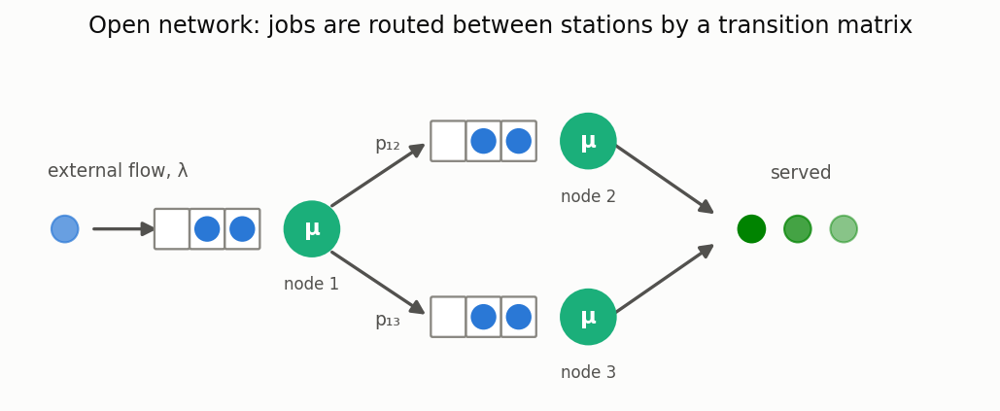
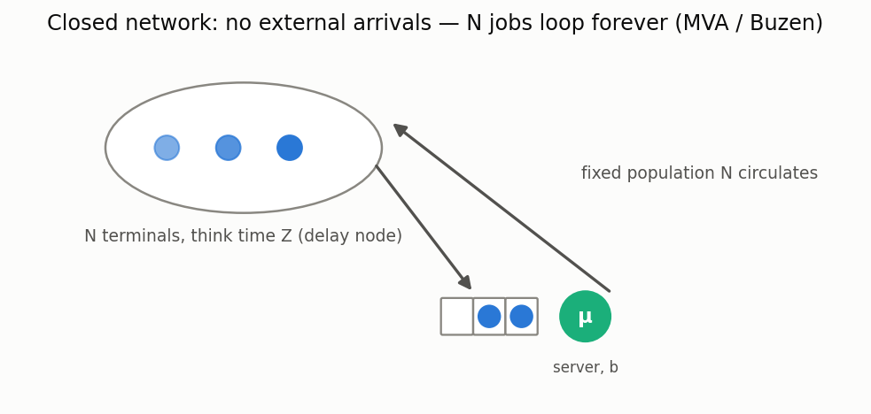
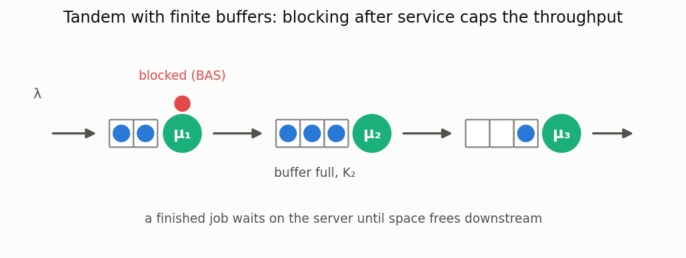
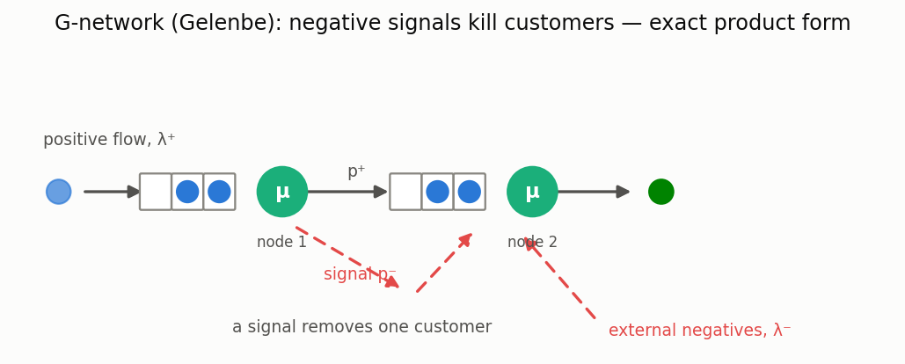
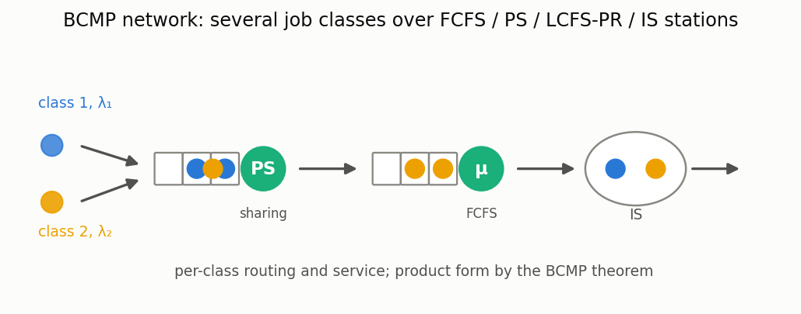

# Queueing networks

[🇷🇺 Русская версия](networks.ru.md) · [← Model catalog](../models.md)

**In plain words:** several queueing systems connected by routing: a job served at one node moves
to another (or leaves). Open networks have external arrivals; in closed networks a fixed
population of N jobs circulates forever (the classic "N terminals + central server" capacity
model). See the [networks guide](../networks.md) for the full API.

- **Open network, decomposition** — `OpenNetworkCalc` (approximate, M/G/n nodes), with priority
  (`OpenNetworkCalcPriorities`) and negative-customer (`NegativeNetworkCalc`) variants.
- **Jackson network** — `JacksonNetworkCalc`: exact product form for Markovian open networks.
- **QNA (Whitt)** — `OpenNetworkCalcQNA`: two-moment propagation of internal-flow variability;
  much tighter than plain decomposition when service is highly variable. Takes a MAP external
  flow via the `map_arrival_cv2` helper (autocorrelation is not captured — documented limit).
- **Fork-join in a network** — `OpenNetworkCalcForkJoin` / `ForkJoinNetworkSim`: stations where
  a job forks into k parallel sub-tasks and joins on the last one.
- **Time-varying networks** — `TimeVaryingNetworkCalc` / `TimeVaryingNetworkSim`: λ(t) external
  flow, PSA over the Jackson network (slow-modulation regime).

- **Closed networks** — `ClosedNetworkCalc`: exact MVA (Reiser–Lavenberg), Buzen convolution and
  Schweitzer approximate MVA; multi-server and delay stations; paired `ClosedNetworkSim`.

- **Tandems with finite buffers (BAS)** — `TandemBlockingCalc` / `TandemBlockingSim`: two-pass
  decomposition (Brandwajn–Jow / Dallery–Frein), throughput, blocking and entry-loss
  probabilities; infinite buffers reduce to the Jackson tandem.

- **G-networks (Gelenbe)** — `GNetworkCalc`: exact product form with negative customers/signals;
  `GNetworkMulticlassCalc` — multiple classes over PS nodes (Gelenbe 1996).

- **BCMP** — `BCMPOpenNetworkCalc` / `BCMPClosedNetworkCalc`: multi-class product form
  (FCFS/PS/LCFS-PR/IS stations), closed case via exact multi-chain MVA, multi-server FCFS
  stations supported.
