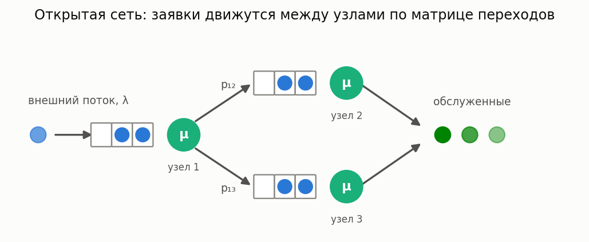
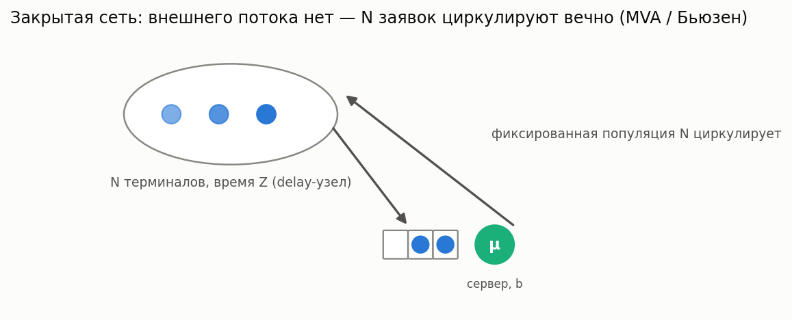
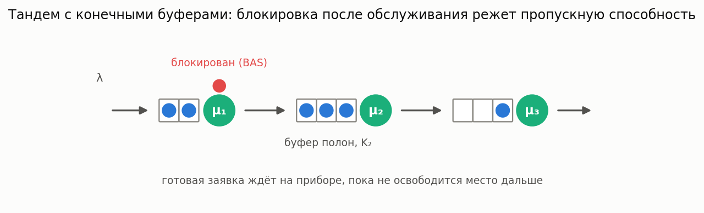
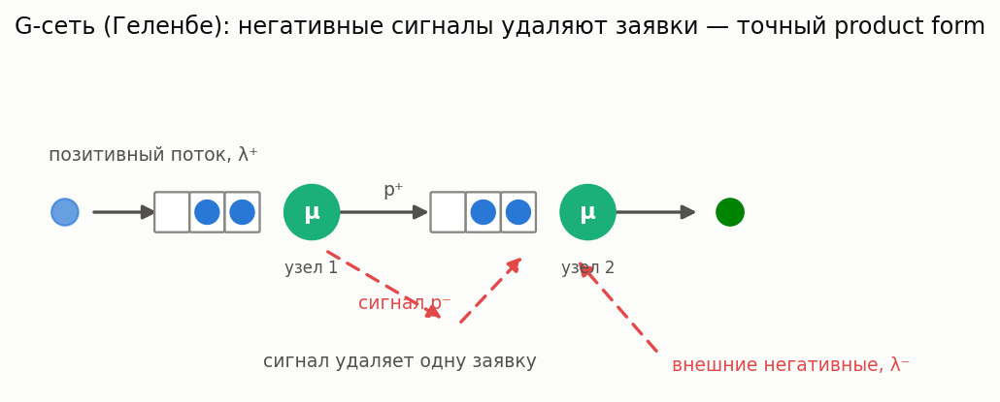
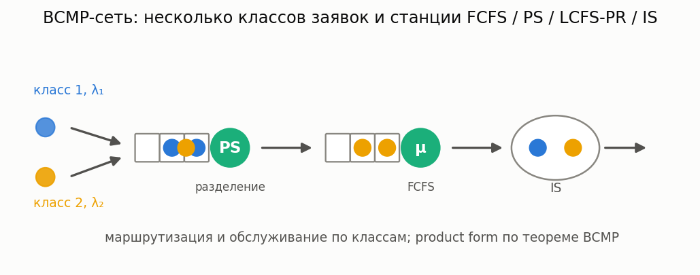

# Сети массового обслуживания

[🇬🇧 English version](networks.md) · [← Каталог моделей](../models.ru.md)

**Простыми словами:** несколько СМО, связанных маршрутизацией: заявка, обслуженная в одном узле,
переходит в другой (или покидает сеть). В открытых сетях есть внешний поток; в закрытых —
фиксированная популяция из N заявок циркулирует по узлам бесконечно (классическая модель ёмкости
«N терминалов + центральный сервер»). Полное API — в [руководстве по сетям](../networks.ru.md).

- **Открытая сеть, декомпозиция** — `OpenNetworkCalc` (приближённо, узлы M/G/n), варианты с
  приоритетами (`OpenNetworkCalcPriorities`) и отрицательными заявками (`NegativeNetworkCalc`).
- **Сеть Джексона** — `JacksonNetworkCalc`: точный product-form для марковских открытых сетей.
- **QNA (Уитт)** — `OpenNetworkCalcQNA`: двухмоментное распространение вариабельности внутренних
  потоков; заметно точнее базовой декомпозиции при высоковариативном обслуживании. Принимает
  MAP-вход через хелпер `map_arrival_cv2` (автокорреляция не учитывается — ограничение
  задокументировано).
- **Fork-join внутри сети** — `OpenNetworkCalcForkJoin` / `ForkJoinNetworkSim`: станции, где
  заявка разветвляется на k параллельных подзадач и собирается на последней.
- **Нестационарные сети** — `TimeVaryingNetworkCalc` / `TimeVaryingNetworkSim`: внешний поток
  λ(t), PSA поверх сети Джексона (режим медленной модуляции).

- **Закрытые сети** — `ClosedNetworkCalc`: точный MVA (Райзер–Лавенберг), свёртка Бьюзена и
  приближённый MVA Швейцера; многоканальные и delay-станции; парный `ClosedNetworkSim`.

- **Тандемы с конечными буферами (BAS)** — `TandemBlockingCalc` / `TandemBlockingSim`:
  двухпроходная декомпозиция (Brandwajn–Jow / Dallery–Frein), пропускная способность,
  вероятности блокировки и потерь на входе; бесконечные буферы сводятся к тандему Джексона.

- **G-сети (Геленбе)** — `GNetworkCalc`: точный product-form с отрицательными
  заявками/сигналами; `GNetworkMulticlassCalc` — несколько классов на PS-узлах (Gelenbe 1996).

- **BCMP** — `BCMPOpenNetworkCalc` / `BCMPClosedNetworkCalc`: мультиклассовый product-form
  (станции FCFS/PS/LCFS-PR/IS), закрытый случай — точный мультичейн-MVA, поддержаны
  многоканальные FCFS-станции.
