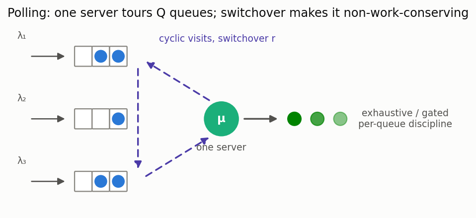

# Polling systems (cyclic server)

[🇷🇺 Русская версия](polling.ru.md) · [← Model catalog](../models.md)



**In plain words:** one server cyclically visits several queues (a token ring, a USB/Bluetooth
host polling devices, a maintenance crew touring machines, a traffic light). Moving between queues
costs a **switchover** time, so the system is *not* work-conserving. Yet a **pseudo-conservation
law** pins down the load-weighted sum of the mean waits exactly — priorities-by-position
redistribute delay, but the switchover overhead sets the invariant.

### M/G/1 polling — pseudo-conservation law & symmetric wait

**Description:** Q queues, cyclic service under **exhaustive** (serve a queue until empty) or
**gated** (serve only what was present at the polling instant) discipline, with switchover times.
Computes the exact pseudo-conservation sum `Σ ρ_i W_i` (Boxma–Groenevelt) for any (asymmetric)
system; for a symmetric system the per-queue mean wait is `W = (Σ ρ_i W_i)/ρ`. General asymmetric
per-queue waits come from the paired simulator.

**Calculator class:** `PollingCalc` (`most_queue.theory.polling`) ·
**Simulator:** `PollingSim` (`most_queue.sim.polling`)

```python
from most_queue.theory.polling import PollingCalc

calc = PollingCalc(discipline="exhaustive")   # or "gated"
calc.set_sources([0.2, 0.2, 0.2])             # per-queue arrival rates
calc.set_servers([1.0, 2.0, 6.0])             # service raw moments (shared or per-queue)
calc.set_switchover(0.5)                       # mean switchover between queues
res = calc.run()   # res.pseudo_conservation_sum, res.mean_wait_symmetric, res.mean_cycle
```
