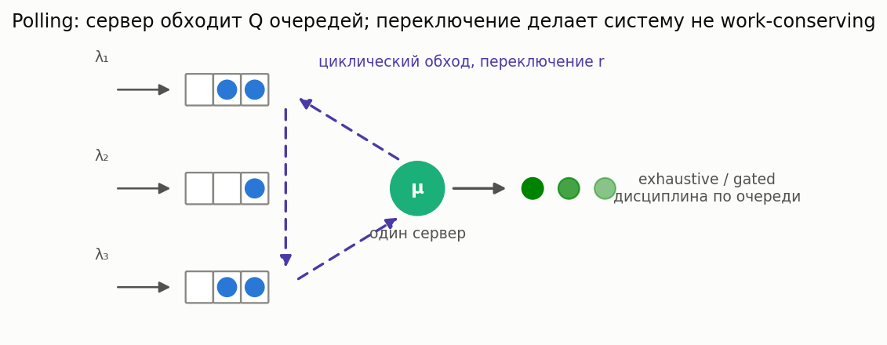

# Polling-системы (циклический сервер)

[🇬🇧 English version](polling.md) · [← Каталог моделей](../models.ru.md)



**Простыми словами:** один сервер циклически обходит несколько очередей (token ring, USB/Bluetooth
host, обслуживающая бригада на обходе, светофор). Переход между очередями стоит **времени
переключения** (switchover), поэтому система *не* work-conserving. Тем не менее **псевдо-закон
сохранения** точно фиксирует взвешенную по загрузке сумму средних ожиданий — приоритет-по-позиции
перераспределяет задержку, а накладные switchover задают инвариант.

### M/G/1 polling — псевдо-закон сохранения и симметричное ожидание

**Описание:** Q очередей, циклическое обслуживание по дисциплине **exhaustive** (до опустошения)
или **gated** (только присутствовавшие в момент опроса) с временами переключения. Считает точную
псевдо-сумму сохранения `Σ ρ_i W_i` (Boxma–Groenevelt) для любой (асимметричной) системы; для
симметричной среднее ожидание по очереди `W = (Σ ρ_i W_i)/ρ`. Общие асимметричные ожидания по
очередям — из парного симулятора.

**Класс расчета:** `PollingCalc` (`most_queue.theory.polling`) ·
**Симулятор:** `PollingSim` (`most_queue.sim.polling`)

```python
from most_queue.theory.polling import PollingCalc

calc = PollingCalc(discipline="exhaustive")   # или "gated"
calc.set_sources([0.2, 0.2, 0.2])             # интенсивности входа по очередям
calc.set_servers([1.0, 2.0, 6.0])             # моменты обслуживания (общие или по очередям)
calc.set_switchover(0.5)                       # среднее время переключения между очередями
res = calc.run()   # res.pseudo_conservation_sum, res.mean_wait_symmetric, res.mean_cycle
```
