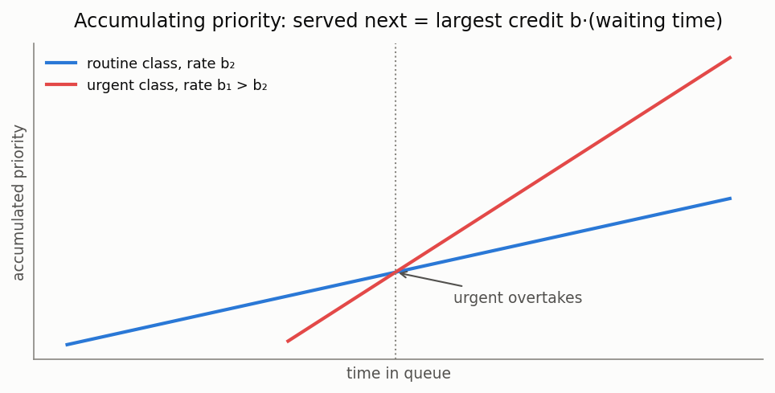

# Priority systems, part 2: dynamic and extended models (EPIC-020)

[🇷🇺 Русская версия](priority-dynamic.ru.md) · [← Model catalog](../models.md) ·
[← Part 1: static priority classes](priority.md)



**In plain words:** the [static priority stack](priority.md) assumes a fixed, hard hierarchy of
classes. This page covers what happens when that assumption is relaxed: urgency that grows with
waiting time (accumulating priority), customers who give up (impatience), arrivals that are
bursty rather than Poisson (MAP), a second queue that retries instead of waiting (retrial), and
interrupted jobs that must start over (preemptive repeat).

### M/G/1 accumulating priority (APQ)

**Description:** Every waiting customer accumulates priority linearly, rate b_k per class; at
each service completion the largest accumulated credit is served (non-preemptive). Kleinrock's
delay-dependent discipline (1964), modern APQ of Stanford-Taylor-Ziedins (2013) — the standard
model of healthcare triage KPIs. Exact mean waits by Kleinrock's recursion; equal rates give
FIFO, extreme rate ratios give the Cobham non-preemptive waits.

**In plain words:** instead of a hard class hierarchy, urgency grows with waiting: a routine
patient who has waited long enough outranks a fresh urgent one. One knob per class (the rate
b_k) tunes the whole spectrum between FIFO and strict priorities.

**Calculator class:** `MG1AccumulatingPriorityCalc` (`most_queue.theory.priority.accumulating`)
**Simulation:** `AccumulatingPrioritySim` (`most_queue.sim.accumulating_priority`)

```python
from most_queue.theory.priority.accumulating import MG1AccumulatingPriorityCalc

calc = MG1AccumulatingPriorityCalc()
calc.set_sources(l=[0.2, 0.3, 0.25])
calc.set_servers(b=b_moments, rates=[4.0, 2.0, 1.0])   # class 0 accumulates fastest
res = calc.run()   # res.w[k][0] — exact mean waits
```

### M/M/n + M with priorities and impatience

**Description:** Two classes share n servers (non-preemptive priority), waiting customers of
class k abandon at rate theta_k — the priority Erlang-A of call centers (Choi 2001,
Iravani-Balcioglu 2008). Exact truncated CTMC; with equal thetas the total queue is exactly the
aggregate Erlang-A (priority only splits it).

**Calculator class:** `MMnPriorityImpatienceCalc` (`most_queue.theory.priority.impatience`)
**Simulation:** `MMnPriorityImpatienceSim` (`most_queue.sim.priority_impatience`)

```python
from most_queue.theory.priority.impatience import MMnPriorityImpatienceCalc

calc = MMnPriorityImpatienceCalc(n=3)
calc.set_sources(l=[1.2, 1.5])
calc.set_servers(mu=1.0, theta=[0.3, 0.6])
res = calc.run()   # res.w, calc.abandon_probs per class
```

### MMAP[2]/PH[2]/1 priority queue (correlated arrivals)

**Description:** Marked MAP arrivals (two classes share one modulating process), phase-type
service per class, disciplines NP, PR (preemptive resume with the interrupted job frozen
mid-phase) and RS (preemptive repeat with resampling). Exact truncated CTMC (Takine 1996;
Horvath et al. 2012; Klimenok-Dudin 2020). One-phase MMAP + exponential PH reduces to the
classic Cobham / preemptive-resume formulas.

**Calculator class:** `MapPh1PriorityCalc` (`most_queue.theory.priority.map_ph_priority`)
**Simulation:** `PriorityQueueSimulator` with per-class `"MAP"` sources

```python
from most_queue.theory.priority.map_ph_priority import MapPh1PriorityCalc

calc = MapPh1PriorityCalc(discipline="NP")     # or "PR", "RS"
calc.set_sources(D0=d0, D1_high=d1h, D1_low=d1l)
calc.set_servers(ph_high=(alpha_h, T_h), ph_low=(alpha_l, T_l))
res = calc.run()
```

### M/M/1 retrial queue with a priority class

**Description:** Priority customers wait in an ordinary queue; ordinary customers finding the
server busy join the orbit and retry at rate gamma each (blocked while the priority queue is
non-empty). Exact truncated CTMC (Artalejo 1994; retrial priority — Operational Research 2015).
gamma to infinity recovers the two-class Cobham waits, no priority class recovers
Falin-Templeton.

**Calculator class:** `MM1RetrialPriorityCalc` (`most_queue.theory.priority.retrial_priority`)
**Simulation:** `MM1RetrialPrioritySim` (`most_queue.sim.retrial_priority`)

```python
from most_queue.theory.priority.retrial_priority import MM1RetrialPriorityCalc

calc = MM1RetrialPriorityCalc(gamma=0.7)
calc.set_sources(l=[0.3, 0.35])
calc.set_servers(mu=[1.2, 1.0])
res = calc.run()   # calc.mean_priority_queue, calc.mean_orbit
```

### M/G/1 preemptive repeat (RS/RW)

**Description:** A high-priority arrival interrupts the low job, which later RESTARTS — with a
fresh draw (RS, resampling) or the same duration (RW, repeat-identical). RS is solved exactly
(Cox-2 fit + CTMC) — the first analytical benchmark for the simulator's RS discipline; for RW
Gaver's (1962) closed-form mean completion time is provided (the RW queueing model has no
finite Markov representation — reserved). With exponential service RS coincides with
preemptive-resume.

**Calculator class:** `MG1PreemptiveRepeatCalc` (`most_queue.theory.priority.preemptive.mg1_repeat`)
**Simulation:** `PriorityQueueSimulator(prty_type="RS"/"RW")`

```python
from most_queue.theory.priority.preemptive.mg1_repeat import MG1PreemptiveRepeatCalc

calc = MG1PreemptiveRepeatCalc(kind="RS")
calc.set_sources(l=[0.25, 0.3])
calc.set_servers(b=[b_high, b_low])            # 3 raw moments per class
res = calc.run()   # exact RS means; calc.completion_means["RS"/"RW"]
```

**See also:** [SLA / deadline-violation probability](sla.md) — turn these moments into a deadline-violation probability or SLO quantile.
