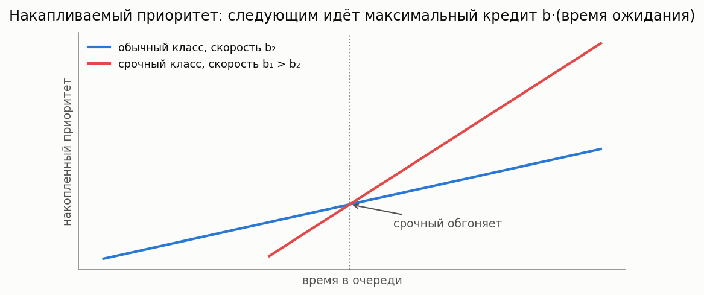

# Системы с приоритетами, часть 2: динамические и расширенные модели (EPIC-020)

[🇬🇧 English version](priority-dynamic.md) · [← Каталог моделей](../models.ru.md) ·
[← Часть 1: статические классы приоритета](priority.ru.md)



**Простыми словами:** [статический приоритетный стек](priority.ru.md) предполагает жёсткую,
фиксированную иерархию классов. Эта страница — про то, что происходит, когда это предположение
снимается: срочность, растущая с ожиданием (накапливаемый приоритет), клиенты, которые уходят
(нетерпение), приходы не пуассоновские, а «пачками» (MAP), вторая очередь, которая вместо
ожидания повторяет попытки (retrial), и прерванные заявки, вынужденные начинать заново
(preemptive repeat).

### M/G/1 с накапливаемым приоритетом (APQ)

**Описание:** Каждая ожидающая заявка линейно накапливает приоритет со скоростью b_k своего
класса; при освобождении прибора обслуживается максимальный накопленный кредит (без
прерываний). Delay-dependent дисциплина Клейнрока (1964), современная APQ
Stanford-Taylor-Ziedins (2013) — стандартная модель KPI медицинского триажа. Точные средние
ожидания по рекурсии Клейнрока; равные скорости дают FIFO, экстремальные отношения — формулы
Кобхэма.

**Суть:** вместо жёсткой иерархии срочность растёт с ожиданием: рядовой пациент, прождавший
достаточно долго, обгоняет свежего срочного. Одна ручка на класс (скорость b_k) настраивает
весь спектр от FIFO до строгих приоритетов.

**Класс расчета:** `MG1AccumulatingPriorityCalc` (`most_queue.theory.priority.accumulating`)
**Симуляция:** `AccumulatingPrioritySim` (`most_queue.sim.accumulating_priority`)

```python
from most_queue.theory.priority.accumulating import MG1AccumulatingPriorityCalc

calc = MG1AccumulatingPriorityCalc()
calc.set_sources(l=[0.2, 0.3, 0.25])
calc.set_servers(b=b_moments, rates=[4.0, 2.0, 1.0])   # класс 0 копит быстрее всех
res = calc.run()   # res.w[k][0] — точные средние ожидания
```

### M/M/n + M с приоритетами и нетерпением

**Описание:** Два класса делят n приборов (относительный приоритет), ожидающие заявки класса k
уходят с интенсивностью theta_k — приоритетный Erlang-A колл-центров (Choi 2001,
Iravani-Balcioglu 2008). Точная усечённая CTMC; при равных theta суммарная очередь в точности
совпадает с агрегированным Erlang-A (приоритет лишь делит её).

**Класс расчета:** `MMnPriorityImpatienceCalc` (`most_queue.theory.priority.impatience`)
**Симуляция:** `MMnPriorityImpatienceSim` (`most_queue.sim.priority_impatience`)

```python
from most_queue.theory.priority.impatience import MMnPriorityImpatienceCalc

calc = MMnPriorityImpatienceCalc(n=3)
calc.set_sources(l=[1.2, 1.5])
calc.set_servers(mu=1.0, theta=[0.3, 0.6])
res = calc.run()   # res.w, calc.abandon_probs по классам
```

### MMAP[2]/PH[2]/1 с приоритетами (коррелированный вход)

**Описание:** Маркированный MAP (два класса делят один модулирующий процесс), PH-обслуживание
по классам, дисциплины NP, PR (preemptive resume с заморозкой фазы прерванной заявки) и RS
(repeat с пересэмплированием). Точная усечённая CTMC (Takine 1996; Horvath et al. 2012;
Klimenok-Dudin 2020). Однофазный MMAP + экспоненциальный PH сводится к классическим формулам
Кобхэма / preemptive-resume.

**Класс расчета:** `MapPh1PriorityCalc` (`most_queue.theory.priority.map_ph_priority`)
**Симуляция:** `PriorityQueueSimulator` с источниками `"MAP"` по классам

```python
from most_queue.theory.priority.map_ph_priority import MapPh1PriorityCalc

calc = MapPh1PriorityCalc(discipline="NP")     # или "PR", "RS"
calc.set_sources(D0=d0, D1_high=d1h, D1_low=d1l)
calc.set_servers(ph_high=(alpha_h, T_h), ph_low=(alpha_l, T_l))
res = calc.run()
```

### M/M/1 retrial с приоритетным классом

**Описание:** Приоритетные заявки ждут в обычной очереди; обычные, застав прибор занятым,
уходят на орбиту и повторяют попытки с интенсивностью gamma каждая (повторы блокированы, пока
очередь приоритетных непуста). Точная усечённая CTMC (Artalejo 1994; retrial-приоритеты —
Operational Research 2015). gamma к бесконечности даёт двухклассовые формулы Кобхэма, без
приоритетного класса — Falin-Templeton.

**Класс расчета:** `MM1RetrialPriorityCalc` (`most_queue.theory.priority.retrial_priority`)
**Симуляция:** `MM1RetrialPrioritySim` (`most_queue.sim.retrial_priority`)

```python
from most_queue.theory.priority.retrial_priority import MM1RetrialPriorityCalc

calc = MM1RetrialPriorityCalc(gamma=0.7)
calc.set_sources(l=[0.3, 0.35])
calc.set_servers(mu=[1.2, 1.0])
res = calc.run()   # calc.mean_priority_queue, calc.mean_orbit
```

### M/G/1 preemptive repeat (RS/RW)

**Описание:** Приоритетная заявка прерывает обслуживание низшего класса, и тот потом начинает
ЗАНОВО — со свежим розыгрышем (RS) или с той же длительностью (RW). RS решён точно (Cox-2 фит +
CTMC) — первый аналитический бенчмарк для RS-дисциплины симулятора; для RW дана замкнутая
форма среднего completion time Гавера (1962) — у RW-очереди нет конечного марковского
представления (в резерве). При экспоненциальном обслуживании RS совпадает с preemptive-resume.

**Класс расчета:** `MG1PreemptiveRepeatCalc` (`most_queue.theory.priority.preemptive.mg1_repeat`)
**Симуляция:** `PriorityQueueSimulator(prty_type="RS"/"RW")`

```python
from most_queue.theory.priority.preemptive.mg1_repeat import MG1PreemptiveRepeatCalc

calc = MG1PreemptiveRepeatCalc(kind="RS")
calc.set_sources(l=[0.25, 0.3])
calc.set_servers(b=[b_high, b_low])            # по 3 момента на класс
res = calc.run()   # точные средние RS; calc.completion_means["RS"/"RW"]
```

### M/M/2 с двумя прерывающими приоритетами и гетерогенными серверами

**Описание:** Все предыдущие многоканальные приоритетные модели (`MMkPriorityExact`,
`RDRAPriorityCalc`, `MPhPhK2Class`) предполагают взаимозаменяемые серверы — неважно, какой именно
занят. При двух серверах с **разной** скоростью (`mu_a ≠ mu_b`) это перестаёт быть верным — та же
история, что и у [machine repair с двумя гетерогенными ремонтниками](reliability.ru.md): точное
решение требует состояния, расщепляющего неоднозначность там, где она реально возникает (ровно
одна заявка класса 0 в обслуживании, либо ровно одна заявка класса 1 без класса 0). Назначение:
простаивающий сервер приоритетнее вытеснения уже занятого; заявка никогда не мигрирует на другой
сервер после начала обслуживания (sticky). Точно сводится к `MMkPriorityExact(n=2, ...)` при
`mu_a = mu_b`.

**Суть:** старший (быстрый) и младший (медленный) техники обслуживают одну очередь с двумя
уровнями приоритета. Старший всегда достаётся заявке высшего приоритета, если она есть; заявка
низшего приоритета в процессе обслуживания никогда не снимается со своего техника только потому,
что освободился другой — она дообслуживается там, где начала.

**Класс расчета:** `MM2PriorityHeterogeneousCalc`
(`most_queue.theory.priority.preemptive.mm2_heterogeneous`)
**Симуляция:** `MM2PriorityHeterogeneousSim` (`most_queue.sim.priority_heterogeneous`)

```python
from most_queue.theory.priority.preemptive.mm2_heterogeneous import MM2PriorityHeterogeneousCalc

calc = MM2PriorityHeterogeneousCalc(truncation=50)
calc.set_sources([0.4, 0.3])      # [lambda_0, lambda_1], класс 0 — высший приоритет
calc.set_servers(1.5, 0.5)        # ставки серверов, в любом порядке
res = calc.run()   # res.v[k][0], res.w[k][0] -- точное среднее пребывание/ожидание по классу
```

**См. также:** [SLA / вероятность нарушения дедлайна](sla.ru.md) — превратить эти моменты в вероятность нарушения дедлайна или SLO-квантиль.
