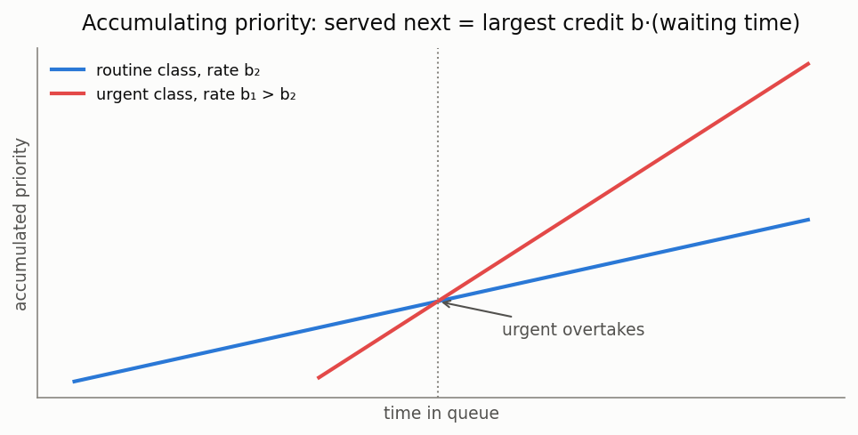

# Priority systems

[🇷🇺 Русская версия](priority.ru.md) · [← Model catalog](../models.md)


**In plain words:** jobs are divided into importance classes, each class with its own queue.
The server always takes a job from the most important non-empty class. Two modes: **PR**
(preemptive) — an important job evicts an ordinary one right off the server; **NP**
(non-preemptive) — a service once started runs to completion, but the important job then jumps
the queue. The price of priority: lower classes wait longer — many times longer at high load.

### M/G/1/PR (preemptive priority)

**Description:** Single-server system with several priority classes. High-priority jobs may preempt the service of low-priority ones.

**Calculator class:** `MG1PreemptiveCalc`

**Example:**

```python
from most_queue.theory.priority.preemptive.mg1 import MG1PreemptiveCalc

calc = MG1PreemptiveCalc()
calc.set_sources([0.1, 0.2, 0.3])  # arrival rates for each class

# Service time moments for each class
b = [
    [2.0, 4.0, 8.0],  # class 1
    [3.0, 9.0, 27.0], # class 2
    [4.0, 16.0, 64.0] # class 3
]
calc.set_servers(b)

results = calc.run()
```

### M/G/1/NP (non-preemptive priority)

**Description:** Single-server priority system in which a service once started is never interrupted.

**Calculator class:** `MG1NonPreemptiveCalc`

**Example:**

```python
from most_queue.theory.priority.non_preemptive.mg1 import MG1NonPreemptiveCalc

calc = MG1NonPreemptiveCalc()
calc.set_sources([0.1, 0.2, 0.3])
calc.set_servers(b)  # moments for each class
results = calc.run()
```

### M/G/c/PR and M/G/c/NP

**Description:** Multi-server priority systems (preemptive and non-preemptive).

**Calculator class:** `MGnInvarApproximation`

**Example:**

```python
from most_queue.theory.priority.mgn_invar_approx import MGnInvarApproximation

calc = MGnInvarApproximation(n=5, priority="PR")  # or "NP"
calc.set_sources([0.1, 0.2, 0.3])
calc.set_servers(b)
results = calc.run()
```

### M/Ph/c/PR

**Description:** Multi-server system with phase-type service time distribution and priorities.

**Calculator class:** `MPhNPrty`

**Example:** See the test `test_m_ph_n_prty.py`

### M/M/2 with 3 priority classes (PR)

**Description:** Two-server system with three preemptive priority classes, approximated via busy periods.

**Calculator class:** `MM2BusyApprox3Classes` (`most_queue.theory.priority.preemptive.mm2_3cls_busy_approx`)

**Example:** See the test `test_mm2_3cls_prty_busy.py`

### M/M/n with 2 priority classes (PR)

**Description:** Multi-server system with two preemptive priority classes, approximated via busy periods.

**Calculator class:** `MMnPR2ClsBusyApprox` (`most_queue.theory.priority.preemptive.mmn_2cls_pr_busy_approx`)

**Example:** See the test `test_mmn_prty_busy_approx.py`

### M/M/n with m priority classes (PR) — RDR-A

**Description:** Multi-server system with an **arbitrary number of preemptive-resume priority
classes**, solved by the aggregated Recursive Dimensionality Reduction method (RDR-A) of
Harchol-Balter, Osogami, Scheller-Wolf & Wierman. To analyse class *k*, all higher-priority
classes are aggregated into a single stream whose busy period is matched by a Cox-2
distribution, reducing the *m*-class problem to a chain of exact two-class problems. Returns the
per-class mean response and waiting time; the highest class carries full raw moments (exact
M/M/n). Matches simulation within a few percent — aggregation is exact when classes share a
common service rate (the paper's canonical setting), and a load-preserving effective rate is
used otherwise.

**Calculator class:** `RDRAPriorityCalc` (`most_queue.theory.priority.preemptive.rdr_a`)

**Example:**

```python
from most_queue.theory.priority.preemptive.rdr_a import RDRAPriorityCalc

calc = RDRAPriorityCalc(n=3)
calc.set_sources([0.6, 0.6, 0.6, 0.6])  # arrival rates, highest priority first
calc.set_servers([1.0, 1.0, 1.0, 1.0])  # service rates per class
results = calc.run()
# results.v[k][0] — mean sojourn time of class k
```

### M/M/k with m priority classes (PR) — exact reference

**Description:** Exact solver for M/M/k with an arbitrary number of preemptive-resume priority
classes and class-dependent exponential rates. Builds the full continuous-time Markov chain on
the class-count vector, truncated per class, and solves the stationary distribution by
uniformized power iteration. Exact up to truncation (reports the boundary mass as a quality
check). Intended as a **noise-free reference** to validate the RDR / RDR-A approximations — the
state space is `∏(N_i+1)`, so it is practical for small `m` and low-to-moderate load, not for the
lowest class at very high load (which is precisely what RDR is for).

It also computes the **exact per-class response-time second moment** (variance) on request, by
the tagged-job first-passage method (the paper's §2.4), for the standard FCFS-resume within-class
discipline.

**Calculator class:** `MMkPriorityExact` (`most_queue.theory.priority.preemptive.mmk_prty_exact`)

**Example:**

```python
from most_queue.theory.priority.preemptive.mmk_prty_exact import MMkPriorityExact

calc = MMkPriorityExact(n=2, with_variance=True)
calc.set_sources([0.3, 0.3, 0.3])
calc.set_servers([1.2, 1.0, 0.8])
results = calc.run()
# results.v[k][0] — exact mean sojourn of class k
# results.v[k][1] — exact second moment of sojourn (variance = v[k][1] - v[k][0]**2)
# calc.boundary_mass — truncation quality indicator
```

> Note on discipline: the second moment is for **FCFS-resume** (a preempted job resumes in its
> arrival-order position). The mean is discipline-invariant. The discrete-event
> `PriorityQueueSimulator` reinserts a preempted job at the back of its class queue, so its
> higher moments differ from `MMkPriorityExact`'s while its means agree.

### M/PH/PH/k with two priority classes (PR) — exact

**Description:** Exact solver for M/PH/PH/k with two preemptive-resume priority classes, where
**both** classes have phase-type service (the §2.3 base case of RDR). Under FCFS-resume only the
≤ k in-service (and ≤ k frozen) jobs carry a live PH phase, so the CTMC is finite; the low class's
active jobs are tracked as an age-ordered tuple. Returns exact per-class means.

**Calculator class:** `MPhPhK2Class` (`most_queue.theory.priority.preemptive.mph_ph_k_2class`)

**Example:**

```python
from most_queue.theory.priority.preemptive.mph_ph_k_2class import MPhPhK2Class, PhaseType

calc = MPhPhK2Class(n=2)
calc.set_sources(l_high=0.4, l_low=0.4)
calc.set_servers(PhaseType.from_moments([1.0, 9.0, 135.0]), PhaseType.from_moments([1.0, 9.0, 135.0]))
results = calc.run()  # results.v[k][0] — exact mean sojourn of class k
```

### M/PH/k with m priority classes (PR) — RDR-A with phase-type service

**Description:** RDR-A for M/PH/k with an arbitrary number of preemptive-resume priority classes
and **per-class phase-type** service (the paper's Fig 5b/6/10 setting). Aggregates the higher
classes into one PH stream and solves each pair exactly with `MPhPhK2Class`. Matches an independent
FCFS-resume simulation within a couple percent.

**Calculator class:** `RDRAPriorityPH` (`most_queue.theory.priority.preemptive.rdr_a`)

**Example:**

```python
from most_queue.theory.priority.preemptive.rdr_a import RDRAPriorityPH

calc = RDRAPriorityPH(n=2)
calc.set_sources([0.2, 0.2, 0.2, 0.2])                 # arrival rates, highest priority first
calc.set_servers([[1.0, 9.0, 135.0]] * 4)              # 3 service moments per class
results = calc.run()  # results.v[k][0] — mean sojourn of class k
```

## Dynamic and extended priority models (EPIC-020)



### M/G/1 accumulating priority (APQ)

**Description:** Every waiting customer accumulates priority linearly, rate b_k per class; at
each service completion the largest accumulated credit is served (non-preemptive). Kleinrock's
delay-dependent discipline (1964), modern APQ of Stanford-Taylor-Ziedins (2013) — the standard
model of healthcare triage KPIs. Exact mean waits by Kleinrock's recursion; equal rates give
FIFO, extreme rate ratios give the Cobham non-preemptive waits.

**In plain words:** instead of a hard class hierarchy, urgency grows with waiting: a routine
patient who has waited long enough outranks a fresh urgent one. One knob per class (the rate
b_k) tunes the whole spectrum between FIFO and strict priorities.

**Calculator class:** `MG1AccumulatingPriorityCalc` (`most_queue.theory.priority.accumulating`)
**Simulation:** `AccumulatingPrioritySim` (`most_queue.sim.accumulating_priority`)

```python
from most_queue.theory.priority.accumulating import MG1AccumulatingPriorityCalc

calc = MG1AccumulatingPriorityCalc()
calc.set_sources(l=[0.2, 0.3, 0.25])
calc.set_servers(b=b_moments, rates=[4.0, 2.0, 1.0])   # class 0 accumulates fastest
res = calc.run()   # res.w[k][0] — exact mean waits
```

### M/M/n + M with priorities and impatience

**Description:** Two classes share n servers (non-preemptive priority), waiting customers of
class k abandon at rate theta_k — the priority Erlang-A of call centers (Choi 2001,
Iravani-Balcioglu 2008). Exact truncated CTMC; with equal thetas the total queue is exactly the
aggregate Erlang-A (priority only splits it).

**Calculator class:** `MMnPriorityImpatienceCalc` (`most_queue.theory.priority.impatience`)
**Simulation:** `MMnPriorityImpatienceSim` (`most_queue.sim.priority_impatience`)

```python
from most_queue.theory.priority.impatience import MMnPriorityImpatienceCalc

calc = MMnPriorityImpatienceCalc(n=3)
calc.set_sources(l=[1.2, 1.5])
calc.set_servers(mu=1.0, theta=[0.3, 0.6])
res = calc.run()   # res.w, calc.abandon_probs per class
```

### MMAP[2]/PH[2]/1 priority queue (correlated arrivals)

**Description:** Marked MAP arrivals (two classes share one modulating process), phase-type
service per class, disciplines NP, PR (preemptive resume with the interrupted job frozen
mid-phase) and RS (preemptive repeat with resampling). Exact truncated CTMC (Takine 1996;
Horvath et al. 2012; Klimenok-Dudin 2020). One-phase MMAP + exponential PH reduces to the
classic Cobham / preemptive-resume formulas.

**Calculator class:** `MapPh1PriorityCalc` (`most_queue.theory.priority.map_ph_priority`)
**Simulation:** `PriorityQueueSimulator` with per-class `"MAP"` sources

```python
from most_queue.theory.priority.map_ph_priority import MapPh1PriorityCalc

calc = MapPh1PriorityCalc(discipline="NP")     # or "PR", "RS"
calc.set_sources(D0=d0, D1_high=d1h, D1_low=d1l)
calc.set_servers(ph_high=(alpha_h, T_h), ph_low=(alpha_l, T_l))
res = calc.run()
```

### M/M/1 retrial queue with a priority class

**Description:** Priority customers wait in an ordinary queue; ordinary customers finding the
server busy join the orbit and retry at rate gamma each (blocked while the priority queue is
non-empty). Exact truncated CTMC (Artalejo 1994; retrial priority — Operational Research 2015).
gamma to infinity recovers the two-class Cobham waits, no priority class recovers
Falin-Templeton.

**Calculator class:** `MM1RetrialPriorityCalc` (`most_queue.theory.priority.retrial_priority`)
**Simulation:** `MM1RetrialPrioritySim` (`most_queue.sim.retrial_priority`)

```python
from most_queue.theory.priority.retrial_priority import MM1RetrialPriorityCalc

calc = MM1RetrialPriorityCalc(gamma=0.7)
calc.set_sources(l=[0.3, 0.35])
calc.set_servers(mu=[1.2, 1.0])
res = calc.run()   # calc.mean_priority_queue, calc.mean_orbit
```

### M/G/1 preemptive repeat (RS/RW)

**Description:** A high-priority arrival interrupts the low job, which later RESTARTS — with a
fresh draw (RS, resampling) or the same duration (RW, repeat-identical). RS is solved exactly
(Cox-2 fit + CTMC) — the first analytical benchmark for the simulator's RS discipline; for RW
Gaver's (1962) closed-form mean completion time is provided (the RW queueing model has no
finite Markov representation — reserved). With exponential service RS coincides with
preemptive-resume.

**Calculator class:** `MG1PreemptiveRepeatCalc` (`most_queue.theory.priority.preemptive.mg1_repeat`)
**Simulation:** `PriorityQueueSimulator(prty_type="RS"/"RW")`

```python
from most_queue.theory.priority.preemptive.mg1_repeat import MG1PreemptiveRepeatCalc

calc = MG1PreemptiveRepeatCalc(kind="RS")
calc.set_sources(l=[0.25, 0.3])
calc.set_servers(b=[b_high, b_low])            # 3 raw moments per class
res = calc.run()   # exact RS means; calc.completion_means["RS"/"RW"]
```
