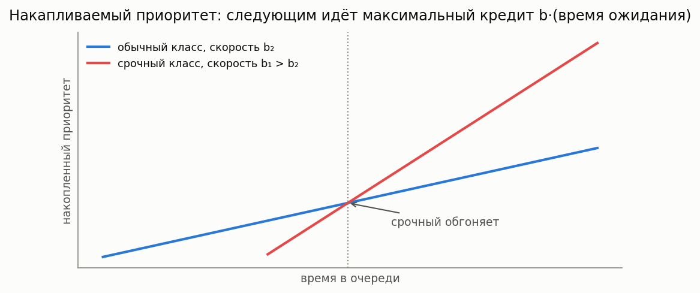

# Системы с приоритетами

[🇬🇧 English version](priority.md) · [← Каталог моделей](../models.ru.md)


**Простыми словами:** заявки делятся на классы важности, у каждого класса — своя очередь.
Прибор всегда берёт заявку самого важного непустого класса. Два режима: **PR** (preemptive,
прерывающий) — важная заявка вытесняет обычную прямо с прибора; **NP** (non-preemptive,
непрерывающий) — начатое обслуживание доводится до конца, но дальше вне очереди идёт важная.
Плата за приоритет: младшие классы ждут дольше, при высокой загрузке — многократно.

### M/G/1/PR (прерываемый приоритет)

**Описание:** Одноканальная система с несколькими классами приоритетов. Приоритетные заявки могут прерывать обслуживание низкоприоритетных.

**Класс расчета:** `MG1PreemptiveCalc`

**Пример:**

```python
from most_queue.theory.priority.preemptive.mg1 import MG1PreemptiveCalc

calc = MG1PreemptiveCalc()
calc.set_sources([0.1, 0.2, 0.3])  # интенсивности для каждого класса

# Моменты времени обслуживания для каждого класса
b = [
    [2.0, 4.0, 8.0],  # класс 1
    [3.0, 9.0, 27.0], # класс 2
    [4.0, 16.0, 64.0] # класс 3
]
calc.set_servers(b)

results = calc.run()
```

### M/G/1/NP (непрерываемый приоритет)

**Описание:** Одноканальная система с приоритетами, где начатое обслуживание не прерывается.

**Класс расчета:** `MG1NonPreemptiveCalc`

**Пример:**

```python
from most_queue.theory.priority.non_preemptive.mg1 import MG1NonPreemptiveCalc

calc = MG1NonPreemptiveCalc()
calc.set_sources([0.1, 0.2, 0.3])
calc.set_servers(b)  # моменты для каждого класса
results = calc.run()
```

### M/G/c/PR и M/G/c/NP

**Описание:** Многоканальные системы с приоритетами (прерываемый и непрерываемый).

**Класс расчета:** `MGnInvarApproximation`

**Пример:**

```python
from most_queue.theory.priority.mgn_invar_approx import MGnInvarApproximation

calc = MGnInvarApproximation(n=5, priority="PR")  # или "NP"
calc.set_sources([0.1, 0.2, 0.3])
calc.set_servers(b)
results = calc.run()
```

### M/Ph/c/PR

**Описание:** Многоканальная система с фазовым распределением времени обслуживания и приоритетами.

**Класс расчета:** `MPhNPrty`

**Пример:** См. тест `test_m_ph_n_prty.py`

### M/M/2 с 3 классами приоритетов (PR)

**Описание:** Двухканальная система с тремя классами прерываемых приоритетов, аппроксимация через периоды занятости.

**Класс расчета:** `MM2BusyApprox3Classes` (`most_queue.theory.priority.preemptive.mm2_3cls_busy_approx`)

**Пример:** См. тест `test_mm2_3cls_prty_busy.py`

### M/M/n с 2 классами приоритетов (PR)

**Описание:** Многоканальная система с двумя классами прерываемых приоритетов, аппроксимация через периоды занятости.

**Класс расчета:** `MMnPR2ClsBusyApprox` (`most_queue.theory.priority.preemptive.mmn_2cls_pr_busy_approx`)

**Пример:** См. тест `test_mmn_prty_busy_approx.py`

### M/M/n с m классами приоритетов (PR) — RDR-A

**Описание:** Многоканальная система с **произвольным числом прерывающих (preemptive-resume)
приоритетов**, метод агрегированной рекурсивной редукции размерности (RDR-A) — Harchol-Balter,
Osogami, Scheller-Wolf, Wierman. Для анализа класса *k* все более приоритетные классы
агрегируются в один поток, период занятости которого matching-ится Cox-2 распределением, что
сводит m-классовую задачу к цепочке точных двухклассовых. Возвращает средние время пребывания
и ожидания по каждому классу; высший класс несёт полный вектор моментов (точное M/M/n).
Совпадает с симуляцией в пределах нескольких процентов: агрегация точна при общей интенсивности
обслуживания всех классов (каноническая постановка статьи), иначе используется эффективная
интенсивность, сохраняющая загрузку.

**Класс расчета:** `RDRAPriorityCalc` (`most_queue.theory.priority.preemptive.rdr_a`)

**Пример:**

```python
from most_queue.theory.priority.preemptive.rdr_a import RDRAPriorityCalc

calc = RDRAPriorityCalc(n=3)
calc.set_sources([0.6, 0.6, 0.6, 0.6])  # интенсивности входа, высший приоритет первым
calc.set_servers([1.0, 1.0, 1.0, 1.0])  # интенсивности обслуживания по классам
results = calc.run()
# results.v[k][0] — среднее время пребывания класса k
```

### M/M/k с m классами приоритетов (PR) — точный эталон

**Описание:** Точный решатель M/M/k с произвольным числом прерывающих (preemptive-resume)
приоритетов и классозависимыми экспоненциальными интенсивностями. Строит полную цепь Маркова по
вектору числа заявок каждого класса (с усечением по классам) и решает стационарное распределение
униформизованной степенной итерацией. Точен с точностью до усечения (возвращает граничную массу
как индикатор качества). Предназначен как **эталон без шума симуляции** для валидации
приближений RDR / RDR-A; пространство состояний — `∏(N_i+1)`, поэтому практичен для малых `m` и
низкой–умеренной загрузки, но не для низшего класса при очень высокой загрузке (для чего и нужен
RDR).

По запросу также считает **точный второй момент времени отклика** (дисперсию) по каждому
классу — методом меченой заявки (first-passage, §2.4 статьи), для стандартной дисциплины
FCFS-resume.

**Класс расчета:** `MMkPriorityExact` (`most_queue.theory.priority.preemptive.mmk_prty_exact`)

**Пример:**

```python
from most_queue.theory.priority.preemptive.mmk_prty_exact import MMkPriorityExact

calc = MMkPriorityExact(n=2, with_variance=True)
calc.set_sources([0.3, 0.3, 0.3])
calc.set_servers([1.2, 1.0, 0.8])
results = calc.run()
# results.v[k][0] — точное среднее время пребывания класса k
# results.v[k][1] — точный второй момент (дисперсия = v[k][1] - v[k][0]**2)
# calc.boundary_mass — индикатор качества усечения
```

> О дисциплине: второй момент — для **FCFS-resume** (прерванная заявка возобновляется на своём
> месте по порядку прихода). Среднее не зависит от дисциплины. Дискретно-событийный
> `PriorityQueueSimulator` возвращает прерванную заявку в конец очереди класса, поэтому его
> старшие моменты отличаются от `MMkPriorityExact`, хотя средние совпадают.

### M/PH/PH/k с двумя классами приоритетов (PR) — точный

**Описание:** Точный решатель M/PH/PH/k с двумя прерывающими (preemptive-resume) приоритетами, где
**оба** класса имеют фазовое обслуживание (базовый случай §2.3 в RDR). При FCFS-resume живую
PH-фазу несут только ≤ k заявок в обслуживании (и ≤ k замороженных), поэтому цепь конечна; активные
заявки низкого класса отслеживаются кортежем по возрасту. Возвращает точные средние по классам.

**Класс расчета:** `MPhPhK2Class` (`most_queue.theory.priority.preemptive.mph_ph_k_2class`)

**Пример:**

```python
from most_queue.theory.priority.preemptive.mph_ph_k_2class import MPhPhK2Class, PhaseType

calc = MPhPhK2Class(n=2)
calc.set_sources(l_high=0.4, l_low=0.4)
calc.set_servers(PhaseType.from_moments([1.0, 9.0, 135.0]), PhaseType.from_moments([1.0, 9.0, 135.0]))
results = calc.run()  # results.v[k][0] — точное среднее время пребывания класса k
```

### M/PH/k с m классами приоритетов (PR) — RDR-A с фазовым обслуживанием

**Описание:** RDR-A для M/PH/k с произвольным числом прерывающих приоритетов и **классозависимым
фазовым** обслуживанием (постановка Fig 5b/6/10 статьи). Агрегирует высшие классы в один PH-поток
и точно решает каждую пару через `MPhPhK2Class`. Совпадает с независимой FCFS-resume симуляцией в
пределах пары процентов.

**Класс расчета:** `RDRAPriorityPH` (`most_queue.theory.priority.preemptive.rdr_a`)

**Пример:**

```python
from most_queue.theory.priority.preemptive.rdr_a import RDRAPriorityPH

calc = RDRAPriorityPH(n=2)
calc.set_sources([0.2, 0.2, 0.2, 0.2])                 # интенсивности входа, высший приоритет первым
calc.set_servers([[1.0, 9.0, 135.0]] * 4)              # 3 момента обслуживания на класс
results = calc.run()  # results.v[k][0] — среднее время пребывания класса k
```

## Динамические и расширенные приоритетные модели (EPIC-020)



### M/G/1 с накапливаемым приоритетом (APQ)

**Описание:** Каждая ожидающая заявка линейно накапливает приоритет со скоростью b_k своего
класса; при освобождении прибора обслуживается максимальный накопленный кредит (без
прерываний). Delay-dependent дисциплина Клейнрока (1964), современная APQ
Stanford-Taylor-Ziedins (2013) — стандартная модель KPI медицинского триажа. Точные средние
ожидания по рекурсии Клейнрока; равные скорости дают FIFO, экстремальные отношения — формулы
Кобхэма.

**Суть:** вместо жёсткой иерархии срочность растёт с ожиданием: рядовой пациент, прождавший
достаточно долго, обгоняет свежего срочного. Одна ручка на класс (скорость b_k) настраивает
весь спектр от FIFO до строгих приоритетов.

**Класс расчета:** `MG1AccumulatingPriorityCalc` (`most_queue.theory.priority.accumulating`)
**Симуляция:** `AccumulatingPrioritySim` (`most_queue.sim.accumulating_priority`)

```python
from most_queue.theory.priority.accumulating import MG1AccumulatingPriorityCalc

calc = MG1AccumulatingPriorityCalc()
calc.set_sources(l=[0.2, 0.3, 0.25])
calc.set_servers(b=b_moments, rates=[4.0, 2.0, 1.0])   # класс 0 копит быстрее всех
res = calc.run()   # res.w[k][0] — точные средние ожидания
```

### M/M/n + M с приоритетами и нетерпением

**Описание:** Два класса делят n приборов (относительный приоритет), ожидающие заявки класса k
уходят с интенсивностью theta_k — приоритетный Erlang-A колл-центров (Choi 2001,
Iravani-Balcioglu 2008). Точная усечённая CTMC; при равных theta суммарная очередь в точности
совпадает с агрегированным Erlang-A (приоритет лишь делит её).

**Класс расчета:** `MMnPriorityImpatienceCalc` (`most_queue.theory.priority.impatience`)
**Симуляция:** `MMnPriorityImpatienceSim` (`most_queue.sim.priority_impatience`)

```python
from most_queue.theory.priority.impatience import MMnPriorityImpatienceCalc

calc = MMnPriorityImpatienceCalc(n=3)
calc.set_sources(l=[1.2, 1.5])
calc.set_servers(mu=1.0, theta=[0.3, 0.6])
res = calc.run()   # res.w, calc.abandon_probs по классам
```

### MMAP[2]/PH[2]/1 с приоритетами (коррелированный вход)

**Описание:** Маркированный MAP (два класса делят один модулирующий процесс), PH-обслуживание
по классам, дисциплины NP, PR (preemptive resume с заморозкой фазы прерванной заявки) и RS
(repeat с пересэмплированием). Точная усечённая CTMC (Takine 1996; Horvath et al. 2012;
Klimenok-Dudin 2020). Однофазный MMAP + экспоненциальный PH сводится к классическим формулам
Кобхэма / preemptive-resume.

**Класс расчета:** `MapPh1PriorityCalc` (`most_queue.theory.priority.map_ph_priority`)
**Симуляция:** `PriorityQueueSimulator` с источниками `"MAP"` по классам

```python
from most_queue.theory.priority.map_ph_priority import MapPh1PriorityCalc

calc = MapPh1PriorityCalc(discipline="NP")     # или "PR", "RS"
calc.set_sources(D0=d0, D1_high=d1h, D1_low=d1l)
calc.set_servers(ph_high=(alpha_h, T_h), ph_low=(alpha_l, T_l))
res = calc.run()
```

### M/M/1 retrial с приоритетным классом

**Описание:** Приоритетные заявки ждут в обычной очереди; обычные, застав прибор занятым,
уходят на орбиту и повторяют попытки с интенсивностью gamma каждая (повторы блокированы, пока
очередь приоритетных непуста). Точная усечённая CTMC (Artalejo 1994; retrial-приоритеты —
Operational Research 2015). gamma к бесконечности даёт двухклассовые формулы Кобхэма, без
приоритетного класса — Falin-Templeton.

**Класс расчета:** `MM1RetrialPriorityCalc` (`most_queue.theory.priority.retrial_priority`)
**Симуляция:** `MM1RetrialPrioritySim` (`most_queue.sim.retrial_priority`)

```python
from most_queue.theory.priority.retrial_priority import MM1RetrialPriorityCalc

calc = MM1RetrialPriorityCalc(gamma=0.7)
calc.set_sources(l=[0.3, 0.35])
calc.set_servers(mu=[1.2, 1.0])
res = calc.run()   # calc.mean_priority_queue, calc.mean_orbit
```

### M/G/1 preemptive repeat (RS/RW)

**Описание:** Приоритетная заявка прерывает обслуживание низшего класса, и тот потом начинает
ЗАНОВО — со свежим розыгрышем (RS) или с той же длительностью (RW). RS решён точно (Cox-2 фит +
CTMC) — первый аналитический бенчмарк для RS-дисциплины симулятора; для RW дана замкнутая
форма среднего completion time Гавера (1962) — у RW-очереди нет конечного марковского
представления (в резерве). При экспоненциальном обслуживании RS совпадает с preemptive-resume.

**Класс расчета:** `MG1PreemptiveRepeatCalc` (`most_queue.theory.priority.preemptive.mg1_repeat`)
**Симуляция:** `PriorityQueueSimulator(prty_type="RS"/"RW")`

```python
from most_queue.theory.priority.preemptive.mg1_repeat import MG1PreemptiveRepeatCalc

calc = MG1PreemptiveRepeatCalc(kind="RS")
calc.set_sources(l=[0.25, 0.3])
calc.set_servers(b=[b_high, b_low])            # по 3 момента на класс
res = calc.run()   # точные средние RS; calc.completion_means["RS"/"RW"]
```
