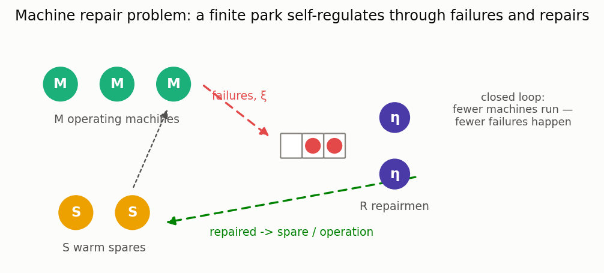

# Reliability: queues with unreliable servers

[🇷🇺 Русская версия](reliability.ru.md) · [← Model catalog](../models.md)


**In plain words:** servers break. A machine fails under load, a VM degrades, a disaster wipes
the queue and takes the server down for repair, a failed base station pushes customers into
retry loops. These models quantify the price of unreliability: how much latency and capacity
you lose to failures, and how much repair capacity or sparing you need. See the
[research survey](../research/unreliable-queues-2026.md) for the literature map.

### M/G/1 with an unreliable server (breakdowns & repairs)

**Description:** The server fails at Poisson rate ξ while serving; the repair time has a general distribution; the interrupted job resumes from where it stopped. Exact reduction to an M/G/1 with a "completion time" (service plus its own repairs) — Avi-Itzhak–Naor (1963).

**In plain words:** a machine that breaks under load: a job occupies the server for its service
time plus all the repairs that happen during it. The cumulants of the completion time are
computed in closed form, after which the ordinary Pollaczek–Khinchine formula applies.

**Calculator class:** `MG1UnreliableCalc` (`most_queue.theory.vacations.mg1_unreliable`)
**Simulation:** `UnreliableQueueSim` (`most_queue.sim.unreliable`)

**Example:**

```python
from most_queue.theory.vacations.mg1_unreliable import MG1UnreliableCalc
from most_queue.random.distributions import GammaDistribution

b = GammaDistribution.calc_theory_moments(
    GammaDistribution.get_params_by_mean_and_cv(0.5, 1.2), 5)
r = GammaDistribution.calc_theory_moments(
    GammaDistribution.get_params_by_mean_and_cv(0.4, 1.2), 5)

calc = MG1UnreliableCalc()
calc.set_sources(l=1.0)
calc.set_servers(b)
calc.set_breakdowns(xi=0.3, repair=r)
results = calc.run()
```

### M/M/c with server breakdowns and repairs

**Description:** Each of the c servers fails independently (rate ξ, busy or idle) and is
repaired at rate η — in parallel (unlimited crew) or by at most R repairmen. An interrupted job
returns to the queue. Exact truncated-CTMC solution (Mitrany–Avi-Itzhak 1968;
Neuts–Lucantoni 1979). Stability requires λ < c·μ·η/(ξ+η).

**In plain words:** a server farm where machines drop out and come back. The effective capacity
is not c·μ but c·μ·(availability), and the queue pays extra for the random capacity dips.

**Calculator class:** `MMcBreakdownsCalc` (`most_queue.theory.reliability.mmc_breakdowns`)
**Simulation:** `MMcBreakdownsSim` (`most_queue.sim.reliability`)

```python
from most_queue.theory.reliability import MMcBreakdownsCalc

calc = MMcBreakdownsCalc(n=3)                # repairmen=None — unlimited crew
calc.set_sources(l=1.5)
calc.set_servers(mu=0.8, xi=0.1, eta=0.6)    # failure and repair rates
res = calc.run()                             # res.v[0], calc.availability, calc.up_distribution
```

### Machine repair problem (machine interference, warm spares)



**Description:** The closed reliability classic (Palm 1947): M machines must run, S warm spares
stand by, failed units queue for R repairmen. Exact finite birth-death solution: park
availability, mean number of failed units, repair-crew utilization.

**In plain words:** how many repairmen (and spares) does a shop floor of M machines need?
While a machine waits for repair it produces nothing — and the fewer machines run, the fewer
failures happen, so the system self-regulates exactly like a closed network.

**Calculator class:** `MachineRepairCalc` (`most_queue.theory.reliability.machine_repair`)
**Simulation:** `MachineRepairSim` (`most_queue.sim.reliability`)

```python
from most_queue.theory.reliability import MachineRepairCalc

calc = MachineRepairCalc(n_machines=5, n_repairmen=2, n_spares=2)
calc.set_sources(xi=0.25, eta=1.0, xi_s=0.05)   # warm spares fail too
res = calc.run()   # res.availability, res.mean_failed, res.repairmen_utilization
```

### M/M/1 with working breakdowns

**Description:** During a breakdown the server keeps working at a reduced rate μ_d < μ instead
of stopping (Kalidass–Kasturi 2012). Exact two-phase CTMC; stability requires
λ < (μη + μ_d·ξ)/(ξ+η). μ_d = μ recovers M/M/1, μ_d = 0 — classic breakdowns.

**In plain words:** the cloud-era failure mode: a degraded VM or a throttled disk serves slower,
not never. Averaging the two rates is wrong — the queue built up during degradation dominates
the latency.

**Calculator class:** `MM1WorkingBreakdownsCalc` (`most_queue.theory.reliability.mm1_working_breakdowns`)
**Simulation:** `MM1WorkingBreakdownsSim` (`most_queue.sim.reliability`)

```python
from most_queue.theory.reliability import MM1WorkingBreakdownsCalc

calc = MM1WorkingBreakdownsCalc()
calc.set_sources(l=0.7)
calc.set_servers(mu=1.2, mu_d=0.4, xi=0.2, eta=0.8)
res = calc.run()   # res.v[0], calc.degraded_prob
```

### M/M/1 with disasters and a repair phase

**Description:** A disaster (rate δ) flushes all jobs AND sends the server to an exponential
repair (rate η); arrivals during the repair wait (Towsley–Tripathi 1991). Strengthens the
negative-arrivals stack, where recovery after a DISASTER is instantaneous: η → ∞ recovers that
model (geometric queue-length law).

**In plain words:** after a crash the system is not instantly back — requests keep arriving
while it reboots, and the backlog at the end of the repair is what users feel. P(down) is
exactly δ/(δ+η).

**Calculator class:** `MM1DisasterRepairCalc` (`most_queue.theory.reliability.mm1_disaster_repair`)
**Simulation:** `MM1DisasterRepairSim` (`most_queue.sim.reliability`)

```python
from most_queue.theory.reliability import MM1DisasterRepairCalc

calc = MM1DisasterRepairCalc()
calc.set_sources(l=0.9, delta=0.1)
calc.set_servers(mu=1.0, eta=0.4)
res = calc.run()   # res.v[0], res.q (prob served), calc.down_prob
```

### M/M/1 retrial queue with an unreliable server

**Description:** Blocked customers join an orbit and retry at rate γ each; the server fails
during service (rate ξ), the interrupted customer returns to the orbit, repair takes exp(η);
retrials are blocked while the server is down (Wang–Cao–Li 2001, Artalejo 1994). Exact
orbit-truncated CTMC. ξ = 0 recovers the classic M/M/1 retrial queue (Falin–Templeton).

**In plain words:** a flaky call center or base station: a failure not only interrupts the
current caller but sends them into the redial loop, and everyone who calls during the outage
piles into the same loop — outages amplify themselves.

**Calculator class:** `MM1RetrialUnreliableCalc` (`most_queue.theory.reliability.retrial_unreliable`)
**Simulation:** `MM1RetrialUnreliableSim` (`most_queue.sim.reliability`)

```python
from most_queue.theory.reliability import MM1RetrialUnreliableCalc

calc = MM1RetrialUnreliableCalc(gamma=0.7)
calc.set_sources(l=0.5)
calc.set_servers(mu=1.0, xi=0.15, eta=0.6)
res = calc.run()   # res.v[0], calc.mean_orbit, calc.availability
```
