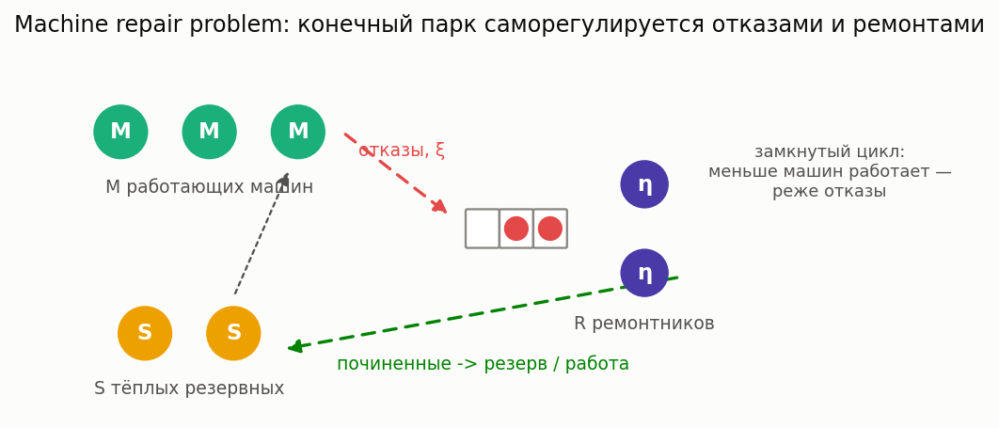

# Надёжность: СМО с ненадёжными приборами

[🇬🇧 English version](reliability.md) · [← Каталог моделей](../models.ru.md)


**Простыми словами:** приборы ломаются. Станок отказывает под нагрузкой, виртуалка
деградирует, катастрофа сносит очередь и уводит сервер в ремонт, отказавшая базовая станция
загоняет абонентов в циклы перезвона. Эти модели оценивают цену ненадёжности: сколько задержки
и ёмкости съедают отказы и сколько нужно ремонтной мощности или резерва. Карта литературы — в
[обзоре](../research/unreliable-queues-2026.md).

### M/G/1 с ненадёжным прибором (breakdowns & repairs)

**Описание:** Прибор отказывает с пуассоновской интенсивностью ξ во время обслуживания; ремонт — произвольное распределение; прерванная заявка дообслуживается с места остановки. Точное сведение к M/G/1 с «completion time» (обслуживание + свои ремонты) — Avi-Itzhak–Naor (1963).

**Суть:** станок, который ломается под нагрузкой: заявка занимает прибор своё время
обслуживания плюс все случившиеся за это время ремонты. Кумулянты completion time
считаются в замкнутой форме, дальше работает обычная формула Полячека–Хинчина.

**Класс расчета:** `MG1UnreliableCalc` (`most_queue.theory.vacations.mg1_unreliable`)
**Симуляция:** `UnreliableQueueSim` (`most_queue.sim.unreliable`)

**Пример:**

```python
from most_queue.theory.vacations.mg1_unreliable import MG1UnreliableCalc
from most_queue.random.distributions import GammaDistribution

b = GammaDistribution.calc_theory_moments(
    GammaDistribution.get_params_by_mean_and_cv(0.5, 1.2), 5)
r = GammaDistribution.calc_theory_moments(
    GammaDistribution.get_params_by_mean_and_cv(0.4, 1.2), 5)

calc = MG1UnreliableCalc()
calc.set_sources(l=1.0)
calc.set_servers(b)
calc.set_breakdowns(xi=0.3, repair=r)
results = calc.run()
```

### M/M/c с отказами и ремонтами серверов

**Описание:** Каждый из c серверов отказывает независимо (интенсивность ξ, занят или свободен)
и ремонтируется с интенсивностью η — параллельно (неограниченная бригада) либо не более R
ремонтниками. Прерванная заявка возвращается в очередь. Точное решение усечённой CTMC
(Mitrany–Avi-Itzhak 1968; Neuts–Lucantoni 1979). Устойчивость: λ < c·μ·η/(ξ+η).

**Суть:** ферма серверов, где машины выпадают и возвращаются. Эффективная ёмкость — не c·μ,
а c·μ·(доступность), и очередь дополнительно платит за случайные провалы ёмкости.

**Класс расчета:** `MMcBreakdownsCalc` (`most_queue.theory.reliability.mmc_breakdowns`)
**Симуляция:** `MMcBreakdownsSim` (`most_queue.sim.reliability`)

```python
from most_queue.theory.reliability import MMcBreakdownsCalc

calc = MMcBreakdownsCalc(n=3)                # repairmen=None — неограниченная бригада
calc.set_sources(l=1.5)
calc.set_servers(mu=0.8, xi=0.1, eta=0.6)    # интенсивности отказа и ремонта
res = calc.run()                             # res.v[0], calc.availability, calc.up_distribution
```

### Machine repair problem (машинная интерференция, тёплый резерв)



**Описание:** Закрытая классика теории надёжности (Palm 1947): M машин должны работать, S
тёплых резервных стоят наготове, отказавшие ждут одного из R ремонтников. Точное конечное
birth-death решение: доступность парка, среднее число неисправных, загрузка ремонтников.

**Суть:** сколько ремонтников (и резервных машин) нужно цеху из M станков? Пока станок ждёт
ремонта, он ничего не производит — а чем меньше станков работает, тем реже отказы: система
саморегулируется ровно как закрытая сеть.

**Класс расчета:** `MachineRepairCalc` (`most_queue.theory.reliability.machine_repair`)
**Симуляция:** `MachineRepairSim` (`most_queue.sim.reliability`)

```python
from most_queue.theory.reliability import MachineRepairCalc

calc = MachineRepairCalc(n_machines=5, n_repairmen=2, n_spares=2)
calc.set_sources(xi=0.25, eta=1.0, xi_s=0.05)   # тёплый резерв тоже отказывает
res = calc.run()   # res.availability, res.mean_failed, res.repairmen_utilization
```

### M/M/1 с working breakdowns

**Описание:** Во время поломки прибор продолжает работать с пониженной скоростью μ_d < μ, а не
останавливается (Kalidass–Kasturi 2012). Точная двухфазная CTMC; устойчивость:
λ < (μη + μ_d·ξ)/(ξ+η). μ_d = μ сводится к M/M/1, μ_d = 0 — к классическим поломкам.

**Суть:** отказ облачной эпохи: деградировавшая виртуалка или затроттленный диск обслуживают
медленнее, а не никогда. Усреднять две скорости нельзя — задержку определяет очередь,
накопленная за время деградации.

**Класс расчета:** `MM1WorkingBreakdownsCalc` (`most_queue.theory.reliability.mm1_working_breakdowns`)
**Симуляция:** `MM1WorkingBreakdownsSim` (`most_queue.sim.reliability`)

```python
from most_queue.theory.reliability import MM1WorkingBreakdownsCalc

calc = MM1WorkingBreakdownsCalc()
calc.set_sources(l=0.7)
calc.set_servers(mu=1.2, mu_d=0.4, xi=0.2, eta=0.8)
res = calc.run()   # res.v[0], calc.degraded_prob
```

### M/M/1 с катастрофами и фазой ремонта

**Описание:** Катастрофа (интенсивность δ) сбрасывает все заявки И уводит прибор в
экспоненциальный ремонт (интенсивность η); прибывающие во время ремонта ждут
(Towsley–Tripathi 1991). Усиливает negative-стек, где восстановление после DISASTER
мгновенно: η → ∞ сводится к той модели (геометрическое распределение очереди).

**Суть:** после сбоя система не возвращается мгновенно — пока она перезагружается, запросы
продолжают приходить, и именно накопленный к концу ремонта хвост чувствуют пользователи.
P(ремонт) ровно δ/(δ+η).

**Класс расчета:** `MM1DisasterRepairCalc` (`most_queue.theory.reliability.mm1_disaster_repair`)
**Симуляция:** `MM1DisasterRepairSim` (`most_queue.sim.reliability`)

```python
from most_queue.theory.reliability import MM1DisasterRepairCalc

calc = MM1DisasterRepairCalc()
calc.set_sources(l=0.9, delta=0.1)
calc.set_servers(mu=1.0, eta=0.4)
res = calc.run()   # res.v[0], res.q (доля обслуженных), calc.down_prob
```

### M/M/1 retrial с ненадёжным прибором

**Описание:** Заблокированные заявки уходят на орбиту и повторяют попытки с интенсивностью γ
каждая; прибор отказывает во время обслуживания (ξ), прерванная заявка возвращается на орбиту,
ремонт exp(η); во время ремонта повторы безуспешны (Wang–Cao–Li 2001, Artalejo 1994). Точная
CTMC с усечением орбиты. ξ = 0 сводится к классической retrial-очереди (Falin–Templeton).

**Суть:** ненадёжный колл-центр или базовая станция: отказ не только обрывает текущего
абонента, но и отправляет его в цикл перезвона, а все позвонившие во время простоя попадают в
тот же цикл — простои усиливают сами себя.

**Класс расчета:** `MM1RetrialUnreliableCalc` (`most_queue.theory.reliability.retrial_unreliable`)
**Симуляция:** `MM1RetrialUnreliableSim` (`most_queue.sim.reliability`)

```python
from most_queue.theory.reliability import MM1RetrialUnreliableCalc

calc = MM1RetrialUnreliableCalc(gamma=0.7)
calc.set_sources(l=0.5)
calc.set_servers(mu=1.0, xi=0.15, eta=0.6)
res = calc.run()   # res.v[0], calc.mean_orbit, calc.availability
```
