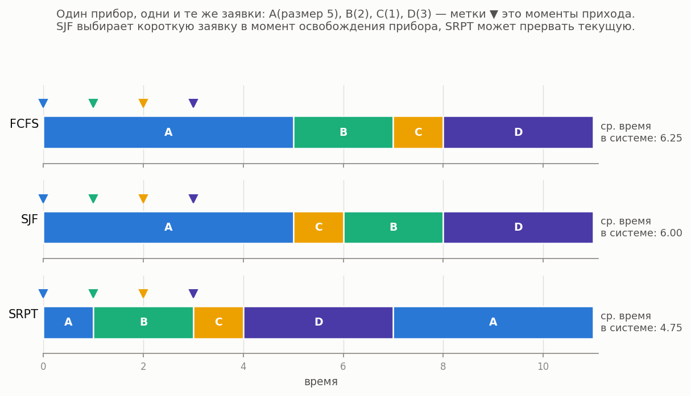
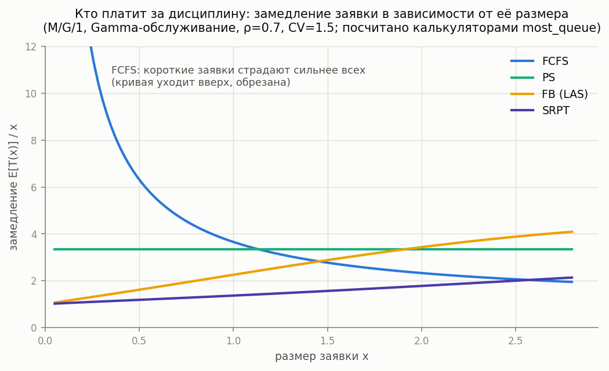
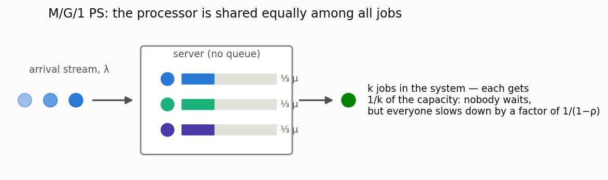
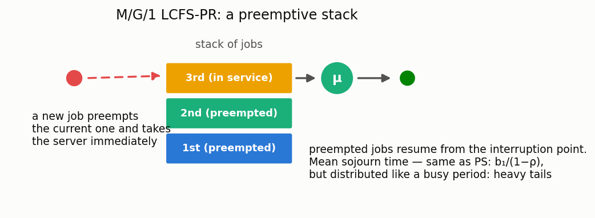

# Size-based scheduling disciplines

[🇷🇺 Русская версия](size-based.ru.md) · [← Model catalog](../models.md) ·
[← FIFO systems](fifo.md)

**In plain words:** these disciplines decide whom to serve based on the *size* of the job (known
or predicted), not on the order of arrival. Here is how the same jobs pass through a single
server under different disciplines:



### M/G/1 SRPT

**Description:** Single-server M/G/1 under the **Shortest Remaining Processing Time** discipline (preemption by remaining work). Numerically: the Schrage–Miller formula (1966).

**In plain words:** the server is always busy with the job that has the least work *remaining*;
if a shorter one arrives, the current job is preempted and waits (see the diagram above, where
job A yields the server and is finished at the end). SRPT provably minimizes the mean sojourn
time among all disciplines.

**Calculator class:** `MG1SrptCalc`  
**Simulation:** `SizeBasedQsSim(discipline="SRPT")` — the job size is sampled on arrival.

**Example:**

```python
from most_queue.theory.srpt import MG1SrptCalc
from most_queue.random.distributions import H2Distribution

calc = MG1SrptCalc()
calc.set_sources(1.0)
h2 = H2Distribution.get_params_by_mean_and_cv(0.7, 1.2)
calc.set_servers(h2, "H")
results = calc.run()
```

### M/G/1 SJF (SPT)

**Description:** Non-preemptive service by the **smallest true size** (Shortest Job First / Shortest Processing Time).

**In plain words:** no preemption — when the server becomes free, the shortest job in the queue
is taken, but a service once started always runs to completion.

**Calculator class:** `MG1SjfCalc`  
**Simulation:** `SizeBasedQsSim(discipline="SJF")`

### M/G/1 PSJF

**Description:** Preemptive service by the **original** job size (different from SRPT).

**In plain words:** like SRPT, but the comparison uses the *full original* size, not the
remainder: an almost-finished long job will still yield to a newly arrived short one.

**Calculator class:** `MG1PsjfCalc`  
**Simulation:** `SizeBasedQsSim(discipline="PSJF")`

### M/G/1 SPJF (with predictions)

**Description:** Non-preemptive service by the **predicted** size \(Y\) (Mitzenmacher, 2020). The joint distribution \((X,Y)\) is specified by a predictor object (`PerfectPredictor`, `ExpNoisePredictor`, …).

**In plain words:** the true job size is unknown, but a *prediction* of it is available (e.g.
from an ML model) — we serve the jobs that are short "according to the forecast". The model
answers the question of how much of the SJF gain survives with imprecise predictions. With a
perfect predictor it reduces to SJF.

**Calculator class:** `MG1SpjfCalc`  
**Simulation:** `SizeBasedQsSim(discipline="SPJF")` + `set_predictor(...)`.

**Example:**

```python
from most_queue.theory.srpt import MG1SpjfCalc
from most_queue.theory.srpt.utils.predictor import ExpNoisePredictor

calc = MG1SpjfCalc()
calc.set_sources(0.5)
calc.set_servers(1.0, "M")
calc.set_predictor(ExpNoisePredictor())
results = calc.run()
```

#### Graceful degradation of predictions (learning-augmented scheduling)

**Description:** How does SPJF's mean response time change as predictions get noisier? The helper
`prediction_degradation_curve` sweeps the log-normal prediction noise σ and returns the SPJF mean
response bracketed by SRPT (size-aware optimum), SJF (perfect predictions) and blind FB/LAS. It
reports the **break-even noise** at which SPJF starts losing to the *blind* policy — reproducing the
central open problem of the SIGMETRICS 2025 survey "Queueing, Predictions, and LLMs" (there is no
free graceful-degradation guarantee).

```python
from most_queue.theory.srpt import prediction_degradation_curve

curve = prediction_degradation_curve(0.7, service_h2_params, "H")
# curve.spjf[i] at curve.sigmas[i]; curve.srpt / curve.sjf / curve.blind_fb references;
# curve.breakeven_sigma — noise where SPJF becomes worse than blind
```

The next three disciplines (FB, PS, LCFS-PR) complete the size-based family. How each of them
treats jobs of different sizes is computed by the library's own calculators:



### M/G/1 FB (Foreground-Background / LAS)

**Description:** A preemptive **blind** discipline: the server always serves the job with the least *attained* service; ties share the server equally. Job sizes need not be known.

**In plain words:** "give the newcomers a chance": a fresh job gets the server immediately and
keeps it until it catches up with the others in attained service. If short jobs are common
(decreasing hazard rate, CV > 1), FB approaches SRPT without knowing the sizes; if the service
time is nearly constant, FB loses even to FCFS. Exponential service is the boundary case: FB
coincides with PS.

**Calculator class:** `MG1FbCalc` (`most_queue.theory.srpt`)
**Simulation:** `FBSim` (`most_queue.sim.single_server_disciplines`)

**Example:**

```python
from most_queue.theory.srpt import MG1FbCalc
from most_queue.random.distributions import GammaDistribution

calc = MG1FbCalc()
calc.set_sources(1.0)
calc.set_servers(GammaDistribution.get_params_by_mean_and_cv(0.7, 1.2), "Gamma")
results = calc.run()
```

### M/G/1 PS (Processor Sharing)



**Description:** The server is shared equally among all jobs present (each of k jobs is served at rate 1/k). The state probabilities are geometric and insensitive to the shape of the service distribution; the conditional mean sojourn time of a job of size x is exactly x/(1−ρ).

**In plain words:** a model of a CPU, a web server, a shared channel: nobody waits "in a queue",
but everyone is slowed down by the same factor 1/(1−ρ). A perfectly fair discipline — the
baseline for comparison with SRPT/SJF (which are faster on average, but at the expense of long
jobs). Only the means are computed for now (higher moments — Yashkov/Ott methods — are deferred).

**Calculator class:** `MG1PSCalc` (`most_queue.theory.fifo.mg1_ps`)
**Simulation:** `ProcessorSharingSim` (`most_queue.sim.single_server_disciplines`)

**Example:**

```python
from most_queue.theory.fifo.mg1_ps import MG1PSCalc

calc = MG1PSCalc()
calc.set_sources(l=1.0)
calc.set_servers([0.7, 1.2])  # service time moments
results = calc.run()
slowdown = calc.get_mean_slowdown()          # 1/(1-rho)
t_x = calc.get_conditional_sojourn_mean(2.0)  # x/(1-rho)
```

### M/G/1 LCFS-PR



**Description:** A preemptive stack: a new job preempts the one in service, and preempted jobs later resume from the point of interruption. The sojourn time is distributed as an M/G/1 busy period — all moments follow from the Takács recursions; the state probabilities are the same geometric ones (BCMP).

**In plain words:** "last come, first served": a fresh job gets the server immediately, but risks
being preempted itself. The mean sojourn time is the same as under PS (b₁/(1−ρ), insensitive
to the distribution shape), but the variability is much larger — the tails are those of a busy
period. FCFS has a different mean: it also depends on b₂ (Pollaczek–Khinchine).

**Calculator class:** `MG1LcfsPrCalc` (`most_queue.theory.fifo.mg1_lcfs_pr`)
**Simulation:** `LcfsPRSim` (`most_queue.sim.single_server_disciplines`)

**See also:** [SLA / deadline-violation probability](sla.md) — turn these moments into a deadline-violation probability or SLO quantile.
