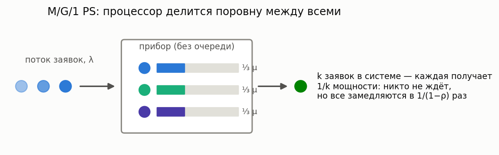
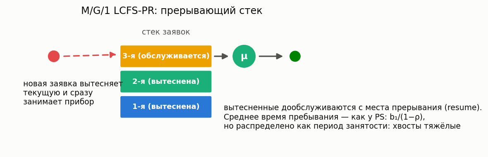

# Size-based дисциплины обслуживания

[🇬🇧 English version](size-based.md) · [← Каталог моделей](../models.ru.md) ·
[← FIFO системы](fifo.ru.md)

**Простыми словами:** эти дисциплины выбирают, кого обслуживать, глядя на *размер* заявки
(известный или предсказанный), а не на порядок прихода. Вот как одни и те же заявки проходят
через один прибор при разных дисциплинах:


### M/G/1 SRPT

**Описание:** Одноканальная M/G/1 с дисциплиной **Shortest Remaining Processing Time** (прерывание по остатку работы). Численно: формула Schrage–Miller (1966).

**Суть:** прибор всегда занят заявкой, которой *осталось* меньше всего работы; если пришла
более короткая — текущая прерывается и ждёт (см. на схеме выше, как заявка A уступает место
и дообслуживается в конце). SRPT доказуемо минимизирует среднее время пребывания среди всех
дисциплин.

**Класс расчета:** `MG1SrptCalc`  
**Симуляция:** `SizeBasedQsSim(discipline="SRPT")` — размер заявки сэмплируется при приходе.

**Пример:**

```python
from most_queue.theory.srpt import MG1SrptCalc
from most_queue.random.distributions import H2Distribution

calc = MG1SrptCalc()
calc.set_sources(1.0)
h2 = H2Distribution.get_params_by_mean_and_cv(0.7, 1.2)
calc.set_servers(h2, "H")
results = calc.run()
```

### M/G/1 SJF (SPT)

**Описание:** Непрерываемое обслуживание по **наименьшему истинному размеру** (Shortest Job First / Shortest Processing Time).

**Суть:** без прерываний — в момент освобождения прибора из очереди берётся самая короткая
заявка, но начатое обслуживание всегда доводится до конца.

**Класс расчета:** `MG1SjfCalc`  
**Симуляция:** `SizeBasedQsSim(discipline="SJF")`

### M/G/1 PSJF

**Описание:** Прерываемое обслуживание по **исходному** размеру заявки (отличается от SRPT).

**Суть:** как SRPT, но сравнивается *полный исходный* размер, а не остаток: почти
дообслуженная длинная заявка всё равно уступит новой короткой.

**Класс расчета:** `MG1PsjfCalc`  
**Симуляция:** `SizeBasedQsSim(discipline="PSJF")`

### M/G/1 SPJF (с предсказаниями)

**Описание:** Непрерываемое обслуживание по **предсказанному** размеру \(Y\) (Mitzenmacher, 2020). Совместное распределение \((X,Y)\) задаётся объектом предиктора (`PerfectPredictor`, `ExpNoisePredictor`, …).

**Суть:** истинный размер заявки неизвестен, но есть его *предсказание* (например, от
ML-модели) — обслуживаем короткие «по прогнозу». Модель отвечает на вопрос, сколько
выигрыша от SJF сохраняется при неточных предсказаниях. При идеальном предикторе
переходит в SJF.

**Класс расчета:** `MG1SpjfCalc`  
**Симуляция:** `SizeBasedQsSim(discipline="SPJF")` + `set_predictor(...)`.

**Пример:**

```python
from most_queue.theory.srpt import MG1SpjfCalc
from most_queue.theory.srpt.utils.predictor import ExpNoisePredictor

calc = MG1SpjfCalc()
calc.set_sources(0.5)
calc.set_servers(1.0, "M")
calc.set_predictor(ExpNoisePredictor())
results = calc.run()
```

#### Graceful degradation предсказаний (learning-augmented scheduling)

**Описание:** Как меняется среднее время отклика SPJF по мере ухудшения предсказаний? Хелпер
`prediction_degradation_curve` проходит по уровню лог-нормального шума σ и возвращает среднее SPJF в
рамке SRPT (size-aware оптимум), SJF (идеальные предсказания) и слепой FB/LAS. Возвращает
**точку перелома** — уровень шума, при котором SPJF начинает проигрывать *слепой* политике,
воспроизводя центральную открытую задачу survey SIGMETRICS 2025 «Queueing, Predictions, and LLMs»
(гарантии graceful degradation нет «бесплатно»).

```python
from most_queue.theory.srpt import prediction_degradation_curve

curve = prediction_degradation_curve(0.7, service_h2_params, "H")
# curve.spjf[i] при curve.sigmas[i]; ссылки curve.srpt / curve.sjf / curve.blind_fb;
# curve.breakeven_sigma — шум, при котором SPJF становится хуже слепой политики
```

Следующие три дисциплины (FB, PS, LCFS-PR) дополняют size-based семейство. Кто из них
как обращается с заявками разного размера — считают сами калькуляторы библиотеки:


### M/G/1 FB (Foreground-Background / LAS)

**Описание:** Прерывающая **blind**-дисциплина: прибор всегда обслуживает заявку с наименьшим *полученным* обслуживанием (least attained service); при равенстве — делится поровну. Размеры заявок знать не нужно.

**Суть:** «дадим шанс новичкам»: свежая заявка сразу получает прибор и держит его, пока не
догонит по обслуженному объёму остальных. Если короткие заявки часты (убывающий hazard rate,
CV > 1) — FB приближается к SRPT, не зная размеров; если время обслуживания почти постоянное —
FB проигрывает даже FCFS. Экспоненциальное обслуживание — граница: FB совпадает с PS.

**Класс расчета:** `MG1FbCalc` (`most_queue.theory.srpt`)
**Симуляция:** `FBSim` (`most_queue.sim.single_server_disciplines`)

**Пример:**

```python
from most_queue.theory.srpt import MG1FbCalc
from most_queue.random.distributions import GammaDistribution

calc = MG1FbCalc()
calc.set_sources(1.0)
calc.set_servers(GammaDistribution.get_params_by_mean_and_cv(0.7, 1.2), "Gamma")
results = calc.run()
```

### M/G/1 PS (Processor Sharing)



**Описание:** Прибор делится поровну между всеми находящимися заявками (каждая из k заявок обслуживается со скоростью 1/k). Вероятности состояний — геометрические, нечувствительные к форме распределения обслуживания; условное среднее время пребывания заявки размера x — ровно x/(1−ρ).

**Суть:** модель процессора, веб-сервера, разделяемого канала: никто не ждёт «в очереди»,
но все замедляются в одинаковое число раз 1/(1−ρ). Идеально справедливая дисциплина —
baseline для сравнения с SRPT/SJF (которые быстрее в среднем, но за счёт длинных заявок).
Пока считаются только средние (старшие моменты — методы Яшкова/Отта, отложено).

**Класс расчета:** `MG1PSCalc` (`most_queue.theory.fifo.mg1_ps`)
**Симуляция:** `ProcessorSharingSim` (`most_queue.sim.single_server_disciplines`)

**Пример:**

```python
from most_queue.theory.fifo.mg1_ps import MG1PSCalc

calc = MG1PSCalc()
calc.set_sources(l=1.0)
calc.set_servers([0.7, 1.2])  # моменты времени обслуживания
results = calc.run()
slowdown = calc.get_mean_slowdown()          # 1/(1-rho)
t_x = calc.get_conditional_sojourn_mean(2.0)  # x/(1-rho)
```

### M/G/1 LCFS-PR



**Описание:** Прерывающий стек: новая заявка вытесняет обслуживаемую, вытесненные дообслуживаются с места прерывания. Время пребывания распределено как период занятости M/G/1 — все моменты по рекурсиям Такача; вероятности состояний — те же геометрические (BCMP).

**Суть:** «последний пришёл — первый обслужен»: свежая заявка получает прибор сразу,
но рискует быть вытесненной. Среднее время пребывания то же, что у PS (b₁/(1−ρ),
нечувствительность к форме распределения), но разброс гораздо больше — хвосты как у
периода занятости. У FCFS среднее другое: оно зависит ещё и от b₂ (Полячек–Хинчин).

**Класс расчета:** `MG1LcfsPrCalc` (`most_queue.theory.fifo.mg1_lcfs_pr`)
**Симуляция:** `LcfsPRSim` (`most_queue.sim.single_server_disciplines`)

**См. также:** [SLA / вероятность нарушения дедлайна](sla.ru.md) — превратить эти моменты в вероятность нарушения дедлайна или SLO-квантиль.
