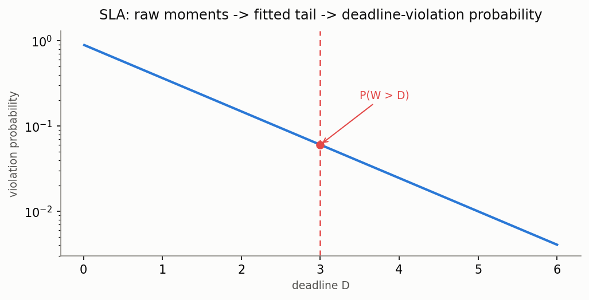

# SLA / deadline-violation probability

[🇷🇺 Русская версия](sla.ru.md) · [← Model catalog](../models.md)



**In plain words:** most calculators in this library return raw moments of the waiting or
sojourn time (mean, variance, skew, ...) — but a service-level objective ("95% of requests get a
response within 2 seconds") is a statement about the **tail** of that distribution, not the mean.
The SLA layer turns moments you already have into a deadline-violation probability `P(W > D)` or
an SLO quantile `D_p` (the deadline such that `P(W > D_p) = p`), by fitting a 2-3 moment
distribution (H2 for cv ≥ 1, Gamma for cv < 1 — the same H2/Gamma pattern used throughout the
library) and reading off its closed-form tail. It is a **horizontal utility**, not a new queueing
model: it works on top of the moments returned by *any* calculator in the catalog — M/G/1, M/G/n,
MAP/PH/1, priority classes, and so on.

This is the most active recent front in SLO-aware LLM-inference serving (SLO-guaranteed tail
latency scheduling, quantile-aware routing for time-to-first-token) — see
[`docs/research/sla-deadline-queueing-2026.md`](../research/sla-deadline-queueing-2026.md) for the
literature survey behind this addition.

### Deadline-violation probability and SLO quantile

**Description:** `deadline_violation_prob(moments, D)` fits a distribution to raw moments
(`moments[0]` = mean, `moments[1]` = second raw moment, `moments[2]` optional third moment for the
H2 branch) and returns `P(W > D)`. `slo_quantile(moments, p)` is the inverse: the deadline `D_p`
such that `P(W > D_p) = p`. Family selection (`family="auto"|"h2"|"gamma"`) mirrors the cv-based
convention used elsewhere in the library: cv ≥ 1 → H2, cv < 1 → Gamma. `family="h2"` raises if
cv < 1 (an H2 mixture cannot represent it); if `fit_h2`'s moment-matching degenerates near the
H2-feasibility boundary (a known edge case — see the `fit_from_moments` docstring), `family="auto"`
falls back to Gamma automatically rather than returning a silently wrong tail.

**Exact anchor:** `mm1_deadline_violation_prob(lam, mu, D)` computes the closed-form M/M/1 tail
`P(W > D) = rho * exp(-mu*(1-rho)*D)` directly (no fitting) — used to validate the fit-based
approach's accuracy, not a general-purpose entry point.

**Exact, non-anchor path for bounded-window batch service:** `BulkServiceMM1Calc`/
`BulkServiceErlangCalc`/`BulkServiceH2Calc` (any `1<=a<=b`, EPIC-067) expose `get_tail(D)`/`get_cdf(D)` — the EXACT
`P(W>D)` for `M/PH^[a,b]/1`, via matrix-exponential-action on the per-state phase-type
decomposition already used by `get_w()`, not a moment fit. Quantified against `fit_from_moments`
on the same raw moments: the fit is fine near the mean, but overestimates `P(W>D)` by orders of
magnitude in the deep tail relevant to GPU/LLM SLOs (rare-but-not-negligible violation targets) —
see [batch-service exact tail](../research/batch-service-sla-exact-tail-results-2026.md).

**Functions:** `deadline_violation_prob`, `slo_quantile`, `fit_from_moments`,
`mm1_deadline_violation_prob` (`most_queue.theory.utils.sla`)

**Example:**

```python
from most_queue.theory.fifo.mg1 import MG1Calc
from most_queue.theory.utils.sla import deadline_violation_prob, slo_quantile

calc = MG1Calc()
calc.set_sources(0.7)
calc.set_servers([1.0, 2.44, 9.47, 50.4])   # raw moments of service time
w = calc.run().w                             # raw moments of waiting time

p_violation = deadline_violation_prob(w, deadline=3.0)   # P(W > 3.0)
d95 = slo_quantile(w, p=0.05)                             # 95th-percentile deadline
```

### Accuracy notes

The fit is a 2-3-moment approximation, not exact (except for the M/M/1 anchor). It is validated
against discrete-event simulation across M/G/1, M/G/n, MAP/PH/1 and priority M/G/1 (see
`tests/test_sla_vs_sim_*.py`) at moderate loads. Accuracy degrades deep in the tail (very small `p`)
and at high utilization, where a 2-3-moment fit under-resolves the true distribution shape — this is
a known limitation of the current iteration, not a bug.

It also assumes **finite variance**: for genuinely heavy-tailed service (Pareto with α ≤ 2), this
fit is not valid at all, not just imprecise. See
[Fork-Join heavy-tailed sub-tasks](fork-join.md#heavy-tailed-sub-task-service-time-pareto--exact-not-approximated)
for the exact alternative (`pareto_max_tail`) in that regime.

### Cross-validation: online deadline counters in simulation

**Description:** `QsSim` and `PriorityQueueSimulator` support `set_deadline_thresholds(D_list)`
before `run()`: online counters (no raw-sample storage, same pattern as the existing moment
accumulators) track how many served tasks exceeded each deadline. After `run()`,
`get_empirical_violation_prob(D)` (per-class variant on `PriorityQueueSimulator`:
`get_empirical_violation_prob(k, D)`) returns the empirical frequency, for comparing against the
fit-based `deadline_violation_prob`.

### Composite example: LLM-inference serving TTFT SLO

**Description:** `examples/llm_serving_slo.py` models GPU batch-inference serving as a bursty
MAP(MMPP-2)/PH/1 queue (autocorrelated request arrivals, PH-fitted batch-inference service time)
and plots `P(TTFT > D)` against load, reproducing the qualitative shape reported by SLO-aware
LLM-serving papers (sharp rise as utilization approaches the stability boundary). A second section
compares two SLO tiers (premium/free) sharing the same server via `MG1NonPreemptiveCalc`.

See also: [Priority systems](priority.md), [Systems with batch arrivals](batch.md),
[Matrix-analytic models (MAP/PH)](map-ph.md), [EDF scheduling](edf.md) and
[deadline-aware admission control](admission-control.md) — two other SLO-management mechanisms
that change the discipline itself, rather than just reporting a metric on top of it.
