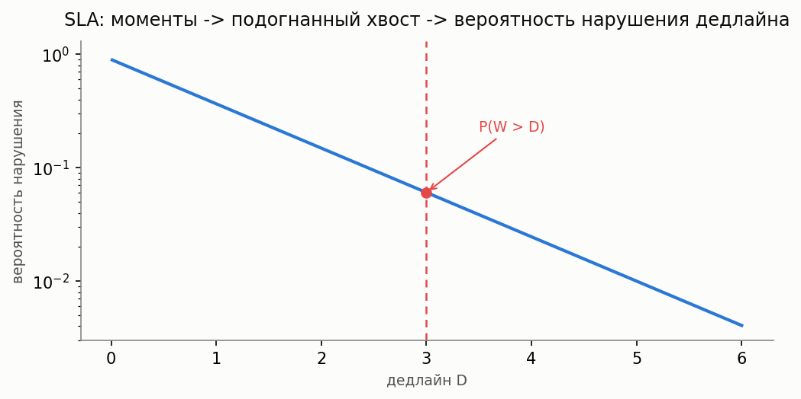

# SLA / вероятность нарушения дедлайна

[🇬🇧 English version](sla.md) · [← Каталог моделей](../models.ru.md)



**Простыми словами:** большинство калькуляторов библиотеки возвращают начальные моменты времени
ожидания/пребывания (среднее, дисперсию, асимметрию...), но SLO («95% запросов получают ответ за
2 секунды») — это утверждение про **хвост** распределения, а не про среднее. SLA-слой превращает
уже имеющиеся моменты в вероятность нарушения дедлайна `P(W > D)` или в SLO-квантиль `D_p`
(дедлайн, при котором `P(W > D_p) = p`), подгоняя 2-3-моментное распределение (H2 при cv ≥ 1, Gamma
при cv < 1 — тот же паттерн H2/Gamma, что используется в библиотеке повсеместно) и считывая его
замкнутый хвост. Это **горизонтальная утилита**, а не новая модель СМО: она работает поверх моментов
из **любого** калькулятора каталога — M/G/1, M/G/n, MAP/PH/1, приоритетных классов и т.д.

Это самое активное свежее направление в SLO-ориентированном обслуживании LLM-инференса
(гарантии хвостовой задержки, quantile-aware маршрутизация для time-to-first-token) — обзор
литературы см. в
[`docs/research/sla-deadline-queueing-2026.md`](../research/sla-deadline-queueing-2026.md).

### Вероятность нарушения дедлайна и SLO-квантиль

**Описание:** `deadline_violation_prob(moments, D)` подгоняет распределение по начальным моментам
(`moments[0]` — среднее, `moments[1]` — второй начальный момент, `moments[2]` опционален для ветки
H2) и возвращает `P(W > D)`. `slo_quantile(moments, p)` — обратная операция: дедлайн `D_p`, при
котором `P(W > D_p) = p`. Выбор семейства (`family="auto"|"h2"|"gamma"`) следует cv-конвенции,
принятой в остальной библиотеке: cv ≥ 1 → H2, cv < 1 → Gamma. `family="h2"` кидает исключение при
cv < 1 (H2-смесь не может это представить); если подгонка `fit_h2` вырождается вблизи границы
H2-достижимости (известный краевой случай — см. докстринг `fit_from_moments`), `family="auto"`
автоматически переключается на Gamma, а не молча возвращает неверный хвост.

**Точный эталон:** `mm1_deadline_violation_prob(lam, mu, D)` считает точный хвост M/M/1
`P(W > D) = rho * exp(-mu*(1-rho)*D)` напрямую (без подгонки) — используется для проверки точности
fit-подхода, а не как основная точка входа.

**Точный путь для batch-service с ограниченным окном:** `BulkServiceMM1Calc`/
`BulkServiceErlangCalc`/`BulkServiceH2Calc` (любое `1<=a<=b`, EPIC-067) дают `get_tail(D)`/`get_cdf(D)` — ТОЧНУЮ
`P(W>D)` для `M/PH^[a,b]/1` через матричную экспоненту phase-type разложения `get_w()`, не
подгонку. Количественное сравнение с `fit_from_moments` на тех же моментах: подгонка нормально
работает у среднего, но завышает `P(W>D)` на порядки в глубоком хвосте, релевантном GPU/LLM SLA —
см. [точный хвост batch-service](../research/batch-service-sla-exact-tail-results-2026.md).

**Функции:** `deadline_violation_prob`, `slo_quantile`, `fit_from_moments`,
`mm1_deadline_violation_prob` (`most_queue.theory.utils.sla`)

**Пример:**

```python
from most_queue.theory.fifo.mg1 import MG1Calc
from most_queue.theory.utils.sla import deadline_violation_prob, slo_quantile

calc = MG1Calc()
calc.set_sources(0.7)
calc.set_servers([1.0, 2.44, 9.47, 50.4])   # начальные моменты времени обслуживания
w = calc.run().w                             # начальные моменты времени ожидания

p_violation = deadline_violation_prob(w, deadline=3.0)   # P(W > 3.0)
d95 = slo_quantile(w, p=0.05)                             # дедлайн 95-го перцентиля
```

### Точность

Подгонка — 2-3-моментное приближение, не точное (кроме эталона M/M/1). Проверено против
дискретно-событийного моделирования на M/G/1, M/G/n, MAP/PH/1 и приоритетном M/G/1 (см.
`tests/test_sla_vs_sim_*.py`) при умеренной загрузке. Точность падает глубоко в хвосте (очень малые
`p`) и при высокой загрузке, где 2-3-моментная подгонка недостаточно разрешает истинную форму
распределения — это известное ограничение текущей итерации, а не баг.

Она также предполагает **конечную дисперсию**: для по-настоящему тяжёлых хвостов (Pareto с α ≤ 2)
подгонка не просто неточна — она неприменима в принципе. См.
[Тяжёлые хвосты подзадач Fork-Join](fork-join.ru.md#тяжёлые-хвосты-подзадач-pareto--точно-без-аппроксимации)
для точной альтернативы (`pareto_max_tail`) в этом режиме.

### Кросс-валидация: онлайн-счётчики дедлайнов в симуляции

**Описание:** `QsSim` и `PriorityQueueSimulator` поддерживают `set_deadline_thresholds(D_list)` до
`run()`: онлайн-счётчики (без хранения сырых выборок, тот же паттерн, что у существующих
накопителей моментов) считают, сколько обслуженных заявок превысили каждый дедлайн. После `run()`
`get_empirical_violation_prob(D)` (для `PriorityQueueSimulator` — по классам:
`get_empirical_violation_prob(k, D)`) возвращает эмпирическую частоту — для сравнения с
fit-хвостом `deadline_violation_prob`.

### Композитный пример: LLM-serving TTFT SLO

**Описание:** `examples/llm_serving_slo.py` моделирует обслуживание батч-инференса на GPU как
бёрсти-очередь MAP(MMPP-2)/PH/1 (коррелированные приходы запросов, PH-подогнанное время
батч-инференса) и строит график `P(TTFT > D)` от загрузки, качественно воспроизводя форму кривых
из SLO-ориентированных статей про LLM-serving (резкий рост при приближении загрузки к границе
устойчивости). Второй раздел сравнивает два SLO-уровня (premium/free) на одном сервере через
`MG1NonPreemptiveCalc`.

См. также: [Приоритетные системы](priority.ru.md), [Системы с пакетным приходом](batch.ru.md),
[Матрично-аналитические модели (MAP/PH)](map-ph.ru.md), [EDF-планирование](edf.ru.md) и
[admission control по дедлайну](admission-control.ru.md) — два других механизма управления SLO,
которые меняют саму дисциплину, а не просто считают метрику поверх неё.
