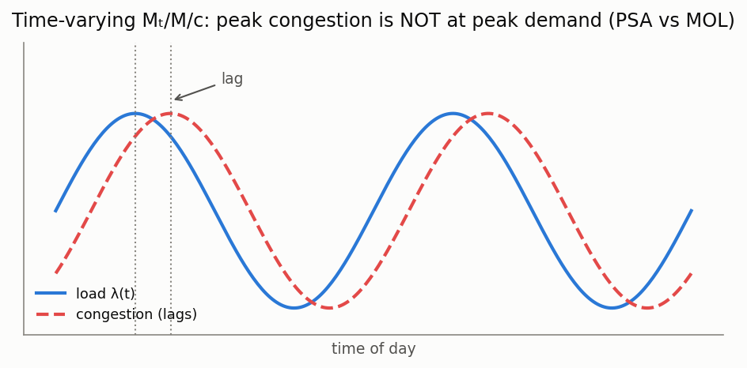

# Non-stationary Mₜ/M/c queues (time-varying load)

[🇷🇺 Русская версия](time-varying.ru.md) · [← Model catalog](../models.md)



**In plain words:** real arrival rates are not constant — call centres, roads, and data-centre
traffic surge and ebb over the day. Plugging the *peak* rate into a stationary formula overstaffs;
plugging the *average* rate understaffs during the peak. When the load moves slowly the system
tracks it and a *pointwise* stationary formula works; when it moves fast the system **lags** behind
the load, and you need a formula that captures that lag.

### PSA and MOL approximations for Mₜ/M/c

**Description:** For a time-varying arrival rate λ(t) and c servers, two approximations of the
blocking probability (loss, `kind="loss"`, Erlang B) or waiting probability (delay, `kind="delay"`,
Erlang C):

- **PSA (pointwise stationary approximation)** — evaluate the stationary Erlang formula at the
  instantaneous offered load a(t) = λ(t)/μ. Exact under slow variation / large c.
- **MOL (modified offered load)** — first pass λ(t) through an M/M/∞ response
  `dm/dt = λ(t) − μ·m(t)` to obtain a lagged, damped offered load m(t), then plug m(t) into the
  Erlang formula. Captures the lag PSA misses; markedly more accurate under fast variation.

**Calculator class:** `TimeVaryingMMcCalc` (`most_queue.theory.time_varying`) ·
**Simulator:** `TimeVaryingMMcSim` (`most_queue.sim.time_varying`, non-homogeneous Poisson via
thinning, loss system)

```python
import numpy as np
from most_queue.theory.time_varying import TimeVaryingMMcCalc

calc = TimeVaryingMMcCalc(n=5, kind="loss")       # or "delay"
calc.set_sources(lambda t: 4.0 * (1 + 0.6 * np.sin(t)))   # lambda(t)
calc.set_servers(mu=1.0)
t_grid = np.linspace(0, 4 * np.pi, 80)
res = calc.run(t_grid, mol_warmup=8.0)
# res.psa, res.mol (blocking prob over t_grid), res.offered_load (MOL m(t))
```
