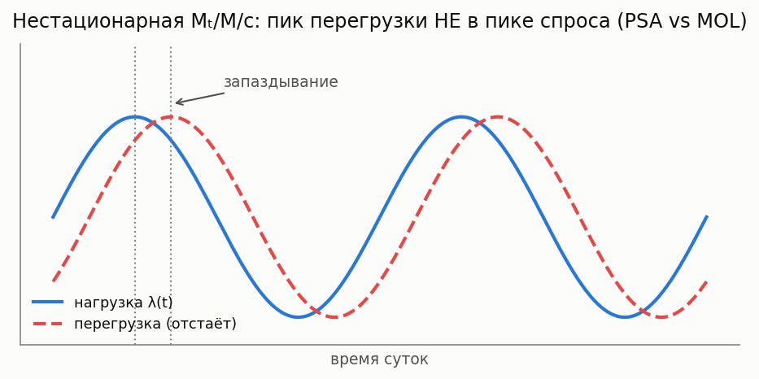

# Нестационарные очереди Mₜ/M/c (переменная нагрузка)

[🇬🇧 English version](time-varying.md) · [← Каталог моделей](../models.ru.md)



**Простыми словами:** реальная интенсивность прихода не постоянна — call-центры, дороги и трафик
ЦОД нарастают и спадают в течение суток. Подставить *пиковую* интенсивность в стационарную формулу
— переоценить штат; подставить *среднюю* — недооценить в час пик. Когда нагрузка меняется медленно,
система успевает за ней и работает *поточечная* стационарная формула; когда быстро — система
**отстаёт** от нагрузки, и нужна формула, учитывающая это отставание.

### Приближения PSA и MOL для Mₜ/M/c

**Описание:** Для переменной интенсивности λ(t) и c серверов — два приближения вероятности блокировки
(потери, `kind="loss"`, Erlang B) или вероятности ожидания (задержка, `kind="delay"`, Erlang C):

- **PSA (pointwise stationary approximation)** — вычислять стационарную формулу Эрланга в мгновенной
  предложенной нагрузке a(t) = λ(t)/μ. Точна при медленной вариации / большом c.
- **MOL (modified offered load)** — сначала пропустить λ(t) через отклик M/M/∞
  `dm/dt = λ(t) − μ·m(t)`, получив запаздывающую сглаженную нагрузку m(t), затем подставить m(t) в
  формулу Эрланга. Учитывает отставание, которое PSA игнорирует; заметно точнее при быстрой вариации.

**Класс расчета:** `TimeVaryingMMcCalc` (`most_queue.theory.time_varying`) ·
**Симулятор:** `TimeVaryingMMcSim` (`most_queue.sim.time_varying`, неоднородный пуассоновский поток
методом прореживания, система с потерями)

```python
import numpy as np
from most_queue.theory.time_varying import TimeVaryingMMcCalc

calc = TimeVaryingMMcCalc(n=5, kind="loss")       # или "delay"
calc.set_sources(lambda t: 4.0 * (1 + 0.6 * np.sin(t)))   # lambda(t)
calc.set_servers(mu=1.0)
t_grid = np.linspace(0, 4 * np.pi, 80)
res = calc.run(t_grid, mol_warmup=8.0)
# res.psa, res.mol (вероятность блокировки по t_grid), res.offered_load (m(t) для MOL)
```
